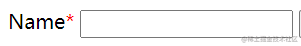
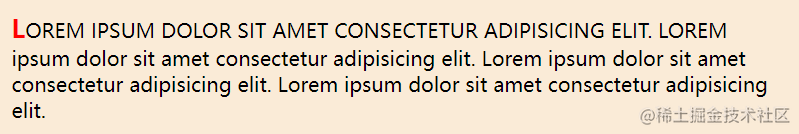
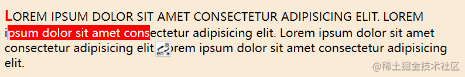
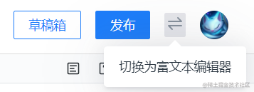
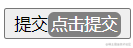
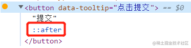
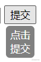
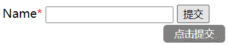

## 伪元素是什么

伪元素一般有两种使用场景：

### 1. 利用 CSS 直接在 HTML 中添加元素

利用伪元素添加的 HTML 元素一般起**装饰作用**。能够实现这种效果的伪元素只有两个，也就是我们最常用的`::after`和`::before`。一个常见的使用场景是给表单中必填项的标签添加星号。

```html
<style>
  .required::after {
    color: red;
    content: "*";
  }
</style>

<body>
  <label class="required">姓名</label>
  <input type="text" required />
</body>
```



### 2. 对 HTML 元素的特定部分进行修改

这里说的特定部分可以是每个段落的第一个字`::first-letter`或者第一行`::first-line`。

```css
p::first-letter {
  font-size: 125%;
  font-weight: bold;
  color: red;
}

p::first-line {
  text-transform: uppercase;
}
```

上述代码的效果如图所示，可以看到**段落的第一个字**被放大加粗并改变了颜色，而**段落的第一行**被转换成了大写字母。


还有对**被选中文本**样式进行修改的`::selection`。

```css
p::selection {
  background-color: red;
  color: white;
}
```



## 用伪元素写一个纯 css 的 tooltip（提示框）

`tooltip`就是当我们`hover`页面中的某些元素时，网页会弹出的提示框或者菜单选项，比如掘金的文本编辑器右上角的这个按钮就有一个`tooltip`。



图中的“切换为富文本编辑器”就是一个`tooltip`。通过给页面添加`tooltip`，可以给用户更多的操作提示，页面的交互性也会变得更强，有利于**提供良好的用户体验**。而这样的`tooltip`，是可以利用纯 CSS 实现的，其本质就是给按钮添加一个`after`伪元素。废话少说，直接上代码。

```html
<button data-tooltip="点击提交">提交</button>
```

首先我们在 HTML 中添加一个`button`元素，给元素添加`data-tooltip`属性来表示这个按钮会有一个`tooltip`，且`tooltip`的内容为“点击提交”。

```css
[data-tooltip]:hover::after {
  content: attr(data-tooltip);
  padding: 2.5px;
  border-radius: 5px;
  background-color: gray;
  color: white;
}
```

然后我们对`tooltip`的内容进行定制。利用`[data-tooltip]`选择器选中需要提示框的按钮，同时添加`:hover`伪类，因为只有按钮被 hover 时我们才希望 tooltip 出现。最后用`::after`伪类来插入我们的`tooltip`。

我们设置了`tooltip`的内容为选中元素的`data-tooltip`属性值，然后添加了圆角、内边距并设置了字体颜色、背景颜色和宽度来让它更加美观。



在浏览器中查看效果，会发现 tooltip 的外观已经符合我们的预期，但是它直接跟在了按钮的文本后面，打开控制台我们发现`::after`伪元素默认被放置于`button`的文本后面，而且它默认是一个`inline`元素，所以才会有这种效果。因此我们需要对伪元素的位置进行一些调整，让它可以正好出现在按钮的正下方。（这里出现黄点是因为`button`被我用开发者工具强制设定为了`hover`状态。）



```css
[data-tooltip] {
  position: relative;
}
[data-tooltip]:hover::after {
  padding: 2.5px;
  border-radius: 5px;
  background-color: gray;
  color: white;
  content: attr(data-tooltip);
  /* 以下是定位相关的属性声明 */
  position: absolute;
  top: 100%;
  left: 0;
  right: 0;
  margin-top: 5px;
}
```

我们可以利用绝对定位来达到我们想要的效果。首先设置父元素`button`的定位为`relative`，然后设置`::after`伪元素为绝对定位，也就是相对于父元素的位置进行定位。我们希望它处于正下方，所以用`top: 100%`令其向下偏移一整个父元素的高度，然后设置左右偏移都为 0 实现**自动居中**。最后添加一点点上边距让效果更加美观。



现在这个`tooltip`就被我们稳稳地放到按钮下方了！但如果我们能把它弄成一行的就更美观了，这需要我们再添加两个属性。

```css
width: 200%;
transform: translateX(-25%);
```

设置宽度为原来的两倍，就可以把四个字都放在一行里面了！但是这样会导致我们的提示框在右边多出来一半，所以我们得把它往左偏移四分之一，这样就实现了一个美观的纯 CSS tooltip 了！



## 参考链接：

https://blog.webdevsimplified.com/2021-12/css-pseudo-elements/
https://developer.mozilla.org/zh-CN/docs/Web/CSS/Pseudo-elements
