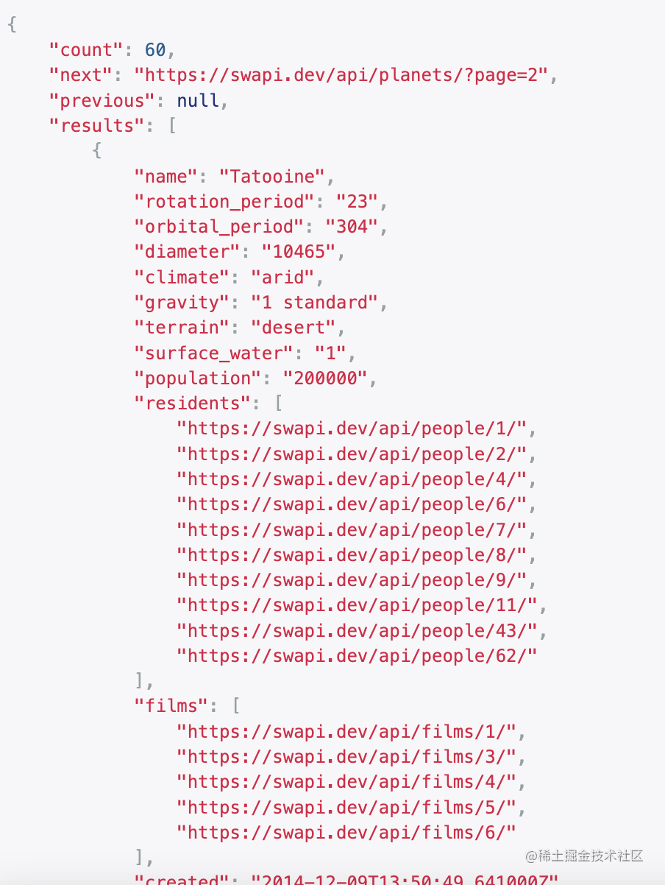
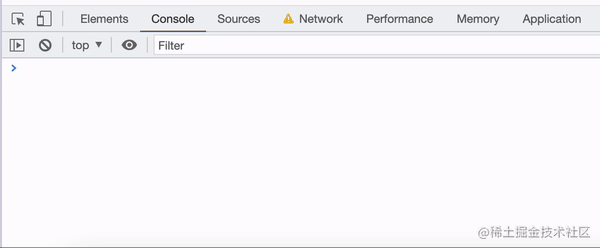

生成器（Generator）是 ES6 中引入的语言特性，其本质是一个可以暂停和恢复执行的函数。利用生成器我们可以很方便地实现自定义的可迭代对象（Iterable）、状态机（state machine）、惰性计算（lazy evaluation）等，并且还能用它来简化我们的异步操作代码，这些在文章中都会有具体的例子介绍。

生成器是一类特殊的迭代器（Iterator）。所以要了解生成器，首先我们要学习迭代器的概念。

## 迭代器（Iterator）

简单地说，迭代器就是实现了`next()`方法的一类特殊的对象。这个`next()`方法的返回值是一个对象，包含了`value`和`done`两个属性。例如：

```js
someIterator.next();
// { value: 'something', done: false }
someIterator.next();
// { value: 'anotherThing', done: false }
someIterator.next();
// { value: undefined, done: true }
```

代码中的`someIterator`就是一个实现了迭代器模式的对象，其中包含了`something`和`anotherThing`两个值。我们通过调用`next()`方法，每次从其中取出一个值。

`next()`方法的返回值中：`value`的值是从对象中取出的值，`done`代表迭代是否结束，如果为`true`说明迭代器中没有更多的值可以取了。

那么迭代器的作用是什么呢？

设想我们写了一个简单的链表数据结构，如下面的代码所示：

```js
class ListNode {
  constructor(val) {
    this.val = val;
    this.next = null;
  }
}

class LinkedList {
  constructor() {
    this.head = null;
    this.length = 0;
  }
  append(val) {
    const newNode = new ListNode(val);
    if (!this.head) {
      this.head = newNode;
    } else {
      let current = this.head;
      while (current.next) {
        current = current.next;
      }
      current.next = newNode;
    }
    this.length++;
  }
}
```

这个链表有一个缺点，就是遍历起来非常的麻烦，需要声明一个额外的`node`变量，还要用 while 循环进行判断。

```js
// 创建一个链表，往其中添加了1，2，3三个元素
const linkedList = new LinkedList();
linkedList.append(1);
linkedList.append(2);
linkedList.append(3);

// 对链表进行遍历
let node = linkedList.head;
while (node) {
  console.log(node.val);
  node = node.next;
}
// 依次打印1, 2, 3
```

我们希望可以使用这个链表结构的人可以用一种更加自然的方式来进行遍历，比如遍历数组时用的`for...of`循环，减少开发时的心智负担。这个时候迭代器就可以派上用场了。

```js
// 通过 Iterator 接口实现遍历
[Symbol.iterator]() {
  let current = this.head;
  return {
    next: () => {
      if (current) {
        current = current.next;
        return { value: current.val, done: false };
      }
      return { done: true };
    }
  }  
}
```

我们可以给`LinkedList`类添加一个`[Symbol.iterator]`属性，它是一个函数，其返回值就是我们一开始所说的迭代器对象，其中包含了`next()`方法。`next()`方法会依次返回链表中的值，直到到达链表末尾返回`{ done: true }`。

正确实现了`[Symbol.iterator]`方法的对象就可以通过`for...of`来进行遍历了。此时我们就可以像遍历数组一样遍历链表中的内容了。

```js
for (const node of linkedList) {
  console.log(node);
}
// 依次打印1, 2, 3
```

不仅如此，我们还可以使用扩展运算符来一次性获取链表中的所有元素并转换为数组。

```js
console.log([...linkedList]);
// [1, 2, 3]
```

## 生成器基础

### 生成器函数和生成器对象

生成器是一个函数，通过在函数名称前面加一个星号`*`来标识生成器函数，例如：

```js
function* genFunction() {
  yield "hello world!";
}
```

生成器函数返回了一个生成器对象，生成器对象实现了刚刚所说的迭代器接口，因此它具有`next()`方法。

```js
let genObject = genFunction();
genObject.next();
// { value: "hello world!", done: false }
genObject.next();
// { value: undefined, done: true }
```

生成器函数中的`yield`关键字会暂停函数的执行并返回一个值，`return`关键字会结束生成器函数的执行。

```js
function* loggerator() {
  console.log("开始执行");
  yield "暂停";
  console.log("继续执行");
  return "停止";
}

let logger = loggerator();
logger.next(); // 开始执行
// { value: '暂停', done: false }
logger.next(); // 继续执行
// { value: '停止', done: true }
```

第一次调用`next()`方法时，生成器函数会执行到第一个`yield`的位置然后暂停执行，并把对应的值放在`value`中返回，此时函数还没有`return`，所以`done`的值为`false`。

第二次调用`next()`方法时，生成器函数从第三行开始执行，在`return`语句处结束执行。函数返回值同样被放在`value`属性中，但因为此时函数的运行已经结束了，所以`done`的值为`true`。

因为生成器对象实现了迭代器协议，所以我们可以通过`for...of`循环和扩展运算符来对其进行操作。

```js
function* abcs() {
  yield "a";
  yield "b";
  yield "c";
}

for (let letter of abcs()) {
  console.log(letter.toUpperCase());
}
// 依次打印 A, B, C

[...abcs()]; // [ "a", "b", "c" ]
```

### 接收输入

`yield`除了返回一个值之外，还能用来接收外界的输入。`next()`方法中传的第一个参数会被`yield`接收。下面是一个例子：

```js
function* listener() {
  console.log("你说，我在听...");
  while (true) {
    let msg = yield;
    console.log("我听到你说:", msg);
  }
}

let l = listener();
l.next("在吗？"); // 你说，我在听...
l.next("你在吗？"); // 我听到你说: 你在吗？
l.next("芜湖！"); // 我听到你说: 芜湖！
```

第一个`next()`方法中传入的值会被忽略，这是因为此时函数才刚刚开始执行，还没有遇到任何`yield`可以接收输入值，函数会在`let msg = yield`处停止执行，因为遇到了`yield`关键字。

第二次调用`next()`时，传入的参数`'你在吗？'`会被`yield`语句返回并赋值给变量`msg`，然后被打印出来。

随后函数再度在`let msg = yield`处停止执行，这次`yield`接收到的值是`'芜湖！'`，因此打印出来`msg`的值就是`'芜湖！'`。

### 递归生成器

我们在生成器中想要实现递归调用时不能直接使用`yield`，因为执行生成器函数返回的值是生成器对象，但我们希望返回的是生成出来的值。

通过`yield*`可以实现生成器函数的递归，这里我们以一个二叉树结构的中序遍历函数为例：

```js
class TreeNode {
  constructor(value) {
    this.value = value;
    this.leftChild = null;
    this.rightChild = null;
  } // 中序遍历函数，通过yield*实现递归

  *[Symbol.iterator]() {
    yield this.value;
    if (this.leftChild) yield* this.leftChild;
    if (this.rightChild) yield* this.rightChild;
  }
}
```

我们构造一个二叉树实例来验证一下我们的中序遍历方法。

```js
const tree = new TreeNode("root");
tree.leftChild = new TreeNode("branch-left");
tree.rightChild = new TreeNode("branch-right");
tree.leftChild.leftChild = new TreeNode("leaf-L1");
tree.leftChild.rightChild = new TreeNode("leaf-L2");
tree.rightChild.leftChild = new TreeNode("leaf-R1");
//              root
//             /    \
//    branch-left  branch-right
//      /    \         /
// leaf-L1  leaf-L2  leaf-R1

console.log([...tree]);
// ['root', 'branch left', 'leaf L1', 'leaf L2', 'branch right', 'leaf R1']
```

代码可以正确地运行，而且由于我们的二叉树实现了`Symbol.iterator`，所以我们可以用扩展运算符和`for...of`循环对其进行遍历。

### 异步生成器

生成器函数也可以是异步函数。当我们想创建一个异步生成一系列值的对象时就可以使用异步生成器。

```js
async function* count() {
  let i = 0;
  // 每秒产生1个新的数字
  while (true) {
    // 等待1秒钟
    await new Promise(resolve => setTimeout(resolve, 1000));
    yield i;
    i++;
  }
}
​
(async () => {
  let countGenerator = count();
  console.log(await countGenerator.next().value);  // 1s 后打印 0
  console.log(await countGenerator.next().value); // 1s 后打印 1
  console.log(await countGenerator.next().value); // 1s 后打印 2
})();
```

在这个例子中，我们声明了一个`count`函数，其作用是每秒生成一个数字，从 0 开始，每次加 1。由于生成器函数是异步的，所以调用`countGenerator.next()`得到的会是一个`Promise`，需要通过`await`来获取最终生成的值。

除了普通的同步迭代器（也就是上面讲的`[Symbol.iterator]`）之外，JavaScript 中的对象还可以声明`[Symbol.asyncIterator]`属性。声明了`asyncIterator`的对象可以用`for await...of`循环进行遍历。

```js
const range = {
  from: 1,
  to: 5,
  async *[Symbol.asyncIterator]() {
    // 生成从 from 到 to 的数值
    for(const value = this.from; value <= this.to;="" value++)="" {=""  ="" 在="" value="" 之间暂停一会儿，等待一些东西=""  await="" new="" Promise(resolve=""> setTimeout(resolve, 1000));
      yield value;
    }
  }
};

(async () => {
  for await (let value of range) {
    console.log(value); // 打印 1，然后 2，然后 3，然后 4，然后 5。每个 log 之间会有1s延迟。
  }
})();
```

这里我们声明了一个 range 对象，设定了其开始数值为 1，结束数值为 5。对其进行迭代可以异步地获取从 1 到 5 的数值。

## 生成器应用

### 自定义序列生成

生成器可以帮我们更方便地进行序列的生成。例如我们想要开发一个扑克游戏，需要一个包含了所有扑克牌数值的序列，如果一一列举会非常麻烦，用生成器就可以简化我们的工作。

````js
const cards = ({
  suits: ["♣️", "♦️", "♥️", "♠️"],
  court: ["J", "Q", "K", "A"],
  [Symbol.iterator]: function* () {
    for (let suit of this.suits) {
      for (let i = 2; i <= 10;="" i++)="" yield="" suit="" +="" i;=""  =""  for="" (let="" c="" of="" this.court)="" c;="" }="" })="" ```="" 我们在`cards`的`[Symbol.iterator]`中对四种花色进行遍历，对于每一种花色，我们首先从2数到10，并数字字符与花色的字符进行拼接，从而生成该花色对应的所有数字牌，共九张；随后再遍历四个特殊的字母字符`"J",="" "Q",="" "K",="" "A"`，与花色的字符进行拼接，生成剩余的四张牌。="" ```js="" console.log([...cards])="" ['♣️2',="" '♣️3',="" '♣️4',="" '♣️5',="" '♣️6',="" '♣️7',="" '♣️8',="" '♣️9',="" '♣️10',="" '♣️J',="" '♣️Q',="" '♣️K',="" '♣️A',="" '♦️2',="" '♦️3',="" '♦️4',="" '♦️5',="" '♦️6',="" '♦️7',="" '♦️8',="" '♦️9',="" '♦️10',="" '♦️J',="" '♦️Q',="" '♦️K',="" '♦️A',="" '♥️2',="" '♥️3',="" '♥️4',="" '♥️5',="" '♥️6',="" '♥️7',="" '♥️8',="" '♥️9',="" '♥️10',="" '♥️J',="" '♥️Q',="" '♥️K',="" '♥️A',="" '♠️2',="" '♠️3',="" '♠️4',="" '♠️5',="" '♠️6',="" '♠️7',="" '♠️8',="" '♠️9',="" '♠️10',="" '♠️J',="" '♠️Q',="" '♠️K',="" '♠️A']="" 使用扩展运算符就可以一次性取出`cards`中的所有扑克牌数值并转化为数组了，这样的写法比直接一一列举方便了很多。="" ###="" 惰性计算="" 因为生成器函数执行时会在`yield`处停止，所以即便是`while(true)`这样的死循环也不会导致程序卡死，我们可以写一个不断生成随机数的`generateRandomNumbers`函数。="" function*="" generateRandomNumbers(count)="" {="" i="0;" <="" count;=""  yield="" Math.random()="" 惰性计算的含义是在要用到的时候才进行求值。以上面的`generateRandomNumbers`函数为例，如果我们采用普通的函数写法，调用函数时JS引擎会一次性把所有随机数都计算出来，如果传入的`count`过大的话，容易造成应用卡顿。="" 如果采用生成器的写法，我们可以一次从生成器中取出一个随机数，这样每次只进行了一次随机数生成的操作，避免了过度的性能消耗。="" 状态机="" 利用生成器可以接受输入的特性，我们可以通过生成器函数来构建一个状态机。="" bankAccount()=""  let="" balance="0;"  while="" (balance="">= 0) {
    balance += yield balance;
  }
  return '你破产了！';
}

let account = bankAccount();
account.next();    // { value: 0, done: false }
account.next(50);  // { value: 50, done: false }
account.next(-10); // { value: 40, done: false }
account.next(-60); // { value: "你破产了！", done: true }
````

这里我们构造了一个银行账户的生成器，一开始用户的余额是 0，我们可以通过在`account.next()`传入账户变动的数值来改变余额。如果余额变成了负数，就结束函数执行并告知用户破产。

### 简化分页请求

目前，有很多在线服务都是发送的分页的数据（paginated data）。例如，当我们需要一个用户列表时，一个请求只返回一个预设数量的用户（例如 100 个用户）—— “一页”，并提供了指向下一页的 URL。

以[星球大战 API](https://swapi.dev/api/)为例，其中的[`planets`API](https://swapi.dev/api/planets)中包含了星球大战中的各个行星的信息。这是一个分页的 API，每次请求返回 60 个星球的数据，包含在 `results` 字段中，下一页的链接在`next`字段中。



直接请求这个接口来迭代地获取每一页的行星数据是非常麻烦的。所以我们希望对这个接口进行封装，创建一个函数 `fetchPlanets()`，我们每次调用这个函数就可以获得下一页的 Planets 数据，并且可以使用 `for await..of` 来迭代获取所有行星数据。其代码如下所示：

```js
async function* fetchPlanets() {
  let nextUrl = `https://swapi.dev/api/planets`;
  while (nextUrl) {
    const response = await fetch(nextUrl);
    const data = await response.json();
    nextUrl = data.next;
    yield data.results;
  }
}
```

调用这个函数，我们可以得到一个`planetPages`生成器对象，对这个对象进行`for await..of` 迭代可以得到每一页的行星数据。可以看到，通过异步生成器进行请求封装大大简化了我们的异步请求代码。

```js
const planetPages = fetchPlanets();
(async () => {
  for await (const page of planetPages) {
    console.log(page);
  }
})();
```

代码运行的效果如图所示：



## 总结

> 本文中的例子和思路参考了 Anjana Vakil 的[演讲](https://www.youtube.com/watch?v=gu3FfmgkwUc)以及现代 JavaScript 教程中的[相关章节](https://zh.javascript.info/async-iterators-generators)

本文讲解了 JavaScript 中生成器的概念和相关应用场景。

- 生成器是一个函数，调用生成器函数可以得到一个生成器对象，生成器对象是一种迭代器（Iterator）。可以用扩展运算符`...`来一次性获取所有生成值，也可以用`for...of`循环来遍历生成器生成的值。
- 生成器可以通过在`next()`函数调用时传递参数来接受输入。
- 生成器可以通过`yield*`关键字进行递归调用。
- 生成器可以是异步函数，异步生成器对象可以用`for await...of`循环进行遍历。
- 利用生成器可以实现自定义序列的生成、惰性计算、状态机和异步分页请求的优雅封装。

（本文作者 wzkMaster）
</=></=>
