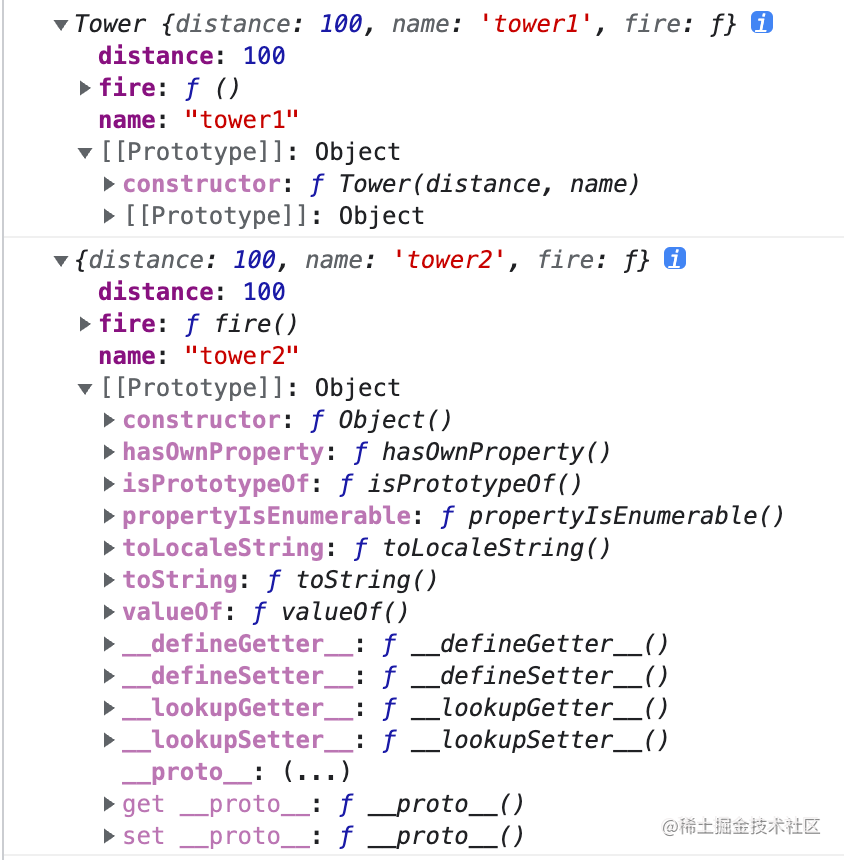
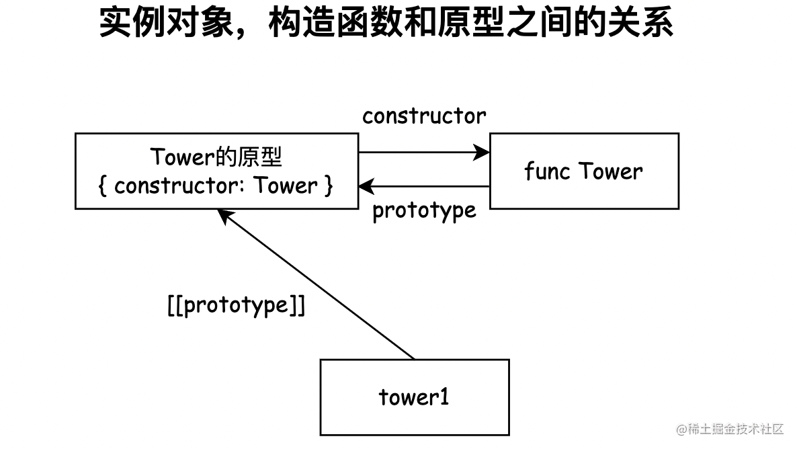
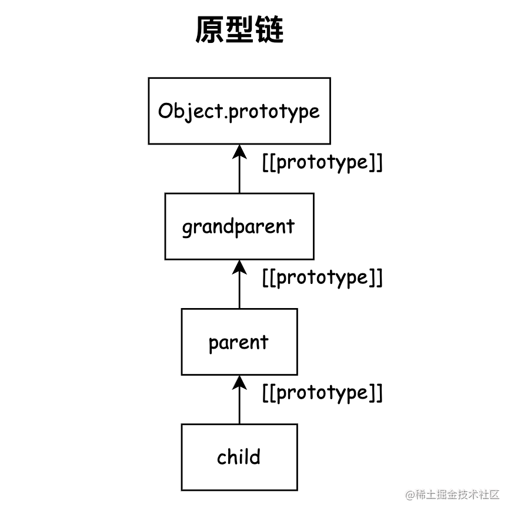
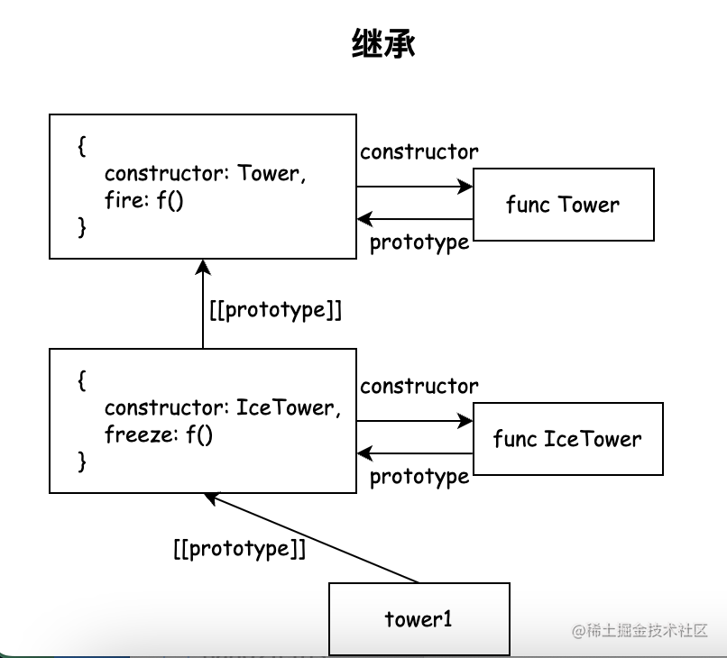
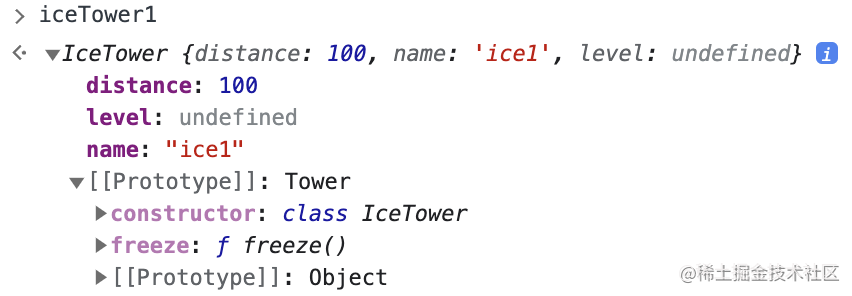

这篇文章将简单介绍面向对象的基本概念，以及 JS 语言是如何支持面向对象这种编程范式的，最后还会讲解一些对象元编程的基础知识。通过阅读这篇文章，你可以了解 JS 中的**原型链机制**，**new 关键字和构造函数的原理**、**寄生组合继承**的实现以及**对象元编程**的相关知识。

## 面向对象的概念

### 面向过程

假设我们想写一个五子棋游戏，如果用面向过程的方式实现，会是类似下面的编码思路。我们创建两个变量分别记录棋盘和当前玩家的信息，然后在一个循环中进行每一步游戏的逻辑。对于一些复杂的逻辑，例如计算游戏是否结束，我们可以单独将其以函数的形式抽象出来。

```js
// 新建一个20*20数组，代表棋盘
const board = new Array(20).fill(0).map(() => new Array(20).fill(""));
let currPlayer = "black";
while (!isGameEnd(board)) {
  // 获取玩家所下的位置
  const [x, y] = getNextStep();
  // 在棋盘中记录该位置
  board[x][y] = currPlayer;
  // 切换当前玩家
  currPlayer = currPlayer === "black" ? "white" : "black";
}

// 判断游戏是否结束的函数
function isGameEnd(board) {
  // ...
}
```

### 面向对象

不同于面向过程的编程范式，面向对象将问题抽象为不同对象之间的交互，每个对象都属于某个类，每个类拥有自己的数据和方法。 _类相当于现实世界中的一个个概念，而对象则是概念对应的实体，也就是类的实例。_

同样以五子棋游戏为例，我们可以声明一个`Game`类，一个`Player`类和一个`Board`类，用来表达五子棋游戏中涉及到的游戏、玩家和棋盘的概念。每个类上有对应的一些属性和方法，例如`Game`类中有开始游戏和输出游戏结果的方法，以及游戏中的棋盘、玩家和获胜方的数据。

```ts
class Board {
  // 棋盘
  constructor(size) {
    this.board = new Array(20).fill(0).map(() => new Array(20).fill(""));
  }
  // 计算结果
  getWinner() {}
}

class Player {
  constructor(type) {
    // 玩家所执方
    this.type = type;
    // 玩家昵称
    this.name = name;
  }
  // 下子
  play(board) {}
}

class Game {
  constructor() {
    this.board = new Board();
    this.players = [new Player("black"), new Player("white")];
    this.currPlayer = this.players[0];
    this.winner = undefined;
  }

  start() {
    while (!this.winner) {
      this.currPlayer.play(this.board);
      this.winner = this.board.getWinner();
      switchPlayer();
    }
    outputWinner();
  }

  outputWinner() {}
  switchPlayer() {}
}

const game = new Game();
game.start();
```

理解面向对象编程，最重要的是要了解在类和对象的基础上发展出的三个特性：**封装**、**继承**和**多态**。封装也就是把属性和方法都封装在一个对象中；继承让不同的对象可以共享属性和方法；多态则意味着在继承的基础上，不同对象的相同方法可以有不同的表现。

下面的例子中 `Point2d` 类代表一个 2 维空间中的点，其中**封装**了 x 和 y 坐标的数据以及计算点到原点距离的方法。同时，`Point3d`**继承**了`Point2d`的属性`x`和`y`，也就意味着它自动地拥有了`x`和`y`属性，因此在其属性声明中我们只要声明`z`属性就好，这样可以帮助我们减少重复的代码。同时`Point3d`也继承了`calcDistance`方法，但我们希望其`calcDistance`的表现和`Point2d`的不一样，所以我们重写了它的`calcDistance`方法，这就是**多态**的表现。

```ts
class Point2d {
  public x: number;
  public y: number;
  calcDistance() {
    return Math.sqrt(Math.pow(this.x) * Math.pow(this.y));
  }
}
class Point3d extends Point2d {
  // 继承了Point2d的x, y属性，因此此处只需声明独有的z属性就好
  public z: number;
  // 覆盖了Point2d的calcDistance方法
  calcDistance() {
    return Math.sqrt(Math.pow(this.x) + Math.pow(this.y) + Math.pow(this.z));
  }
}
```

接下来我们就来详细地看一下 JS 中是如何实现面向对象的这三个特性的。

> 问：现在都有`class`关键字了，为什么不直接使用`class`关键字？
>
> 答：JS 中的`class`本质上只是语法糖，背后采用的机制是基于原型的继承，通过学习采用原生的方法实现面向对象编程，我们才能更好地理解 JS 中的原型链、构造函数、`new`关键字等语言特性，从而写出更好的 JS 代码。

## 封装

如果我们想要在 JS 中实现将一些属性和方法封装起来，很自然地会想到采用 JS 的**对象**数据结构。

假设我们现在要开发一个塔防游戏，采用面向对象的方法，我们创建一个防御塔对象。

```js
const tower1 = {
  distance: 100,
  name: "tower1",
  fire() {
    console.log(this.name, " fired!");
  },
};

tower1.distance; // 100
tower1.fire(); // tower1 fired!
```

游戏中必然有不止一个防御塔，如果每次创建防御塔都采用这种字面量的形式，代码会有大量重复，也不便于修改。设想如果我们想给每个`tower`都加上一个新的生命值属性，那就意味着要到代码中找到每一个字面量去做修改，这是很不方便的。为了解决这个问题，我们可以编写一个专门用于创建`tower`的函数。

```js
function createTower(distance, name) {
  return {
    distance,
    name,
    fire() {
      console.log(this.name, " fired!");
    },
  };
}

const tower1 = createTower(100, "tower1");
tower1.distance; // 100
tower1.fire(); // tower1 fired!
```

有了这个函数，我们就不用再每一次都通过冗长的字面量来创建`Tower`对象了。如果想要给`Tower`添加一个新属性，也只要改动一下创建函数就好了。

但这还不够，设想这样一种场景，我们希望敌人攻击`Tower`的时候会触发警报，但如果敌人攻击的是一些其他的设施则不会。这就需要我们能够判断某个对象是否属于 Tower 类。目前我们创建的这些对象并不能体现他们是属于`Tower`这个类的。

JS 的`new`操作符可以帮我们解决这个问题。为此我们需要声明一个`Tower`类的**构造函数**。

```js
// 构造函数必须以大写字母开头
function Tower(distance, name) {
  this.distance = distance;
  this.name = name;
  this.fire = function () {
    console.log(this.name, " fires!");
  };
}

const tower1 = new Tower(100, "tower1");
const tower2 = createTower(100, "tower2");
// 判断tower1/tower2是否属于Tower类型
tower1 instanceof Tower; // true
tower2 instanceof Tower; // false
```

通过`instanceof`这个操作符我们可以判断对象是否属于某个类，那么为什么`tower1`和`tower2`明明有着同样的内容，却只有`tower1`被判定为属于`Tower`类呢。我们不妨打印一下他们的具体内容。



可以看到两者的区别主要在于它们的`[[prototype]]`这个属性不一样，这其实就是我们常说的**原型**。`instanceof`进行判断的依据就是对象的原型。_通过 new 关键字调用构造函数创建出来的对象，其原型将会指向构造函数的`prototype`属性对应的对象_，默认情况下该对象仅带有`constrctor`这个属性，指向构造函数本身。



我们可以结合下面这段手写`new`和`instanceof`的代码来更好的理解`new`和`instanceof`的原理。

```js
// 手写 new
function myNew(constructor, ...args) {
  // 创建一个空对象
  const obj = {};
  // 将对象的原型（也就是[[prototype]]）设为构造函数的prototype
  Object.setPrototypeOf(obj, construtor.prototype);
  // 将obj作为this调用构造函数
  const ret = constructor.call(obj, ...args);
  // 如果调用构造函数后返回了一个对象，就返回那个对象，否则返回obj
  return typeof ret === "object" ? ret : obj;
}

// 手写 instanceof
function myInstanceof(left, right) {
  //基本数据类型直接返回false
  if (typeof left !== "object" || left === null) return false;
  //getProtypeOf是Object对象自带的一个方法，能够拿到参数的原型对象
  let proto = Object.getPrototypeOf(left);
  while (true) {
    //查找到原型链尽头，还没找到
    if (proto == null) return false;
    //找到相同的原型对象
    if (proto == right.prototype) return true;
    proto = Object.getPrototypeOf(proto);
  }
}
```

可以看到，`instanceof`判断对象类型是通过查看其原型链实现的，其右值是一个构造函数，这是因为理论上某个类的原型对象是无法在代码中直接获取到的，因此需要用构造函数作为指向原型的入口，`instanceof`在判断时做的事情就是顺着左边对象的原型链进行查看，如果找到了右侧构造函数所对应的原型，就返回`true`，否则返回`false`。

## 继承和多态

### 利用原型管理类方法

设想我们用`new Tower()`创建出了很多个防御塔对象，每个对象上都会绑定一个`fire`方法，这相当于创建出了大量重复的函数，极大地浪费了内存。我们可以通过将函数挂载到`Tower.prototype`上来解决这个问题。这里我们利用了 JS 的**原型链**机制：当我们访问对象的某个属性时，如果对象本身没有这个属性，JS 引擎就会查找该对象的原型，而这个原型正是挂载在对象`constructor`的`prototype`属性上，在我们的例子中也就是`Tower.prototype`。

```js
// 构造函数必须以大写字母开头
function Tower(distance, name) {
  this.distance = distance;
  this.name = name;
}
Tower.prototype.fire = function () {
  console.log(this.name, " fired!");
};

const tower1 = new Tower(100, "tower1");
tower1.fire; // tower1 fired!
```

通过这种方式，我们创建的每个`Tower`实例仍然都具有`fire`方法，但他们是**共享**同一个`fire`方法。

### 原型链

```js
const grandparent = {
  a: 1,
};

const parent = {
  b: 2,
};
// 将grandparent设为parent的原型
Object.setPrototypeOf(parent, grandparent);
// 也可以写作 parent.__proto__ = grandparent

const child = {
  c: 3,
};

// 将parent设为child的原型
Object.setPrototypeOf(child, parent);
// 也可以写作 child.__proto__ = parent

console.log(child.a); // 1
console.log(child.b); // 2
console.log(child.c); // 3
```

_对象的原型也可以有自己的原型，如果对象的原型上也没有相应的属性，那么 JS 引擎又会接着查找原型的原型上有没有该属性，以此类推，直到找到该属性或原型为空_。这就是我们所说的原型链，利用原型链我们就可以在 js 中实现继承的机制。

在上面的例子中，我们访问`child`的`a`和`b`属性时，JS 引擎就是顺着原型链进行查找从而找到对应的属性的。这三个对象之间的关系如图所示。



我们使用对象字面量创建出来的对象的原型默认为`Object.prototype`，上面定义了我们在所有对象上都可以调用的方法如`toString()`, `valueOf()`等。`Object.prototype`的原型为`null`，也就是说所有原型链的查找通常都会到此为止。我们创建的数组的原型都为`Array.prototype`，数组的相关方法都挂载在该原型上面。`Date`对象、正则表达式对象等也有自己的原型，而这些原型的原型又都是`Object.prototype`。

### 方法的继承

```js
function Tower(distance, name) {
  this.distance = distance;
  this.name = name;
}
Tower.prototype.fire = function () {
  console.log(this.name, " fired!");
};

function IceTower(distance, name, level) {
  this.distance = distance;
  this.name = name;
  this.level = level;
}
IceTower.prototype = Object.create(Tower.prototype, { constructor: IceTower });

IceTower.prototype.freeze = function () {
  console.log(this.name, " freezed!");
};

const iceTower1 = new IceTower(100, "ice1");
iceTower1.fire(); // ice1 fired!
```

为了继承`Tower`上的方法，我们需要将`IceTower`的原型设定为一个原型为`Tower.prototype`的对象（`Object.create()`的第一个参数是创建出的对象原型，第二个参数是对象的内容），当我们调用`fire`方法时，JS 引擎就可以顺着原型链找到`Tower.prototype`，从而触发`fire`方法，在这里找到了`fire`方法并进行调用。下面这张图展示了上面代码中各个对象之间的关系。



### 属性的继承

上面的例子中我们只实现了方法的继承，并没有实现属性的继承。在`IceTower`的构造函数中我们又写了一遍`distance`和`name`的挂载逻辑。如果我们要挂载的属性很多的话，这样就很不方便了，修改父类属性的时候也会需要修改多处代码。我们可以通过“借用”父类的构造函数来解决这个问题，也就是在子类的构造函数中调用一次父类的构造函数。通过`call`方法将`this`绑定为当前的子类，这样就相当于直接利用了父类构造函数中的代码，实现了代码的复用，减少了冗余。

```js
function Tower(distance, name) {
  this.distance = distance;
  this.name = name;
}
Tower.prototype.fire = function () {
  console.log(this.name, " fired!");
};

function IceTower(distance, name, level) {
  // 借用父类构造函数，实现属性的继承
  Tower.call(this, distance, name);
  this.level = level;
}
// 连接父类的原型，实现方法的继承
IceTower.prototype = Object.create(Tower.prototype, { constructor: IceTower });
IceTower.prototype.freeze = function () {
  console.log(this.name, " freezed!");
};

const iceTower1 = new IceTower(100, "ice1");
iceTower1.fire(); // ice1 fired!
```

上面这种实现继承的方法被称为**寄生组合继承**。

### Class 关键字

在了解完如何采用非`class`语法实现继承之后，我们再来看看 ES6 的`class`语法，这也是我更加建议大家在日常编码中使用的语法，前面的内容主要是用于了解一些相关的概念。

```js
class Tower {
  constructor(distance, name) {
    this.distance = distance;
    this.name = name;
  }

  fire() {
    console.log(this.name, " fires!");
  }
}

class IceTower extends Tower {
  constructor(distance, name, level) {
    super(distance, name);
    this.level = level;
  }

  freeze() {
    console.log(this.name, " freezed!");
  }
}

const iceTower1 = new IceTower(100, "ice1");
iceTower1.fire(); // ice1 fired!
```



通过控制台我们可以看到，类实例的`constructor`就是类的名称，实例的的方法则挂载在实例的`[[prototype]]`上，这跟我们之前手动实现的继承的最终效果是一致的。在进行继承时，我们通过`super`关键字调用了父类的构造函数，和我们在寄生组合式继承时借用父类构造函数的逻辑是类似的。但`class`语法让我们可以把类声明的相关内容集中在一个代码块中，逻辑更加清晰，也方便来自其它语言的使用者快速上手。

## 对象元编程

### 属性枚举

在 JS 中我们可以利用`for/in`来枚举对象的属性，这种枚举默认会将对象原型链上的所有`emurable`(可枚举)属性也枚举出来，但这通常是不符合预期的。我们可以利用`hasOwnProperty`这个方法来判断某个属性是属于对象本身还是来自其原型链。

```js
for (let key in obj) {
  // 过滤来自原型链的属性
  if (obj.hasOwnProperty(key)) {
    // do something
  }
}
```

另外一种更方便的方法是利用`Object.keys()`，这个方法会返回对象所有**可枚举的自有属性**（也就是非原型链上的属性）数组。

### 属性配置

前面我们讲过所有的对象的原型都是`Object.prototype`，但当我们枚举一个对象的值时，就算不作过滤也不会枚举出`toString`, `valueOf`这些方法，原因在于这些属性的`enumerable`属性都设置为了`false`。除了`enumerable`，每个对象属性都还有`configurable`, `writable`两个属性。`writable`决定了一个属性能否被改变，`configurable`决定了一个属性能否被删除以及其配置属性（也就是`wirtable`、`enumerable`和`configurable`）能否被修改。

通过`getOwnPropertyDescriptor`和`defineProperty`我们可以实现属性配置的查看和修改。

```js
Object.getOwnPropertyDescriptor(Object.prototype, "toString");
// {
//     "writable": true,
//     "enumerable": false,
//     "configurable": true
// }
const obj = {};
Object.defineProperty(obj, "x", {
  value: 1, // 对象的值
  writable: false,
  enumerable: true,
  configurable: false,
});

obj.x; // 1
obj.x = 2; // 因为x的writable属性为false,写入后其值并不会改变
obj.x; // 1
delete obj.x; // 返回false,代表删除失败,严格模式下会报错
obj.x; // 1，x仍然存在
```

### 对象冻结

除了对某个属性进行限制之外，有的时候我们会希望能够限制整个对象的一些行为，例如属性的添加、删除、更新等。有三个函数可以帮我们实现这种功能。

- `Object.preventExtensions`：限制对象不能再添加新的属性

- `Object.seal`：在前者的基础上，将所有属性的`configurable`设为`false`，也就是不能删除

- `Object.freeze`：在前者的基础上，将所有属性的`writable`设为`false`，也就是不能修改任何属性

除了上述的特性之外，ES6 中又引入了`Symbol`, `Reflect`, `Proxy`等元编程特性，感兴趣的同学可以自行了解一下。

## 参考资料

[You Don't Know JS 第二版 - Object & classes](https://github.com/getify/You-Dont-Know-JS/blob/2nd-ed/objects-classes/README.md)

JavaScript The Definitive Guide(犀牛书) - Chapter6, Chapter9, Chapter14
