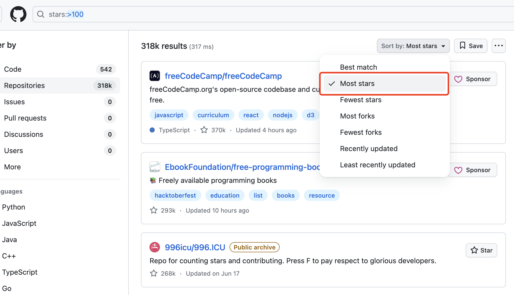
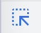
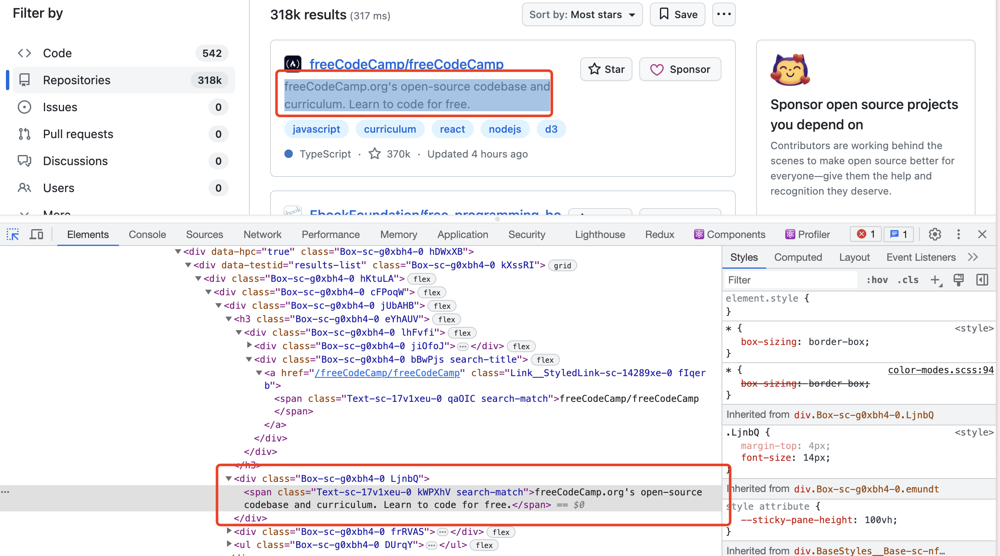
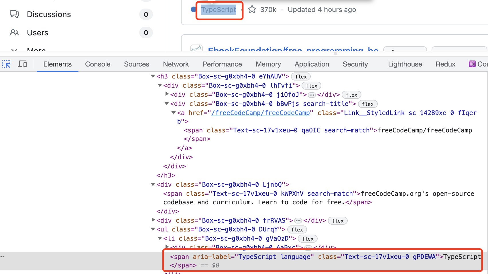

Puppeteer 是 Google 开源的一个用于操作浏览器的库，可以用于爬虫、自动化测试等。Puppeteer 的本义是“提线木偶”，因此可以把它理解为代替我们去操作浏览器的一个机器人，例如我想复制 Github 上面超过 1w star 的所有项目信息，如果自己手动做就很麻烦，那么我们就可以让 Puppeteer 为我们代劳。

## 环境准备

新建一个文件夹，输入以下命令安装 Puppeteer：

```
npm install puppeteer
```

## 爬取 Github 项目数据

假设我们想获取 Github 上面 stars 数量前 100 名的项目数据，包括项目名称、项目链接、项目 stars 数量、项目描述、项目语言和项目标签，如果手动的一个一个录入数据就太麻烦了，这个时候我们就可以利用 Puppeteer 来帮助我们。

首先我们要知道如何获取 Github stars 数前一百项目的列表，这可以通过 Github 的高级搜索符来实现，我们在 Github 输入框输入 `stars:>10000`，然后搜索。这个搜索符的含义是找到所有 star 数量大于一万的项目。

在搜索结果出来之后，我们点击右上角的筛选，把搜索结果改为按 stars 数量排序。



可以看到项目列表中的每一项包含了我们所需要获取的各项信息，接下来就可以编写代码来帮助我们完成数据爬取的任务了。

首先我们导入 Puppeteer，然后启动一个浏览器，并让它访问我们搜索得到的页面：

```js
const browser = await puppeteer.launch();

const page = await browser.newPage();
await page.goto(
  "https://github.com/search?q=stars:%3E100&type=repositories&s=stars&o=desc"
);
```

然后我们通过 `page.evaluate()` 函数来获取页面上的项目数据。

```js
const projects = page.evaluate(() => {
  // 获取各个项目对应的元素
  const repos = document.querySelectorAll(".jUbAHB");
  // 遍历各个项目元素，提取其中的项目数据
  const data = [...repos].map((repo) => {
    const title = repo.querySelector("h3").innerText;
    const link = repo.querySelector(".fIqerb").href;
    const description = repo.querySelector(".kWPXhV").innerText;
    const language =
      repo.querySelector('[aria-label*="language"]')?.innerText || "";
    const tags = Array.from(repo.querySelectorAll(".cvduTM")).map(
      (e) => e.innerText
    );
    const stars = repo.querySelector('[aria-label*="stars"]').innerText;
    return {
      title,
      link,
      description,
      language,
      stars,
      tags,
    };
  });

  return data;
});
```

`page.evaluate()` 的回调函数中的代码会在打开的页面中被执行，也就是说我们可以在其中访问页面的 dom 元素，从而获取到我们所需要的数据。这里我们首先获取了每一个项目对应的 dom 元素，然后从各个项目的 dom 元素中收集其信息，最后返回得到的数据。

这里每项数据对应的 dom 元素可以通过开发者工具查看，首先右键点击页面然后选择“检查”，打开 Elements/元素 Tab，点击左上角的箭头 icon。



此时把鼠标放到页面中的任意元素上，开发者工具中就会显示出该元素对应的标签信息。以项目的描述为例，我们可以看到该元素对应的 class 中有一个 `kWPXhV`，那么我们就可以通过 `.kWPXhV` 这个选择器来获取到该元素，然后用`innerText`获取项目描述的内容。



有些元素的 class 可能会和其他的元素重复，这时可以尝试通过其他的属性来获取该元素，例如项目 stars 数量的 class 就和项目语言的 class 相同，那么就可以用 `aria-label` 来获取这两个元素。通过 `[aria-label*="language"]` 这个选择器来获取 `aria-label` 属性中包含 `language` 的元素，该元素的 `innerText` 就是项目语言的数据。



此时我们只是获取了前 10 个项目的数据，但我们想要的是前 100 的项目数据，所以还需要在每一页的数据获取完成后进入下一页，重复 10 次。我们可以点击进入项目列表的下一页，观察 url，会发现多了一个 `p=2` 的参数，因此我们只需要循环改变 url 中 `p` 参数的数值就可以访问前十页的数据了。

```js
const projects = [];
for (let i = 1; i <= 10; i++) {
  await page.goto(
    `https://github.com/search?q=stars:%3E100&type=repositories&s=stars&o=desc&p=${i}`
  );
  const currentPageProjects = await page.evaluate(() => {
    // ...
  });

  projects.push(...currentProjects);
}
```

最后我们可以把收集到的数据保存到一个 `json` 文件中方便使用。

```js
const fs = require("fs");
fs.writeFileSync("projects.json", JSON.stringify(projects));
```

完整的项目代码如下：

```js
const puppeteer = require("puppeteer");
const fs = require("fs");

(async () => {
  const browser = await puppeteer.launch();

  const page = await browser.newPage();
  await page.goto(
    "https://github.com/search?q=stars:%3E100&type=repositories&s=stars&o=desc"
  );

  const projects = [];
  for (let i = 0; i < 10; i++) {
    const currentPageProjects = await page.evaluate(() => {
      const repos = document.querySelectorAll(".jUbAHB");
      const data = [...repos].map((repo) => {
        const title = repo.querySelector("h3").innerText;
        const link = repo.querySelector(".fIqerb").href;
        const description = repo.querySelector(".kWPXhV").innerText;
        const language =
          repo.querySelector('[aria-label*="language"]')?.innerText || "";
        const tags = Array.from(repo.querySelectorAll(".cvduTM")).map(
          (e) => e.innerText
        );
        const stars = repo.querySelector('[aria-label*="stars"]').innerText;
        return {
          title,
          link,
          description,
          language,
          stars,
          tags,
        };
      });

      return data;
    });

    console.log(1234);
    const link = await page.$('[rel="next"]');
    await link.click();

    projects.push(...currentPageProjects);
  }

  fs.writeFileSync("projects.json", JSON.stringify(projects));

  await browser.close();
})();
```

## 总结

本文通过爬取 Github 高 stars 项目讲解了 Puppeteer 的入门知识，包括浏览器启动、页面访问、页面数据提取、页面交互等，利用这些知识你可以用 Puppeteer 自动化你的日常工作，比如进行数据爬取、自动化 UI 测试等等。
