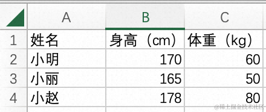
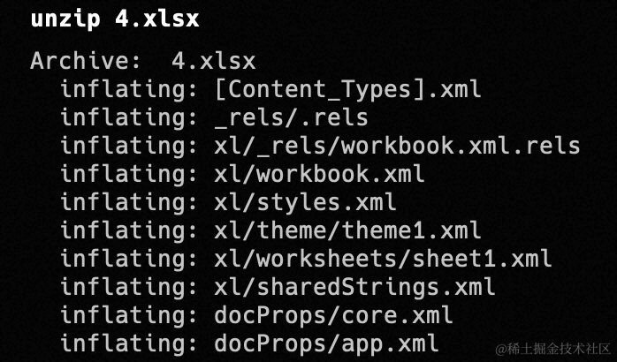

由于工作的关系经常需要把 Excel 表格复制到 Markdown 编辑器中，但经常会遇到有些编辑器的支持并不是很好，导致复制过去格式会错乱。除此之外，我每次处理的文件其实都是那几份，于是我决定想个办法来把这个流程自动化一下。

我希望写一个 CLI，其功能是把输入的 Excel 表格文件转化为 Markdown 文件，文件的内容就是表格对应的 Markdown 表格代码。如[视频](https://www.ixigua.com/7294853806951825930?logTag=5789f797c87b8cbf5973)所示。

想要实现 Excel 表格的读取其实非常简单，无论是 JS、Python 还是 Go 等语言，都有非常好用的第三方库可以用来实现此功能。然而我希望自己写的这个 CLI 能够让同事们也复用起来，所以就想看看能不能**不依赖第三方库**实现 Excel 文件的读取。（其实用编译型语言写 CLI 就没这个问题，但我对自己的 Go 水平不太自信）

去网上简单查了一下，发现 Excel 文件其实就是个 zip 压缩包，解压出来是一系列的 xml 文件。结合这些信息，我最终选择了 Python 作为我的开发语言，因为 Python 内置了解压缩和 xml 解析的功能。而且 Python 在所有的 Mac 系统上都预装了，其他同事直接可以一键运行。

由于 Python 的语法非常简单，可以说就是伪代码，因此即便是对于 Python 没有了解过的读者也不必担心，文章中的代码只要学过任意编程语言就能看懂。

## Excel 文件结构探秘

正如刚刚说到的，`.xlsx`文件其实就是一个`zip`包而已，我们可以用`unzip`命令来对其进行解压。假设我们有下面这样一个简单的 Excel 表格：



我们用`unzip`命令解压一下看看：



可以看到我们得到了一系列`xml`文件，这些文件大致的含义如下（参考[这篇文章](https://zhuanlan.zhihu.com/p/180074383)）：

```
[Content_Types].xml // 总体资源文件列表
├── _rels
├── docProps
│   ├── app.xml
│   └── core.xml
└── xl
    ├── _rels
    │   └── workbook.xml.rels
    ├── sharedStrings.xml		// 存储 sheet 用到的字符串 !important
    ├── styles.xml		// 当前工作簿的设置
    ├── theme					// Excel 主题默认配置
    │   └── theme1.xml
    ├── workbook.xml  // Excel 工作簿的相关属性
    └── worksheets		// Excel 工作表的相关属性 !important
        └── sheet1.xml
```

这些文件遵循的是 Office Open XML 规范，它是一个国际标准，详见 [ISO / IEC-29500-3](https://link.zhihu.com/?target=https%3A//docs.microsoft.com/en-us/openspecs/office_standards/ms-docx/b839fe1f-e1ca-4fa6-8c26-5954d0abbccd)。

这里面我们只需要关注`worksheets`文件夹和`sharedStrings.xml`的内容。

打开`sheet1.xml`文件，我们重点关注`sheetData`标签中的内容：

```xml
<sheetData>
  <row r="1" spans="1:3">
    <c r="A1" t="s">
      <v>0</v>
    </-c>
    <c r="B1" t="s">
      <v>4</v>
    </c>
    <c r="C1" t="s">
      <v>5</v>
    </c>
  </row>
  <row r="2" spans="1:3">
    <c r="A2" t="s">
      <v>1</v>
    </c>
    <c r="B2">
      <v>170</v>
    </c>
    <c r="C2">
      <v>60</v>
    </c>
  </row>
  <row r="3" spans="1:3">
    <c r="A3" t="s">
      <v>2</v>
    </c>
    <c r="B3">
      <v>165</v>
    </c>
    <c r="C3">
      <v>50</v>
    </c>
  </row>
  <row r="4" spans="1:3">
    <c r="A4" t="s">
      <v>3</v>
    </c>
    <c r="B4">
      <v>178</v>
    </c>
    <c r="C4">
      <v>80</v>
    </c>
  </row>
</sheetData>
```

这里面包含的其实就是表格的数据，每个`row`标签是一行数据，每个`c`标签包含了一格的数据和位置等信息。可以看到 170，165 等数据都包含在其中，但表头和姓名的字符串却变成了一个个数字，那那些字符串去哪里了呢？这个时候就需要`sharedStrings.xml`出场了。

```xml
<?xml version="1.0" encoding="UTF-8" standalone="yes"?>
<sst xmlns="http://schemas.openxmlformats.org/spreadsheetml/2006/main" count="6" uniqueCount="6">
  <si>
    <t>姓名</t>
    <phoneticPr fontId="1" type="noConversion"/>
  </si>
  <si>
    <t>小明</t>
    <phoneticPr fontId="1" type="noConversion"/>
  </si>
  <si>
    <t>小丽</t>
    <phoneticPr fontId="1" type="noConversion"/>
  </si>
  <si>
    <t>小赵</t>
    <phoneticPr fontId="1" type="noConversion"/>
  </si>
  <si>
    <t>身高（cm）</t>
    <phoneticPr fontId="1" type="noConversion"/>
  </si>
  <si>
    <t>体重（kg）</t>
    <phoneticPr fontId="1" type="noConversion"/>
  </si>
</sst>
```

我们表格里的字符串全部都会被放到这里，`sheet1.xml`中通过字符串在文件中的`index`对其进行引用。例如 0 就对应“姓名”，1 就对应“小明”。

那如何区分引用字符串的索引和普通的数字呢？注意到`c`标签中包含了一个`t`属性，若`t="s"`，说明这一格是个字符串，其中的数字是字符串索引。否则就是普通的数字。

## CLI 代码编写

了解了这些信息之后，我们就可以开始编写代码了。我们需要做以下 4 件事情：

1.  读取用户输入的命令行参数，获取并解压对应的 Excel 文件
2.  对 `sharedStrings.xml` 文件进行解析，把共享字符串保存为一个数组，方便后续引用
3.  解析 `sheet1.xml` ，把表格数据保存为一个二维数组
4.  将表格数据转化为 Markdown 表格字符串，保存到对应的 Markdown 文件中

现在我们来看看具体的代码：

首先，我们导入一些必要的库，这些都是语言内置的，不需要额外安装。同时我们也声明了一个常量 `output_path`，用于指定解压 Excel 后的临时文件夹名称：

```py
import xml.dom.minidom 	# xml 解析库
import zipfile 		   	# 压缩包处理库
import sys 			   	# 读取命令行参数
import os 				# 文件处理
import shutil 			# 文件夹处理

output_path = 'data' # 解压 excel 后的临时文件夹名称
```

然后我们读取用户输入的命令行参数，据此生成输出的 Markdown 文件名：

```py
file_path = sys.argv[1] # 读取用户输入的第一个命令行参数
md_path = file_path.split('.')[0] + ".md" # 输出的markdown文件名称
```

为什么第一个参数是 `sys.argv[1]` 而不是 `[0]` 呢？这是因为系统会把当前运行的程序路径放在 `sys.argv`的第一位。假设用户通过 `python excel-reader.py data.xlsx` 来运行我们的程序，则 `file_path` 的值就是 `data.xlsx`，输出的 Markdown 文件名就是 `data.md`。

接下来我们对 Excel 文件进行解压，输出目录指定为刚刚声明的 `output_path`：

```
# 解压 excel 文件
with zipfile.ZipFile(file_path, 'r') as zip_ref:
    zip_ref.extractall(output_path)
```

然后我们开始解析 `sharedStrings.xml` 文件，并将读取到的共享字符串放到 `strings` 数组中。之所以放在数组中，是因为在 `sheet1.xml` 文件中，我们就是根据字符串的索引来引用字符串的，保存为数组查找起来就非常方便。

```py
strings = []

# 读取共享字符串
if os.path.exists(output_path + "/xl/sharedStrings.xml"):
  with open(output_path + "/xl/sharedStrings.xml", 'r') as data:
      # 将 xml 文件转化为 dom 结构
      dom = xml.dom.minidom.parse(data)
      # 找到所有 t 标签
      for string in dom.getElementsByTagName('t'):
          # 将 t 标签中的字符串值加到 strings 数组中
          strings.append(string.childNodes[0].nodeValue)
```

在解压 `sharedStrings.xml` 之前，我们需要先通过 `os.path.exists()` 看一下其是否存在。因为纯数字的 Excel 文件解压出来是不会有它的。

对于 xml 的读取，我们使用了 Python 内置的 `xml.dom`，它会把 xml 文件转化为类似浏览器的 DOM 结构，然后我们可以用 DOM API 来读取其中的内容，这样比较方便。否则直接对 xml 字符串进行分析的话会非常麻烦，需要高超的正则表达式技巧。如果你对 DOM 不熟悉的话也没有关系，这里的代码做的事情就是遍历 `sharedStrings.xml` 中所有的 `<t>` 标签，然后获取该 `<t>` 标签中的字符串值，放到 `strings` 数组中。

接下来我们解析 `sheet1.xml` ，来对表格数据进行读取，并把结果保存在一个二维数组 `result` 中：

```py
result = []

# 读取表格数据
with open(output_path + "/xl/worksheets/sheet1.xml", 'r') as data:
    dom = xml.dom.minidom.parse(data)
    # 遍历每一个 row 标签
    for row in dom.getElementsByTagName('row'):
        row_data = []
        # 遍历 row 标签中包含的每个 c 标签
        for cell in row.getElementsByTagName('c'):
          value = ''
          # 如果该 c 标签的 t 属性值为 s，说明是字符串，需要到 strings 中获取其真实值
          if cell.getAttribute('t') == 's':
              shared_string_index = int(cell.getElementsByTagName('v')[0].childNodes[0].nodeValue)
              value = strings[shared_string_index]
          # 否则直接读取其值
          else:
              value = cell.getElementsByTagName('v')[0].childNodes[0].nodeValue
          # 将这一格的数据添加到 row_data 中
          row_data.append(value)
        # 将这一行的数据添加到 result 中
        result.append(row_data)

# 删除临时文件夹
shutil.rmtree(output_path)
```

我们遍历 `sheet1.xml` 中的每一个 `<row>` 标签，也就是表格的每一行。对于每一个 `<row>` 标签，我们再遍历其中包含的所有 `<c>` 标签，也就是一行中的每一格，获取 `<c>` 标签中的数据值，添加到 `row_data` 数组中。一行的数据遍历完成之后，再把这一行对应的 `row_data` 添加到最终的 `result` 数组中。

上文中提到，一个 `<c>` 标签中的数字有可能是真实值，也有可能是共享字符串索引，需要通过其 `t` 属性进行判断。如果 `t` 的值为 `s`，那么我们需要到 `strings` 数组中取出该索引对应的字符串值，再添加到 `row_data` 中；否则直接加进去就好了。

读取完毕之后，别忘了把解压 Excel 文件得到的临时文件夹给删除掉。

现在我们已经得到了 Excel 表格中的所有数据，保存在一个二维数组中，最后一步就是把数组转化为 Markdown 表格字符串，写入输出文件中。

```py
# 构建 Markdown 表格
# 生成第一行
markdown_table = "|"
markdown_table += "|".join(result[0]) + "|"
markdown_table += "\n"
# 生成分隔行（第二行）
markdown_table += "|"
markdown_table += "|".join(["-" for _ in result[0]]) + "|"
markdown_table += "\n"
# 生成后续的行
for row in result[1:]:
    markdown_table += "|"
    markdown_table += "|".join([value for value in row]) + "|"
    markdown_table += "\n"
# 去除多余的换行符
markdown_table = markdown_table[:-1]

# 生成 Markdown 文件
with open(md_path, 'w') as md_file:
    md_file.write(markdown_table)
```

这一步如果对于 Markdown 表格语法熟悉的话，就没有太多需要讲解的了，大家看下注释即可。还不熟悉 Markdown 表格语法的朋友可以看一下文章最后的附录。

在生成分隔行也就是第二行时，我用到了 python 的列表生成式，`["-" for _ in result[0]])`表示生成与 `result[0]` 的元素数量相同的一个由 `"-"` 组成的数组。在我们的例子中，因为表格共有三列，生成的就是 `["-", "-", "-"]`。而`"|".join(["-", "-", "-"]) + "|"` 的结果就是 `"-|-|-|"`。这样我们就用非常简洁的方式生成了表格的第二行。

## 总结

在这篇文章中，我们使用 Python 语言，在没有依赖任何第三方库的基础上实现了一个 Excel 转 Markdown 的工具。可以看到 Python 在实现这类脚本程序时非常的高效，这是因为其简洁的语法和强大的内置库。

目前我们的程序只能处理没有空单元格的情况，如果表格中存在空单元格，我们就得不到正确的结果。如果读者有兴趣的话，可以研究一下如何应对这种情况。

## 完整代码

```python
import xml.dom.minidom 	# xml 解析库
import zipfile 		   	# 压缩包处理库
import sys 			   	# 读取命令行参数
import os 				# 文件处理
import shutil 			# 文件夹处理

output_path = 'data' # 解压 excel 后的临时文件夹名称

file_path = sys.argv[1] # 读取用户输入的第一个命令行参数
md_path = file_path.split('.')[0] + ".md" # 输出的markdown文件名称

# 解压 excel 文件
with zipfile.ZipFile(file_path, 'r') as zip_ref:
    zip_ref.extractall(output_path)

strings = []

# 读取共享字符串
if os.path.exists(output_path + "/xl/sharedStrings.xml"):
  with open(output_path + "/xl/sharedStrings.xml", 'r') as data:
      # 将 xml 文件转化为 dom 结构
      dom = xml.dom.minidom.parse(data)
      # 找到所有 t 标签
      for string in dom.getElementsByTagName('t'):
          # 将 t 标签中的字符串值加到 strings 数组中
          strings.append(string.childNodes[0].nodeValue)

result = []

# 读取表格数据
with open(output_path + "/xl/worksheets/sheet1.xml", 'r') as data:
    dom = xml.dom.minidom.parse(data)
    # 遍历每一个 row 标签
    for row in dom.getElementsByTagName('row'):
        row_data = []
        # 遍历 row 标签中包含的每个 c 标签
        for cell in row.getElementsByTagName('c'):
          value = ''
          # 如果该 c 标签的 t 属性值为 s，说明是字符串，需要到 strings 中获取其真实值
          if cell.getAttribute('t') == 's':
              shared_string_index = int(cell.getElementsByTagName('v')[0].childNodes[0].nodeValue)
              value = strings[shared_string_index]
          # 否则直接读取其值
          else:
              value = cell.getElementsByTagName('v')[0].childNodes[0].nodeValue
          # 将这一格的数据添加到 row_data 中
          row_data.append(value)
        # 将这一行的数据添加到 result 中
        result.append(row_data)

# 删除临时文件夹
shutil.rmtree(output_path)

# 构建 Markdown 表格
# 生成第一行
markdown_table = "|"
markdown_table += "|".join(result[0]) + "|"
markdown_table += "\n"
# 生成分隔行（第二行）
markdown_table += "|"
markdown_table += "|".join(["-" for _ in result[0]]) + "|"
markdown_table += "\n"
# 生成后续的行
for row in result[1:]:
    markdown_table += "|"
    markdown_table += "|".join([value for value in row]) + "|"
    markdown_table += "\n"
# 去除多余的换行符
markdown_table = markdown_table[:-1]

# 生成 Markdown 文件
with open(md_path, 'w') as md_file:
    md_file.write(markdown_table)
```

## 附录：Markdown 表格语法


用`|`分割单元格，用`-`分割表头和其他行。以上面这个 Excel 表格为例，它对应的 markdown 表格代码如下：

```
| 姓名 | 身高（cm） | 体重（kg） |
| ---- | ---------- | ---------- |
| 小明 | 170        | 60         |
| 小丽 | 165        | 50         |
| 小赵 | 178        | 80         |
```

**第二行的横线数量以及单元内容前后的空格没有特定的限制**，只是为了对齐美观所以这样写。直接写成下面这样也可以正常渲染： **（下面的这种格式也是我们写的 CLI 中采用的格式，不需要在**`|`**和文字之间添加额外的空格，** `-`**也只写一个就好。）**

```
|姓名|身高（cm）|体重（kg）|
|-|-|-|
|小明|170|60|
|小丽|165|50|
|小赵|178|80|
```
