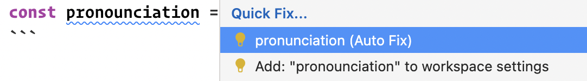
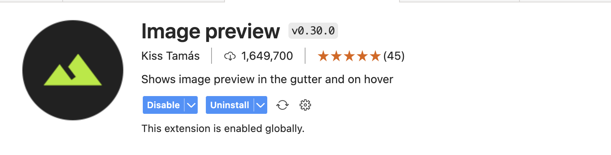
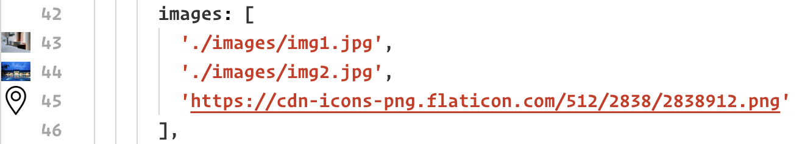
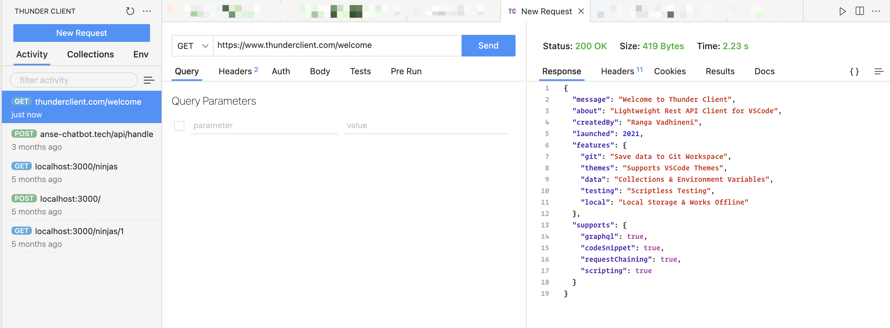
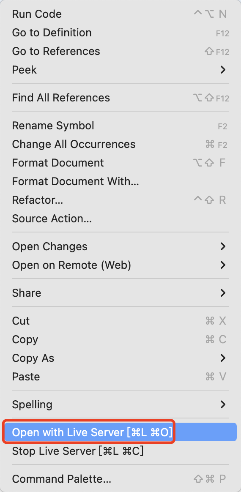
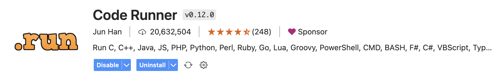
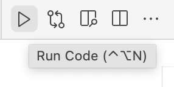

VSCode 无疑是当前最受欢迎的代码编辑器，它如此受欢迎的一个重要原因就是其丰富的插件生态系统。这些插件中有的是与某类语言和框架强相关的，例如 C++，Python，Rust，Java 等的相关插件，如果要用 VSCode 进行这些语言的开发，装上这些插件可以让你拥有专业 IDE 级别的体验。有些是通用的工具类插件，例如汉化插件、代码人工智能补全等。还有些是装饰类的插件，例如颜色主题、文件主题。甚至你还能在插件市场中看到游戏机、小说阅读器、电子宠物这样奇奇怪怪的插件。

本文中我将推荐几个平时开发过程中用到的好用的通用工具类插件，使用这些插件可以大大提升你的开发效率和编码体验。

## 1. Code Spell Checker

对于母语非英语的我们来说，平日里给变量命名往往是一件非常痛苦的事情。使用拼音会显得很 low，如果硬着头皮拼写出英语却很容易拼错。这个插件可以帮我们解决这些烦恼，它会找出你的代码中的拼写错误，并提供相应的纠正建议，类似于 word 的自动纠错功能。例如我想拼写 pronunciation （发音）这个单词，但只能根据读音记个大概，没关系，直接写出来，如果写错了插件就会帮你指出，并且会提供自动纠错的选项。

如果确实是项目中独有的名词术语，也可以选择把单词添加到项目设置里，这样下次插件就不会再认为你写错了。

除了帮助我们正确拼写想要的单词之外，拼写检查还有一个好处，特别是在弱类型语言中，很容易出现写错一个字母导致程序无法运行起来的问题。但有了拼写检查之后，写错单词的情况就可以第一时间被发现，从而避免这类低级错误。

[下载链接](https://marketplace.visualstudio.com/items?itemName=streetsidesoftware.code-spell-checker)

## 2. Image Preview

w

在写项目的过程中少不了对图片文件的引用，不管是本地的还是网络上的图片，但有的时候我们可能会因为粗心写错图片引用的路径，或者引用了错误的图片，使用这个插件可以帮助我们避免这类问题。

可以看到在每行包含图片地址的代码左侧都会出现一张对应图片的预览图，如果没有出现预览图或者预览图不是我们想要的图片，那就说明我们的路径写的有问题，这个时候就可以第一时间发现并修改了。

[下载链接](https://marketplace.visualstudio.com/items?itemName=kisstkondoros.vscode-gutter-preview)

## 3. Thunder Client

不管是前端、客户端还是后端工程师，相信大家在平时开发的过程中都会有调试或者 mock API 请求的需要，这方面最常用的工具就是 postman。而在 VSCode 中就有一款插件提供了和 Postman 一样的功能，它就是 Thunder Client。其功能和界面和 Postman 高度类似，可以新建请求、给不同的请求分组、设置请求参数等等。

相比于 Postman，使用 Thunder Client 的好处在于不需要进行应用的切换，所有的工作都可以在 VSCode 中完成。

[下载链接](https://marketplace.visualstudio.com/items?itemName=rangav.vscode-thunder-client)

## 4. Live Server

作为 Web 开发工程师，很多时候我们会需要起一个本地服务器用来预览网页。nodejs 的 `http-server` 和 python 的 `http.server` 可以实现这类功能，但这需要我们离开编辑器打开命令行，输入相应的命令，还是比较麻烦的，对于新手来说也不太友好。Live Server 让我们可以直接在 VSCode 中起一个本地服务，安装这个插件之后，只需要打开任意一个 `html` 文件，在右键菜单中选择 Open With Live Server，就会自动得到一个对应文件所在目录的本地服务器，同时网页会自动在浏览器中打开。

[下载链接](https://marketplace.visualstudio.com/items?itemName=ritwickdey.LiveServer)

## 5. Code Runner

在没有使用这款插件之前，我在 VSCode 中开发的流程一般是 - 完成代码编写 -> 打开命令行 -> 输入运行代码的命令，检验代码运行的结果。每使用一门新的语言开发，就要去了解一下运行该语言程序的命令行代码。而这款插件可以帮助我们简化这个流程，只需要在完成代码编写之后点击右上角的运行按钮，就可以直接运行代码了。目前这款插件支持了 C, C++, Java, JS, PHP, Python, Perl, Ruby, Go, Lua 等三十多门语言，覆盖了大部分常见的语言。其背后的原理其实就是代替你输入运行代码的命令，所以我们也可以自定义其运行命令，例如添加需要的参数等等。

如果你对于通过命令行运行程序不是很熟悉，或者希望简化在 VSCode 中运行代码的流程，这款插件正是你所需要的。

[下载链接](https://marketplace.visualstudio.com/items?itemName=rangav.vscode-thunder-client)
