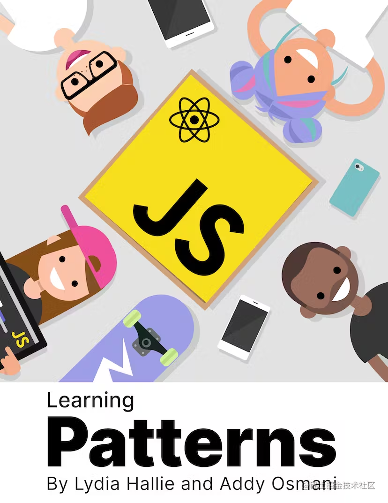

这篇文章中整理了一系列前端开发相关的开源书籍，它们全部都可以**免费**在线阅读，内容质量都非常的高。这些书有中文的也有英文的，大部分的英文资料也都能找到中文翻译的版本。文章中把书籍按照内容划分为 JavaScript、前端工程化、前端框架和面试四个主题，大家可以自行选择感兴趣的主题进行阅读。

## JavaScript

### [You Don't Know JS Yet](https://github.com/getify/You-Dont-Know-JS)

这本书是著名的 JavaScript 书籍 《你不知道的 JavaScript》的第二版，作者是 Kyle Simpson，目前已经出了前四部分。

这本书的宗旨是帮助 JS 开发者深入了解语言的方方面面，从而解决开发中因为语言问题带来的疑难杂症，成为一个更好的 JS 程序员。书中会对 JavaScript 的各方面知识进行深入介绍，包括**作用域、闭包、对象和类、数据类型及其转换、语法细节、异步编程**等等。里面讲到的很多知识点都**经常在面试中出现**，讲解非常清晰，有丰富的代码示例，非常值得一看。

### [Deep JavaScript](https://exploringjs.com/deep-js/toc.html)

这本书同样是深入讲解 JavaScript 语言的一本书籍，相比于 You Don't Know JS Yet，这本书涵盖的主题更加广泛且深入，包括**强制类型转换、解构算法、变量环境、全局变量、对象拷贝、对象更新、不可变数据、对象元编程、正则表达式、Promise 实现、Proxy** 等等。书中很多章节中讲述的知识点都是**面试的常考点**，非常适合用来进阶学习 JavaScript。

### [Javascript Allongé](https://leanpub.com/javascriptallongesix/read#functions)

Javascript Allongé 涵盖了一系列广泛的主题，包括 **JS 语言特性、函数式编程、面向对象编程**等。本书力求重新解读、强化 JavaScript 学习者对语言本质的深入理解。

这本书从 JavaScript 中值（Value）和表达式（Expression）的概念讲起，讨论了类型、相等性、函数、闭包、作用域、集合、迭代器、类、实例等等概念。书中还讲解了如何用 JavaScript 进行面向对象编程和函数式编程，写出更优雅的代码。Javascript Allongé 将教会你如何处理并简化复杂的代码，全方位提升你的代码水平。

### [Functional Light JavaScript](https://github.com/getify/Functional-Light-JS)

这本书和 You Don't Know JS yet 是**同一个作者**。这本书讲解了**函数式编程的核心概念及其在 JavaScript 中的应用**。这本书的与众不同之处在于作者极力避免使用大量晦涩的函数式编程术语，书中介绍了函数式编程基本概念中的一个子集，因此本书的标题是“轻量级函数式编程”。

### [Understanding ECMAScript 6](https://leanpub.com/understandinges6/read/)

这本书的作者是 Nicholas C. Zakas，他是著名的 JavaScript **红宝书前三版的作者**。这本书是他所攥写的 ES6 指南，书中**完整地介绍了 ES6 中的新语言特性**，包括变量绑定、字符串和正则表达式、函数、对象、解构、Symbol、集合（Set）和映射（Map）、迭代器（Iterator）和生成器（Generator）、Class 关键字、数组、Promise、Proxy 和 Reflection、ES Module 等，内容非常丰富，讲解深入浅出。附录中还介绍了 ES7 标准中的内容。

### [ECMAScript 6 入门](https://es6.ruanyifeng.com/)

《ECMAScript 6 入门教程》是一本开源的 JavaScript 语言教程，作者是**阮一峰**。这本书**全面介绍了 ECMAScript 6 新引入的语法特性**，具体的内容可以参考书的目录：

### [Introduction to Design Patterns](https://www.patterns.dev/posts/introduction)

这本书介绍了前端开发中常用的各种 Patterns，包括了**设计模式、渲染模式和性能优化模式**三个大类。每个模式的讲解都配备了完整可运行的代码示例和生动的视频图解，完整讲述了各个模式的概念、使用方法、应用场景和 Tradeoff。在设计模式的讲解中还提供了对应的单元测试代码。

## 前端工程化

### [七天学会 NodeJS](http://nqdeng.github.io/7-days-nodejs/)

这本书出自于阿里巴巴国际站前端技术部，分为 7 个部分（一天一个），分别是：**NodeJS 基础、代码的组织和部署、文件操作、网络操作、进程管理、异步编程、实战示例**。通过学习这本书可以掌握 NodeJS 的常用核心知识。

### [深入理解 TypeScript](https://jkchao.github.io/typescript-book-chinese/)

TypeScript 发展至今，已经成为大型项目的标配，其提供的静态类型系统，大大增强了代码的可读性以及可维护性；同时，它提供最新和不断发展的 JavaScript 特性，能让我们建立更健壮的组件。

[TypeScript Deep Dive](https://github.com/basarat/typescript-book/) 是一本很好的开源书，从基础到深入，全面地阐述了 TypeScript 的各种魔法，包括 **TS 项目的构建、TS 类型和基本语法、TS 编译原理以及性能优化方法**等等。不管你是新手还是老鸟都可以阅读。此外，它不同于 TypeScript 官方给出的文档（当然 TypeScript 给出的文档是很好的），在此书中，结合实际应用下的场景用例，你将能更深入的理解 TypeScript。本书是 TypeScript Deep Dive 的中文版。

### [深入浅出 Webpack](https://webpack.wuhaolin.cn/)

Web 应用日益复杂，相关开发技术也百花齐放，这对前端构建工具提出了更高的要求。 Webpack 从众多构建工具中脱颖而出成为目前最流行的构建工具，几乎成为目前前端开发里的必备工具之一， 因此每位紧跟时代的前端工程师都应该掌握 Webpack。

这本书的作者是[吴浩麟](https://github.com/gwuhaolin)。本书从实践出发，用简单易懂的例子带你快速入门 Webpack，再结合实际工作中常用的场景给出最佳实战，通过前 3 章的学习足以让你解决工作中的常见问题； 本书还介绍了如何优化构建的速度和输出，并解析了 Webpack 的工作原理，以及 Plugin 和 Loader 的编写方法，可帮助你进一步学习 Webpack。 本书按照**入门、配置、实战、优化和原理**的路线层层深入，涵盖了 Webpack 的方方面面。

书中每一小节都会提供与之对应的完整项目代码，在每节的最后会有下载链接，它们都是可以正常运行的，并且有详细的注释。

## 前端框架

### [React 技术揭秘](https://react.iamkasong.com/)

这本书的作者是魔术师卡颂，其宗旨是打造一本严谨、易懂的 **React 源码分析教程**。本书从理念、架构到实现循序渐进地分析了 React 的源码，每一章都提供了可运行的 demo。书中所有观点来自 React 核心团队成员在公开场合的分享，并且包含了丰富的参考资料 —— 包括在线 Demo、文章、视频。

### [深入理解 Vue.js 实战](https://godbasin.github.io/vue-ebook/)

这本书全面了介绍 Vue.js 框架的**相关历史、设计原理和使用方法**，结合实战让读者更深入理解 Vue.js 框架，掌握其使用方法。

## 面试

### [web 前端面试 - 面试官系列](https://vue3js.cn/interview/)

这本书是由“JS 每日一题”社群维护的前端面试题库，包含但不限于 Vue 面试题，React 面试题，JS 面试题，HTTP 面试题，工程化面试题，CSS 面试题，算法面试题。其内容基本上**涵盖了常见的面试问题**，问题的解答质量也非常不错，并且提供了丰富的参考文献，很适合用来进行八股文复习。

### [代码随想录](https://programmercarl.com/)

这本书是由[程序员 Carl](https://github.com/youngyangyang04)整理的一份 **Leetcode 刷题攻略**，遵循循序渐进的原则，其中的题目基本上都是经典题目高频面试题，每道题目都有详细的题解（图文并茂，难点配有视频）。现在还有配套的[算法公开课](https://space.bilibili.com/525438321/channel/collectiondetail?sid=180037)可以观看，由作者本人亲自讲解。算法面试的复习可以参考这本书来进行。

（本文作者 wzkMaster）
