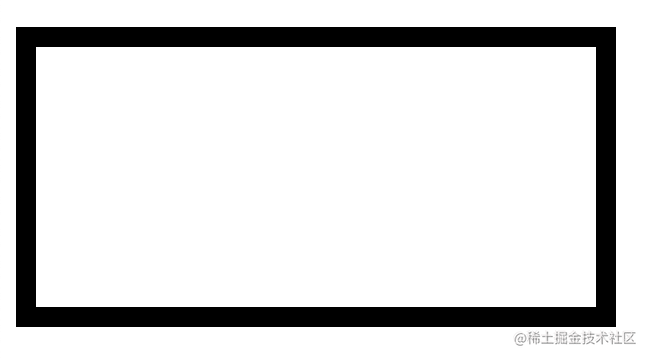
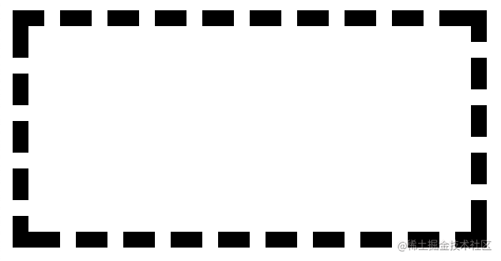
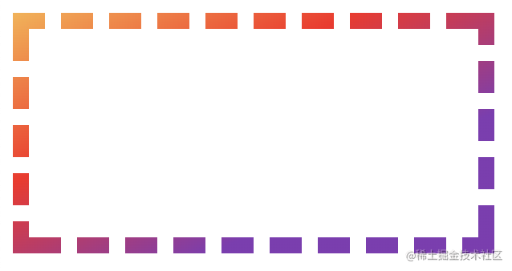
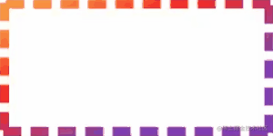

现代网页设计中常常会涉及到渐变边框的使用，CSS 的`border-image` 属性也提供了渐变色边框的支持，我们可以在其中传入一个 `linear-gradient` 函数来实现渐变效果。
但是这个属性是不能和虚线效果或者圆角效果等同时存在的，这就给我们带来了很大的限制。例如想要实现封面中**那样的虚线 + 渐变 + 动画**的效果，我们就得寻找别的方法。

> 你将学到的
>
> 1. SVG 矩形绘制
> 2. SVG 颜色渐变
> 3. SVG 动画

## 用 SVG 实现虚线渐变边框

我们可以利用 SVG 来绘制边框的样式，然后把 SVG 图片作为元素的背景图进行加载。

### SVG 矩形绘制

SVG 是一套声明式的绘图系统，和 HTML 标签类似，我们想绘制什么图形就用相应的标签，再通过标签的属性进行图像样式的控制。绘制一个矩形的 SVG 代码如下所示：

```html
<svg>
  <rect
    width="100%"
    height="100%"
    style="
		fill: none;
		stroke: black;
		stroke-width: 20px;
	"
  ></rect>
</svg>
```



把这段代码放在 HTML 中，就可以在屏幕上画出一个矩形。我们把`width`和`height`都设为 100%，也就是填满浏览器提供的容器。这里的`style`属性里面其实就是 CSS 代码，SVG 也是可以通过 CSS 控制的，其中除了可以使用常规的 CSS 属性之外，还有有一些 SVG 特有的属性，例如这里用到的三个属性。`fill`用于设置图形填充的样式，类似于`canvas`的`fillStyle`，这里我们设置为 `none`，也就相当于绘制一个空心的矩形。`stroke`用于设置边框颜色，`stroke-width`用于设置边框粗细。
如果要把边框变成虚线也很简单，只需要在`style`中加上这一句

```css
stroke-dasharray: 20px 10px;
```



可以看到我们的矩形边框变成了虚线。`stroke-dasharray`的两个参数分别表示**短划线的长度和间隔的大小**。我们也可以通过提供若干对的短划线和间隔长度来绘制不均衡的虚线，更多信息可以参考[MDN 的文档](https://developer.mozilla.org/zh-CN/docs/Web/SVG/Attribute/stroke-dasharray)。

### SVG 渐变

目前我们已经完成了虚线效果，那么要怎么实现渐变的边框颜色呢？与 CSS 中的渐变类似，我们需要先声明一个 `linear-gradient` 节点，再将其应用于边框的颜色上。具体的代码如下：

```html
<linearGradient id="gradient">
  <stop stop-color="#fcb045"></stop>
  <stop stop-color="#fd1d1d" offset="0.5"></stop>
  <stop stop-color="#833ab4" offset="1"></stop>
</linearGradient>
```

这个节点的效果相当于 CSS 中的 `linear-gradient(#fcb045 0%, #fd1d1d 50%, #833ab4 100%);`。也就是说我们的渐变起点颜色为`#fcb045`，50%处的颜色为`#fd1d1d`，渐变终点的颜色为`#833ab4`。我们给这个节点设置了一个`id`，用于后续在`stroke`属性中进行引用。

```css
stroke: url(#gradient);
```

把我们刚才的矩形的`stroke`改为 `#gradient` 节点的引用，可以看到我们的边框已经变成了渐变色。



### SVG 动画

给 SVG 添加动画非常的简单，因为 SVG 是可以直接被 CSS 控制的，所以我们只需要用 CSS animation 来改变 SVG 元素相应的属性就可以了。具体要改变的是 `stroke-dashoffset` 这个属性。我们将它的值设为`10px`来看看效果。

```css
stroke-dashoffset: 10px;
```


可以看到边框的形状变得不一样了，因为该属性使得整个边框的虚线移动了 `10px`。所以我们只要通过一个 CSS 动画来不断改变`stroke-dashoffset`就可以实现边框旋转的效果了。

```css
@keyframes border-animate {
  to {
    stroke-dashoffset: 30px;
  }
}

/* rect.style */
animation: border-animate 1s linear infinite;
```

这里我们把动画函数设置为 `linear` ，因为默认的 `ease` 函数会让边框的滚动变得不均匀。通过设置 `infinite` 来让动画持续进行。动画的最终效果设置为 `stroke-dashoffset: 30px`，是因为`30px`的效果刚好和`0px`是一样的（后一条短划线刚好走到前一条短划线的位置），这样可以保证动画的连贯性。最终效果如下图所示：



我们再调整一下边框的样式来让它更符合设计图的要求，最后在需要这个边框的元素上将`background`设置为这个 SVG 图片就大功告成啦！最终的完整代码如下：

```html
<!-- index.html -->
<div class="banner">
  <p>渐变</p>
  <p>边框</p>
</div>
```

```css
/* style.css */
.banner {
  background: url("./border.svg");

  width: 300px;
  height: 200px;
  display: flex;
  align-items: center;
  justify-content: center;
  flex-direction: column;
}

p {
  font-weight: bolder;
  font-size: 400%;
  margin: 0;
  line-height: 95%;
}

p:first-child {
  color: #d63c45;
}

p:last-child {
  color: #833ab4;
}
```

```html
<!-- border.svg -->
<svg xmlns="http://www.w3.org/2000/svg">
  <style>
    @keyframes border-animate {
      to {
        stroke-dashoffset: calc(var(--stroke) * 2.75);
      }
    }
  </style>
  <linearGradient id="gradient" gradientTransform="rotate(45)">
    <stop stop-color="#fcb045"></stop>
    <stop stop-color="#fd1d1d" offset="0.5"></stop>
    <stop stop-color="#833ab4" offset="1"></stop>
  </linearGradient>
  <rect
    width="100%"
    height="100%"
    style=" 
            --stroke: 35px;
            stroke: url(#gradient); 
            stroke-width: var(--stroke); 
            fill: none; 
            stroke-dasharray: calc(var(--stroke) * 2) calc(var(--stroke) * 0.75);
            animation: border-animate 1s infinite linear;
        "
  />
</svg>
```

代码的运行效果如图所示：


## 总结

相比于其他常见的使用 `background + linear-gradient` 和直接放图片的方法，用 SVG 来进行边框绘制主要有两个优势：

1. SVG 标签的结构和 HTML 很相似，属于声明式的绘图系统，只要了解 HTML 可以很轻松地掌握和修改。使用 SVG 可以很方便直观地实现虚线和渐变的效果。而直接放图片的修改成本就比较高了，需要进行图片的替换，可能还需要设计师的参与，这就降低了开发效率。如果用 `background + linear-gradient` 这种比较 hack 的方法，则可读性比较差，维护起来也很不方便。
2. SVG 可以直接和 CSS 交互，所以我们可以利用 CSS 动画来修改 SVG 的属性，实现动画的效果。也可以根据实际需要很方便地修改动画的属性，从而控制边框转动的频率、方向等等。
