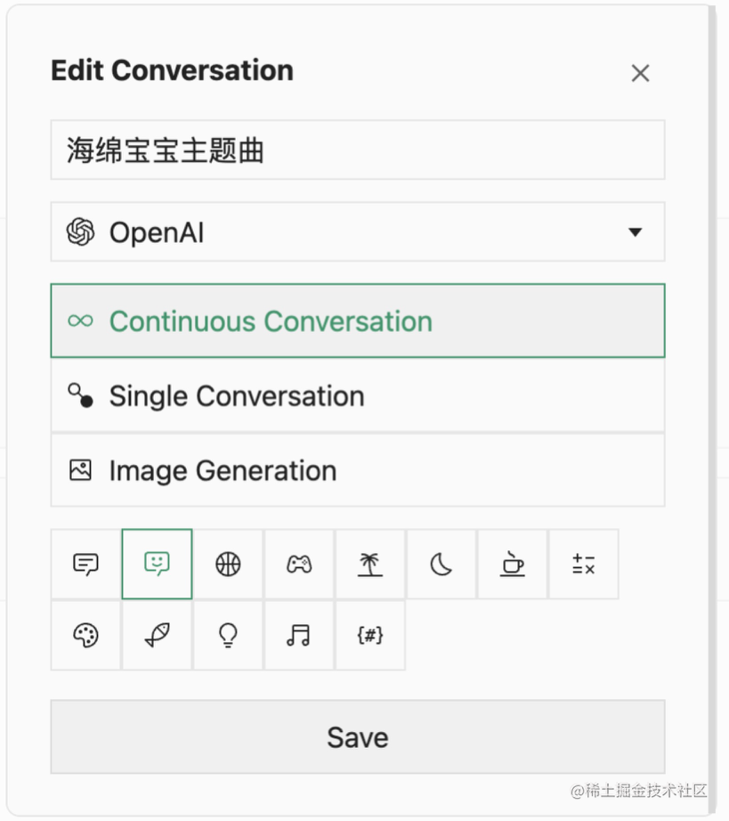
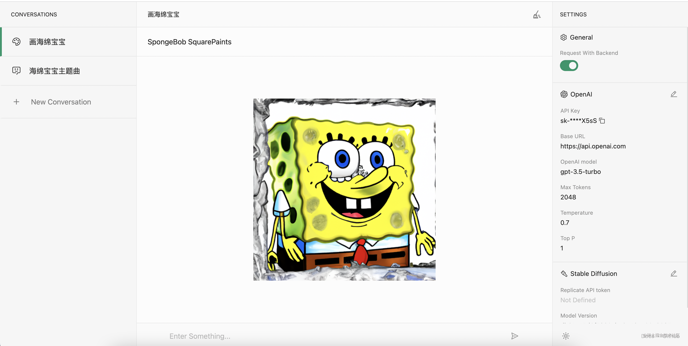
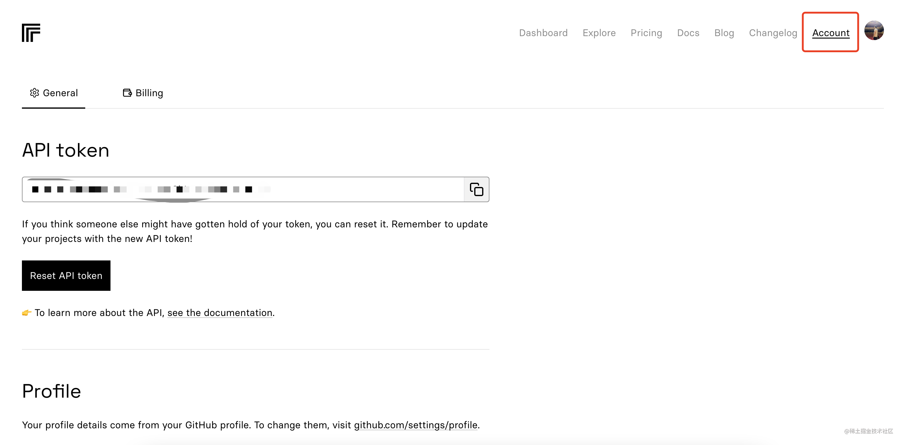
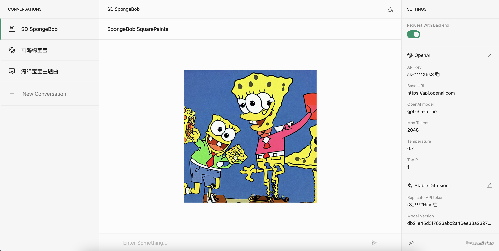
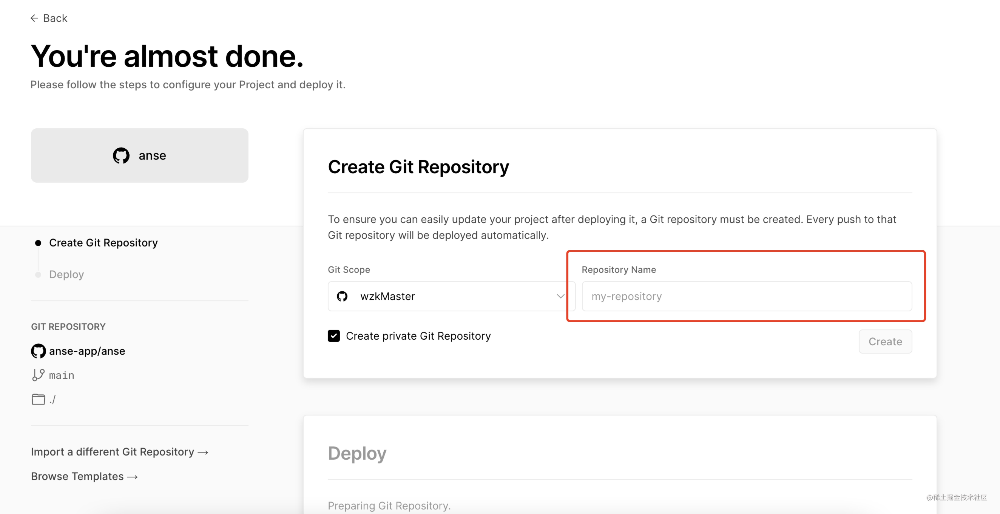
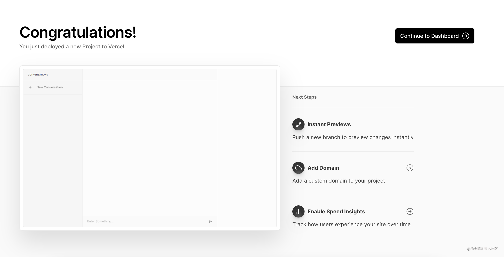

现在许多人的工作生活里可能都离不开 ChatGPT 了。简单的翻译、文本生成、代码编写的任务都可以让它辅助完成，这样我们能够把精力放在更具有创造力的事情上。

但是，由于 OpenAI 对于中国区 IP 的限制，我们想要访问 ChatGPT 官方网站很不方便。一种解决方法是第三方客户端，例如 [Poe](https://juejin.cn/post/7216644653126811709)。但这类第三方客户端相对来说没有那么好用，首先是它们通常不支持多个会话历史的保存，所以查找起来很不方便。同时，因为只有一个会话历史，所以隔一段时间对话的上下文就会被清除，想要恢复上下文只能从头问起。另外一种解决方法是自己部署一个客户端，利用 OpenAI 的 API 来使用 ChatGPT，这样就不会受到 IP 封锁的影响。

本文正是要介绍一个非常好用的 ChatGPT 客户端，它的**交互和 ChatGPT 的官方网页非常接近**，但**响应速度快**很多。不仅支持会话记录的保存和命名，而且还提供了参数配置和 AI 绘画模型调用的功能。同时这个客户端的代码是**开源**的，所以我们可以把它 clone 到本地自己部署，本文将讲解部署到 Vercel 的方法。

## 客户端介绍

这个客户端名字叫做 [anse](https://github.com/anse-app/anse)，它是由一个之前[非常火的 ChatGPT 客户端](https://github.com/anse-app/chatgpt-demo)升级而来，大家可以[在线预览](https://anse.app/)体验一下。需要在右侧填写你的 OpenAI 密钥才能体验聊天和 OpenAI 的图像生成功能，密钥的申请掘金上有很多教程，大家需要的话可以自行搜索一下。如果想要体验 Stable Diffusion，需要申请 Replicate 的 API 密钥，[下文](#使用stable-diffusion)将会介绍申请的方法。

填写了 OpenAI 的密钥之后，就可以使用绘画和聊天的功能了。可以新建一个对话或者直接提问，我们点击 “New Conversation” 新建一个对话，并在弹窗中设定对话的名字和图标，然后就可以开始聊天了。

如果不设定对话的名字，应用也会根据你第一个问题来自动设置对话的名称，跟 ChatGPT 的网页是一致的。聊天时我在没有使用魔法的情况下也可以得到**非常迅速的响应**，可以说是非常优秀了（如果没有开魔法的话记得要把 “Request With Backend” 选项开启，否则会得不到响应）。

我们再试一下绘画功能，在弹窗中选择 “Image Generation” 然后新建对话即可。该功能调用的是 OpenAI 的 DALLE 模型。

### 使用 Stable Diffusion

我们还可以点击下拉框把 “OpenAI” 换成 “Stable Diffusion” 来利用 Stable Diffusion 模型进行图像生成。首先要到[Replicate](https://replicate.com/)的官方网站注册一个账号（用 Github 账号就可以注册），然后点击 Tab 栏里的 “Account”，在这里可以看到自己的 API Token。把这个 API Token 填到右下方 Stable Diffusion 的设置中就可以了。

填写完 Token 之后，我们来新建一个 Stable Diffusion 的对话。

我们同样让它画一个海绵宝宝试试，感觉质量不如 DALLE。

## 部署教程

因为 anse 是一个开源项目，所以我们也可以把它 clone 下来然后根据自己的需要做一些修改，再重新部署。例如我想要给自己的亲朋好友提供一个方便访问的 ChatGPT 客户端，我就把 anse 做了汉化处理，并且把设置面板去掉了，改成使用我自己写死的 API Key。然后我把修改后的项目部署到了 Vercel 上面，并且绑定了一个国内可以访问的域名，这样就可以提供给他们使用了。

关于代码的修改，大家可以自行根据需要对项目代码进行修改，我这里就不做讲解了。

重点讲一下部署的方法，原作者非常贴心地提供了多种部署的方法，把配置文件都帮我们写好了。可以一键部署到 Netlify，Vercel，Railway 等平台，也可以利用 Docker 快速地部署到自己的服务器上。接下来给大家讲解我个人认为最方便的部署到 Vercel 的方法，如果想要使用其他的部署途径，可以自行参考项目的 README，里面写的非常清楚。

首先，打开[anse 的仓库主页](https://github.com/anse-app/anse#deploy-with-vercel)，在 README 的 “Deploy With Vercel” 一节中，有一个 “Deploy” 按钮（真.一键部署），点击它，会跳转到如下的页面。

这个页面将会做两件事，首先是给你的 Github 账户创建一个新的仓库，然后把 anse 克隆到这个仓库中。在 Repository Name 中填入你想要的仓库名称，并选择是否要创建为私人仓库，填写完成后点击 “Create” 即可。第二件事是把创建好的仓库中的代码通过 Vercel 进行部署，这一步会在仓库克隆完成之后自动进行。

大概三十秒之后，页面部署就完成了，网页会跳转到这样一个页面。

点击 “Continue To Dashboard”，可以看到网站的基本信息，包括域名、当前部署的分支和 commit 等。点击 “Visit” 或者域名中的某一个就可以访问网站了。

如果想对客户端进行进一步修改，则需要把刚刚创建的那个仓库 clone 到本地，修改后 push 到主分支，Vercel 就会自动帮你把改动后的代码重新部署了。如果想要绑定其他域名，就到 Settings 中选择 Domain，把想要绑定的域名添加到列表中，按照指引进行操作即可。

## 总结

本文给大家介绍了一个开源的 ChatGPT+AI 绘画客户端。大家可以[在线预览](https://anse.app/)或者 clone 下来自己魔改后部署。相较于 ChatGPT 的官方网站和其他第三方网站，该客户端具有如下优点：

- 只需要有 OpenAI 的 API Key 就可以使用，不需要科学上网，响应速度非常之快。
- 相比于其他第三方客户端，交互与 ChatGPT 官方网站更加接近，支持多个会话历史的保存和命名。
- 支持调用 OpenAI 的 DALLE 及 Replicate 的 Stable Diffusion 模型进行 AI 绘画，一站式体验新一代人工智能。
- 提供了方便的一键部署的方法，可以自己修改之后进行部署。
