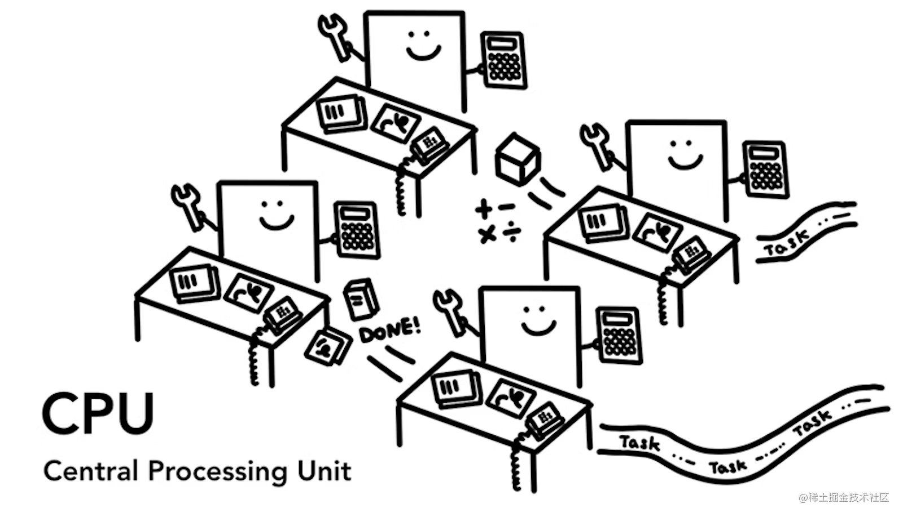
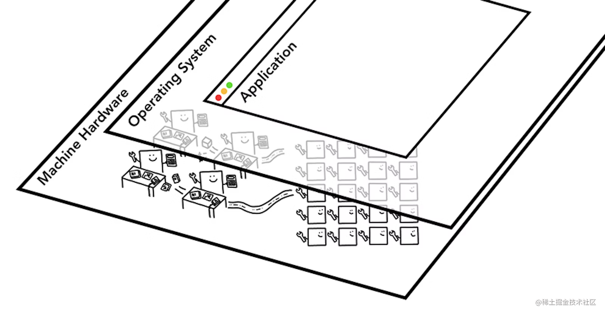
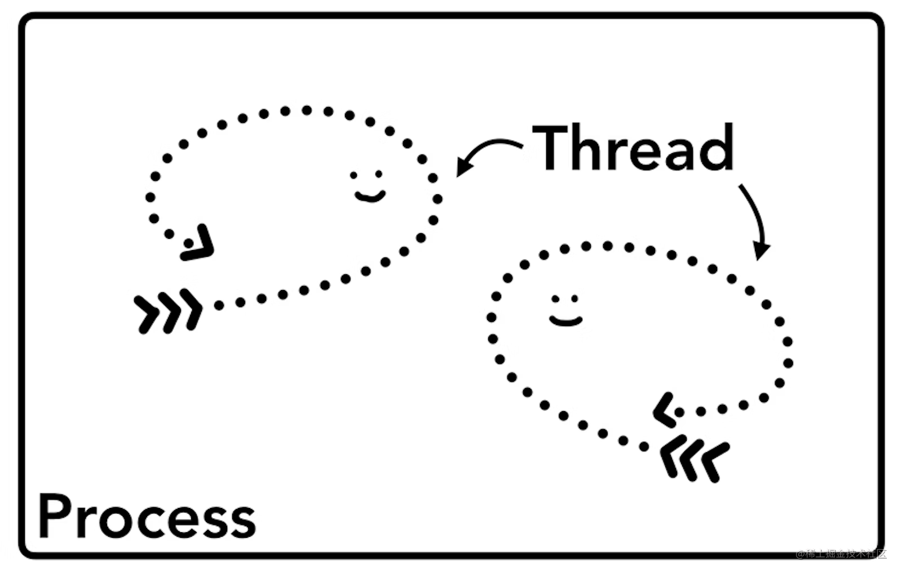
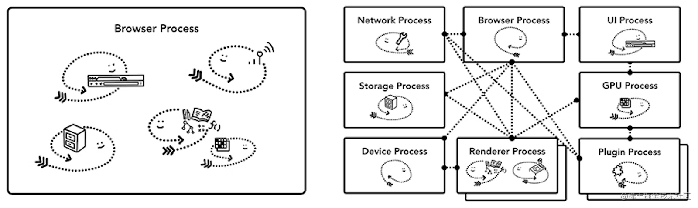
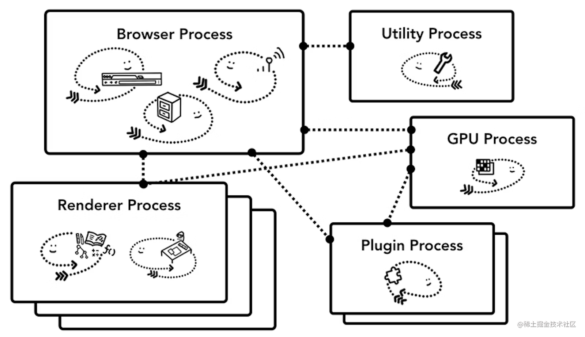
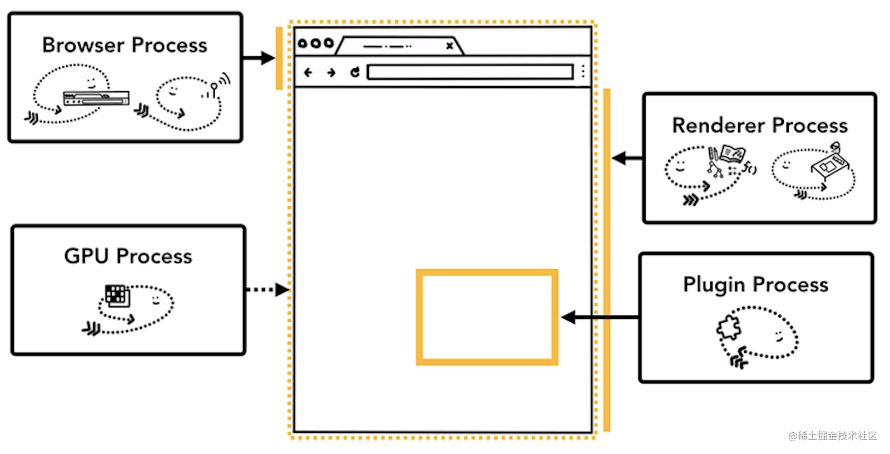
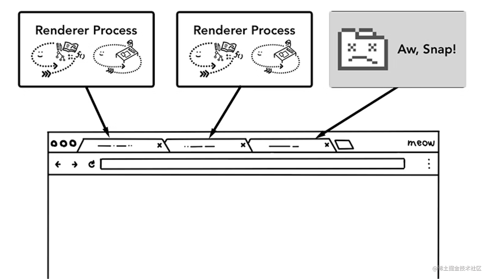
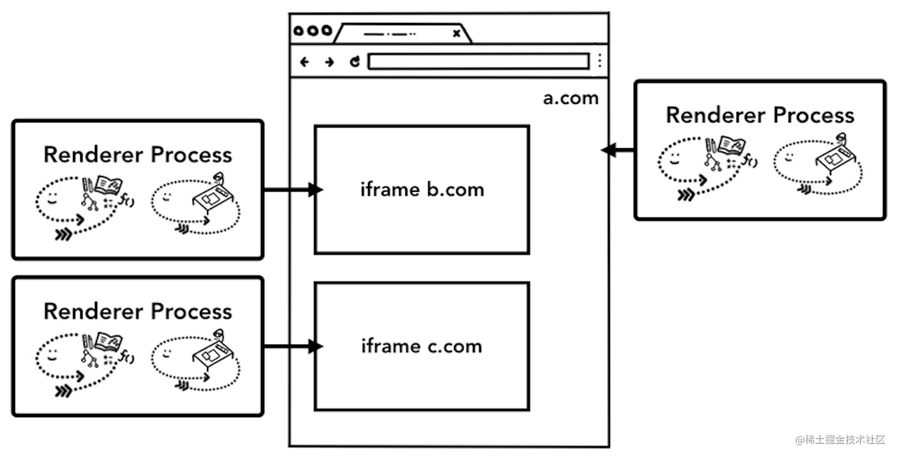

> 原文链接: <https://developer.chrome.com/blog/inside-browser-part1>
>
> 原文作者：[Mariko Kosaka](https://developer.chrome.com/authors/kosamari/)

> 本文是现代浏览器原理系列博客的第 1 篇。在这个由 4 篇文章组成的博客系列中，我们将深入了解 Chrome 浏览器，从总体的架构概览到渲染流水线的具体细节，包括页面导航、渲染、合成的具体流程。如果你想知道浏览器是如何将你的代码转化为一个能够运行的网站的，或者你想了解某些性能优化技巧背后的原理，那么本系列文章就是为你量身打造的。
>
> - [现代浏览器原理（1）- Chrome 浏览器架构概览](https://juejin.cn/post/7269070543882027043)
> - [现代浏览器原理（2）- 网页导航流程](https://juejin.cn/post/7269225865619636259)
> - [现代浏览器原理（3）- 渲染流水线](https://juejin.cn/post/7269385060611047439)
> - [现代浏览器原理（4）- 处理用户输入](https://juejin.cn/post/7269321562683408399)

## CPU, GPU, 内存和多进程架构

这篇文章中，我们将介绍相关的计算机术语和 Chrome 浏览器的多进程架构。

> 如果你对 CPU/GPU 以及进程/线程的概念已经非常熟悉了，可以直接跳到“浏览器架构”章节开始阅读。

### 计算机的核心是 CPU 和 GPU

要了解浏览器运行的环境，我们首先得了解计算机的几个重要部分以及它们的工作内容。

#### CPU

首先是 CPU（**C**entral **P**rocessing **U**nit - 中央处理单元）。可以认为 CPU 是计算机的大脑。一个 CPU 的核，也就是图中的一个办公室职员，可以一个接一个的处理不同类型的任务。它能够处理从数学到艺术的一切问题，同时知道如何回复客户的电话。过去，大多数 CPU 都是单芯片，每个 CPU 只有一个内核。而在现代 CPU 中，通常会有一个以上的内核，从而为手机和笔记本电脑提供更强的计算能力。

### GPU

GPU（**G**raphic **P**rocessing **U**nit - 图形处理单元）是计算机的另一个重要部分。与 CPU 不同，GPU 只能处理简单的任务，但它可以同时跨多个内核工作。顾名思义，它最初是为处理图形而开发的。这就是为什么在图形学中，“使用 GPU ”或“GPU 支持”与快速渲染和流畅交互有关。近年来，随着 GPU 加速计算的发展，越来越多的计算仅靠 GPU 就能实现。

当你在电脑或手机上启动应用程序时，CPU 和 GPU 为应用程序提供动力。通常，应用程序通过操作系统提供的能力在 CPU 和 GPU 上运行。

### 通过进程和线程运行程序

在深入研究浏览器架构之前，还需要掌握两个概念，那就是进程（Process）和线程（Thread）。进程可以负责一个应用程序的执行。线程是进程的一部分，负责执行其进程程序的某部分功能。

当你启动一个应用时，就会创建一个进程。程序可能会创建多个线程来帮助它工作，但这是可选的。操作系统会为进程提供一个内存空间，应用程序的所有数据都保存在这个私有内存空间中。关闭程序时，进程也会消失，操作系统会释放对应的内存空间。

一个进程可以要求操作系统启动另一个进程来运行不同的任务。此时，一个新的内存空间将分配给新进程。如果两个进程需要对话，它们可以通过使用 IPC（Inter Process Communication - 进程间通信）来实现。许多应用程序都是这样设计的，这样如果一个工作进程没有响应，就可以直接重新启动它，而无需停止运行应用程序不同部分的其他进程，避免整个应用卡死。

## 浏览器架构

那么，浏览器是如何使用进程和线程构建的呢？答案可以是通过一个进程，进程中包含多个不同的线程；也可以是多个不同的进程，每个进程包含若干个线程，进程之间通过 IPC 进行通信。

这里需要注意的是，这些不同的架构都是实现细节。目前并没有关于如何构建浏览器的标准规范，一个浏览器的实现可能与另一个完全不同。

在本系列博客中，我们将使用下图中描述的 Chrome 浏览器最新架构进行讲解。

位于顶层的是浏览器进程，它与负责应用程序不同部分的其他进程相互配合。每个标签页都会有自己独立的渲染进程。之前，Chrome 浏览器会在可能的情况下为每个标签页分配一个进程；现在，它会尝试为每个网站（包括 iframe）分配一个进程（参考[网站隔离](https://developer.chrome.com/blog/inside-browser-part1/#site-isolation)）。

### 不同进程的职责

| 进程名称   | 进程职责                                                                                                                   |
| ---------- | -------------------------------------------------------------------------------------------------------------------------- |
| 浏览器进程 | 控制浏览器本身的 UI，包括地址栏、书签、后退和前进按钮。处理网络浏览器中不可见的高级功能，如网络请求和文件访问。            |
| 渲染进程   | 控制显示网页内的任何内容。                                                                                                 |
| 插件进程   | 控制网站使用的所有插件，例如 Flash。                                                                                       |
| GPU 进程   | 处理与其他进程隔离的 GPU 任务。它会被分割为不同的进程，因为 GPU 会同时处理来自多个应用程序的请求，并在同一屏幕上绘制它们。 |

还有许多其他的进程，如扩展进程和实用程序进程。如果你想查看 Chrome 浏览器中正在运行的进程数量，请单击右上角的菜单图标，选择 "更多工具"，然后选择 "任务管理器"。这将打开一个窗口，其中包含当前正在运行的进程列表以及它们正在使用的 CPU/内存数量。

### 浏览器多进程架构的优势

前面我提到 Chrome 浏览器使用了多个渲染进程。在最简单的情况下，你可以想象每个标签页都有自己的渲染进程。假设你打开了 3 个标签页，每个标签页都由一个独立的渲染进程进行渲染。如果有一个标签页没有响应，那么你可以关闭没有响应的标签页，然后继续使用其他标签页。如果所有标签页都在一个进程上运行，当一个标签页无响应时，所有标签页都会无响应，这就很糟糕了。

将浏览器的工作分离成多个进程的另一个好处是安全性和沙箱。由于操作系统提供了限制进程权限的方法，因此浏览器可以对某些进程进行沙箱化，阻止其使用某些功能。例如，Chrome 浏览器会限制处理任意用户输入的进程（如渲染进程）的文件访问权限。

由于进程拥有自己的内存空间，因此它们通常各自保存了通用基础软件的副本（如 Chrome 浏览器的 JavaScript 引擎 V8）。这意味着内存使用量会增加，因为它们无法像同一进程内的线程那样共享。为了节省内存，Chrome 浏览器会限制进程的数量。该限制根据设备的内存和 CPU 容量而有所不同，但当 Chrome 浏览器达到限制时，它就会开始在一个进程中运行来自同一网站的多个标签页。

### 节省更多内存 - Chrome 的服务化

同样的方法也适用于浏览器进程。Chrome 浏览器正在进行架构调整，以便将浏览器程序的每个部分作为服务运行，从而可以轻松地将它们拆分为不同的进程或合并为一个进程。

总体思路是，当 Chrome 浏览器运行在强大的硬件上时，它可能会将每个服务拆分成不同的进程，以提高稳定性；但如果运行在资源有限的设备上，Chrome 浏览器就会将服务整合到一个进程中，以节省内存占用。类似的合并进程以减少内存使用量的方法，在之前已经在安卓等平台上使用过。

### 每个网站一个渲染进程 - 网站隔离

[站点隔离（Site Isolation）](https://developers.google.com//web/updates/2018/07/site-isolation)是 Chrome 浏览器最近推出的一项功能，可为每个跨站 iframe 运行单独的渲染进程。我们刚刚一直在讨论每个标签页一个渲染进程的模式，这种模式允许跨站 iframe 在一个渲染进程中运行，不同的网站共享内存空间。在同一个渲染进程中运行 a.com 和 b.com 看起来似乎没什么问题。然而，同源策略是网络的核心安全策略；它确保一个网站在未经同意的情况下不能访问其他网站的数据，绕过这一策略是安全攻击的主要目标。进程隔离是分离网站的最有效方法，随着 [Meltdown 和 Spectre 漏洞](https://developers.google.com/web/updates/2018/02/meltdown-spectre)的出现，我们更需要使用进程来隔离网站。自 Chrome 67 默认在桌面电脑上启用 "网站隔离 "后，网页中的每个跨站 iframe 都会有一个独立的渲染进程。

实现“网站隔离”是一项耗时多年的工程。网站隔离不止是分配不同的渲染进程那么简单，它从根本上改变了 iframe 之间的对话方式。设想在包含了不同进程的 iframe 的页面上使用开发者工具，它必须执行额外的幕后工作，才能看起来天衣无缝。即使是运行一个简单的 Ctrl+F 在页面中查找单词，也需要在不同的渲染进程中进行搜索。这就是为什么浏览器工程师们将 "网站隔离"功能的发布视为一个重要的里程碑！

## 总结

在这篇文章中，我们介绍了浏览器的总体架构，并介绍了多进程架构的优势。我们还介绍了 Chrome 浏览器中与多进程架构密切相关的服务化和站点隔离。在[下一篇文章](https://juejin.cn/post/7269225865619636259)中，我们将开始深入探讨这些进程和线程之间为显示网站所做的事情。
