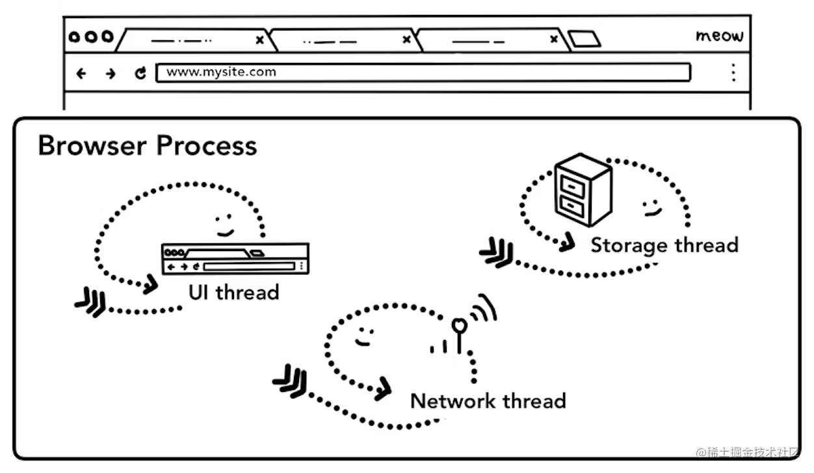
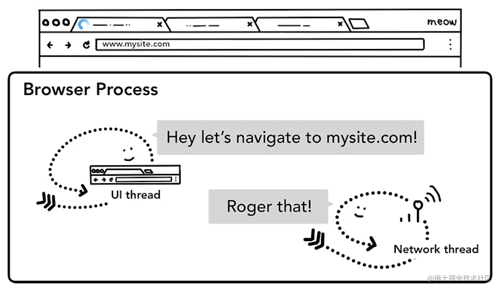
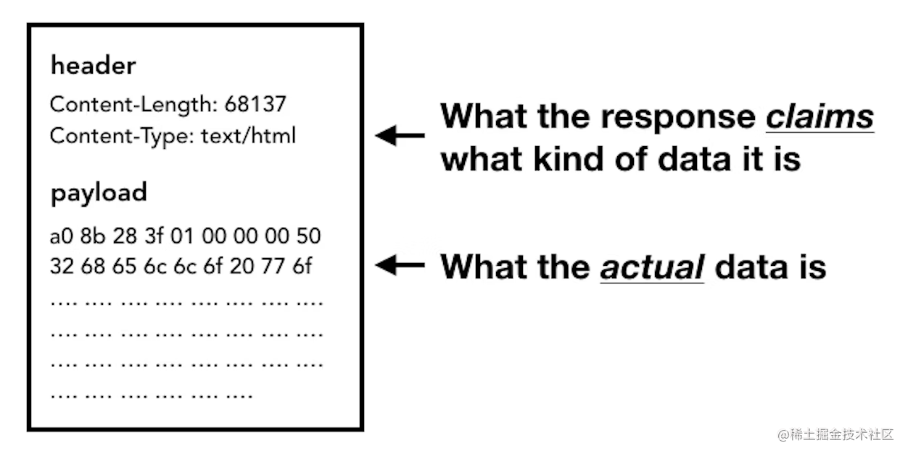
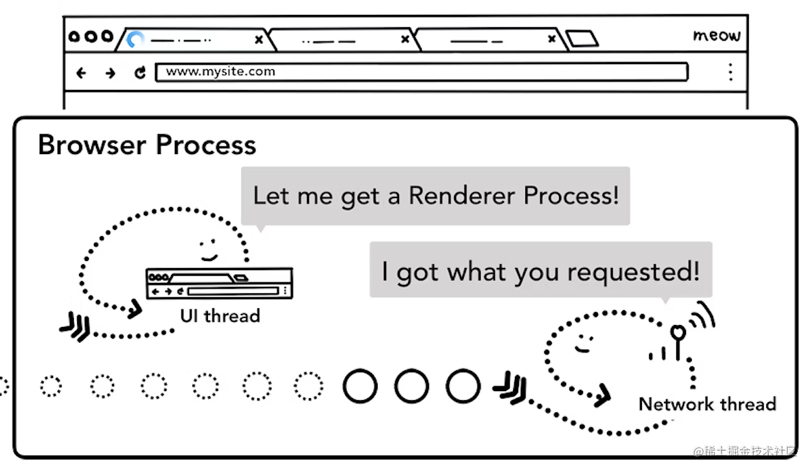
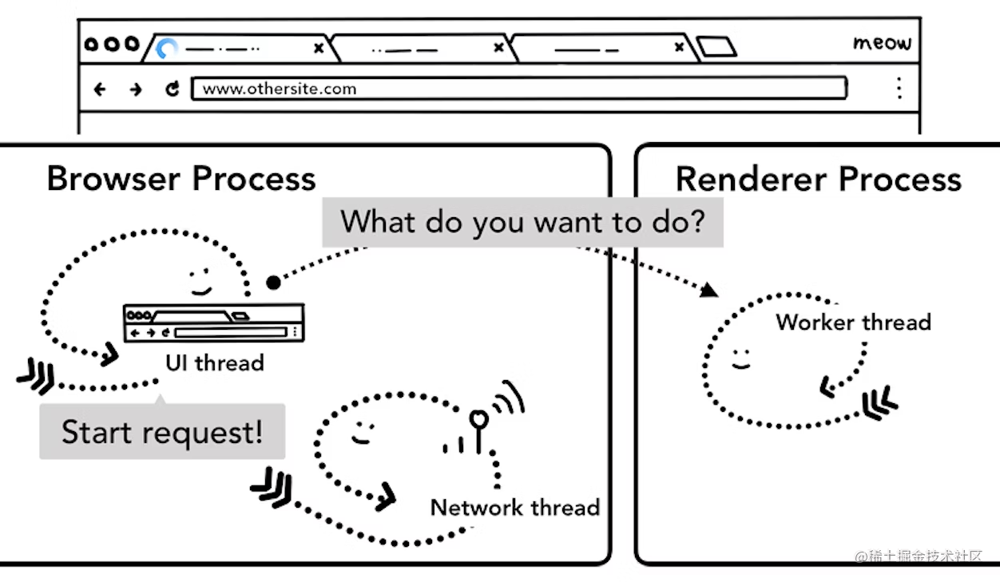

> 原文链接: <https://developer.chrome.com/blog/inside-browser-part2>
>
> 原文作者：[Mariko Kosaka](https://developer.chrome.com/authors/kosamari/)

> 本文是现代浏览器原理系列博客的第 2 篇。在这个由 4 篇文章组成的博客系列中，我们将深入了解 Chrome 浏览器，从总体的架构概览到渲染流水线的具体细节，包括页面导航、渲染、合成的具体流程。如果你想知道浏览器是如何将你的代码转化为一个能够运行的网站的，或者你想了解某些性能优化技巧背后的原理，那么本系列文章就是为你量身打造的。
>
> - [现代浏览器原理（1）- Chrome 浏览器架构概览](https://juejin.cn/post/7269070543882027043)
> - [现代浏览器原理（2）- 网页导航流程](https://juejin.cn/post/7269225865619636259)
> - [现代浏览器原理（3）- 渲染流水线](https://juejin.cn/post/7269385060611047439)
> - [现代浏览器原理（4）- 处理用户输入](https://juejin.cn/post/7269321562683408399)

## 导航过程中发生了什么

在[上一篇文章](https://juejin.cn/post/7269070543882027043)中，我们了解了不同进程和线程如何负责浏览器不同部分的工作。在本篇文章中，我们将深入探讨各个进程和线程是如何通信以显示网站的。 我们以一个简单的网络浏览流程为例：用户在浏览器中输入一个 URL，然后浏览器从互联网上获取数据并显示页面。在本篇文章中，我们将重点讨论这个流程中**用户请求网站**和**浏览器准备呈现页面（也称为导航 - Navigation）** 的部分。

## 从浏览器进程开始

正如我们在[第一篇文章](https://juejin.cn/post/7269070543882027043)中所介绍的，网页之外的一切都由浏览器进程处理。浏览器进程有多个线程，如绘制浏览器按钮和输入框的 UI 线程、处理网络堆栈以接收互联网数据的网络线程、控制文件访问的存储线程等。当你在地址栏中输入 URL 时，浏览器进程的 UI 线程会处理你的输入。

## 导航流程

### 第一步：处理输入

当用户开始在地址栏中输入时，UI 线程首先会问：“这是搜索查询还是 URL？”。在 Chrome 浏览器中，地址栏也是搜索框，因此 UI 线程需要对输入进行解析，并决定是将你带到搜索引擎还是你请求的网站。

### 第二步：开始导航

当用户按下回车键时，UI 线程会进行网络调用以获取网站内容。标签页会显示“加载中”图标，网络线程会执行相应的协议，如 DNS 查找和为请求建立 TLS 连接。

此时，网络线程可能会收到像 HTTP 301 这样的重定向状态码。在这种情况下，网络线程会与 UI 线程通信，告知服务器正在请求重定向，然后启动另一个 URL 请求。

### 第三步：读取响应

随着响应体（payload）开始输入，网络线程会查看数据流的前几个字节。响应的 Content-Type 头部应当说明响应的数据类型，但由于它可能缺失或出错，因此在这里进行 [MIME 类型嗅探](https://developer.mozilla.org/docs/Web/HTTP/Basics_of_HTTP/MIME_types)。正如引擎[源代码中的注释](https://cs.chromium.org/chromium/src/net/base/mime_sniffer.cc?sq=package:chromium&dr=CS&l=5)所言，这是一项 "棘手的工作"。感兴趣的话，你可以阅读注释，了解不同浏览器如何处理 Content-Type 和 payload 的关系。

如果响应是 HTML 文件，那么下一步就是将数据传递给渲染进程，但如果是压缩文件或其他文件，则意味着这是一个下载请求，数据将被传递给下载管理器。

这时还会进行[安全浏览检查](https://safebrowsing.google.com/)。如果网站域名和响应数据与已知的恶意网站相匹配，网络线程就会发出警报，显示警告页面。此外，还会进行[跨源读取阻塞（Cross Origin Read Blocking, CORB）](https://www.chromium.org/Home/chromium-security/corb-for-developers)检查，以确保敏感的跨站点数据不会进入渲染进程。

### 第四步：查找渲染进程

完成所有检查后，网络线程确认浏览器可以导航到请求的网站，告诉 UI 线程数据已准备就绪。然后，UI 线程会找到一个渲染进程，继续呈现网页。

由于网络请求可能需要几百毫秒才能得到响应，因此可以进行优化以加快这一过程。当 UI 线程在第 2 步向网络线程发送 URL 请求时，它已经知道将要导航到哪个网站，此时 UI 线程会尝试主动查找或启动一个与网络请求并行的渲染进程。这样，如果一切按预期进行，当网络线程收到数据时，渲染进程已经处于待机状态。如果导航跨站重定向，这个备用进程可能不会被使用，在这种情况下需要启动另一个进程。

### 第五步：提交导航

现在数据和渲染进程都已准备就绪，浏览器进程会向渲染进程发送 IPC 消息，以提交导航。同时，它还会传递 HTML 数据流给渲染进程。一旦浏览器进程监听到渲染进程确认提交，导航阶段就完成了，接下来开始文档加载阶段。

此时，地址栏会更新，安全指示器和网站设置界面也会显示新页面的网站信息。标签页的会话历史记录将被更新，因此后退/前进按钮将依次访问前面导航到的网站。为便于在关闭标签页或窗口时恢复标签页/会话，会话历史记录会存储在硬盘上。

### 额外步骤：初始加载完成

导航提交后，渲染进程将继续加载资源并渲染页面。我们将在下一篇文章中详细介绍这一阶段发生的事情。一旦渲染进程“完成”渲染，它就会向浏览器进程发送 IPC 消息（在页面中所有 frame 的 `onload` 事件都已触发并执行完毕之后）。此时，UI 线程会把标签页的“加载中”图标去除。

之所以“完成”加了引号，是因为网页的 JavaScript 代码仍然可以在此之后加载其他资源并渲染新视图。

## 导航到另一个网站

导航流程完成了！但是，如果用户再次在地址栏中输入不同的 URL，会发生什么情况呢？此时，浏览器程序会通过相同的步骤导航到不同的网站。但在此之前，它需要检查当前渲染的网站是否注册了 [`beforeunload`](https://developer.mozilla.org/docs/Web/Events/beforeunload) 事件。

`beforeunload` 可以在用户尝试离开或关闭标签页时创建“确定离开网站？”提示。标签页内的所有内容，包括您的 JavaScript 代码，都是由渲染进程处理的，因此当有新的导航请求时，浏览器进程必须先检查当前的渲染进程。

> 注意：
>
> 不要添加无条件的 `beforeunload` 事件回调，这会造成延迟，因为事件回调会在导航开始之前执行。只有在必要的情况下，例如需要警告用户可能会丢失他们在页面上输入的数据时，才应添加此事件处理程序。

如果导航是从渲染进程启动的（如用户点击了链接，或者 JavaScript 运行了 window.location="<https://newsite.com>"），渲染进程会首先运行 `beforeunload` 回调，然后经历与浏览器进程启动导航相同的过程。唯一不同的是，导航请求是从渲染进程向浏览器进程发起的。

如果新导航的页面与当前渲染的页面不是同个网站，会调用一个单独的渲染进程来处理新导航，同时保留当前渲染进程来处理 `unload` 等事件。如需了解更多信息，请参阅[页面生命周期状态概述](https://developers.google.com/web/updates/2018/07/page-lifecycle-api#overview_of_page_lifecycle_states_and_events)以及[页面生命周期 API](https://developers.google.com/web/updates/2018/07/page-lifecycle-api)。

## 如果有 Service Worker

Service Worker 的引入改变了导航流程。Service Worker 是在前端代码中进行网络代理的一种方法；它让开发人员能够对本地缓存的内容，以及何时从网络获取新数据进行更多控制。如果 Service Worker 设置了从缓存中加载页面，则无需从网络请求数据。

值得注意的是，Service Worker 是在渲染进程中运行的 JavaScript 代码。但是，当导航请求到来时，浏览器进程要怎么知道网站上有没有 Service Worker 呢？

当一个 Service Worker 被注册时，其作用域会被保存在浏览器中（[这篇文章](https://developers.google.com/web/fundamentals/primers/service-workers/lifecycle)中有更多关于 Service Worker 作用域的知识）。当一个导航发生时，网络线程会比较已注册的 Service Worker 作用域以及对应的域名，如果该域名已注册 Service Worker，UI 线程就会找到渲染进程来执行 Service Worker 代码。Service Worker 可以从缓存中加载数据，从而无需从网络请求数据，也可以从网络请求新资源。

## 导航预加载

可以看到，如果 Service Worker 最终决定从网络请求数据，浏览器进程和渲染进程之间的这种往返可能会导致延迟。[导航预加载](https://developers.google.com/web/updates/2017/02/navigation-preload)是一种通过在 Service Worker 启动时并行加载资源来加快这一过程的机制。它用一个特殊的 header 标记这些请求，允许服务器决定为这些请求发送不同的内容；例如，只发送需要更新的数据，而不是完整的 HTML 文档。

## 小结

在这篇文章中，我们介绍了页面导航的流程，以及响应头和 JavaScript 等如何与浏览器交互。了解了浏览器从网络获取数据的步骤，就更能理解为什么要开发像导航预加载这样的 API。在[下一篇文章](https://juejin.cn/post/7269385060611047439)中，我们将深入探讨浏览器如何解析我们的 HTML/CSS/JavaScript 以呈现页面。
