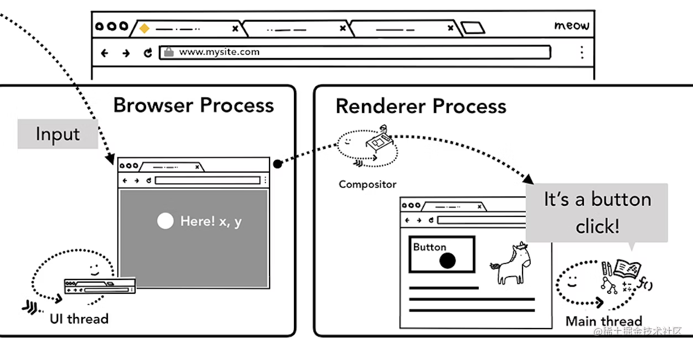
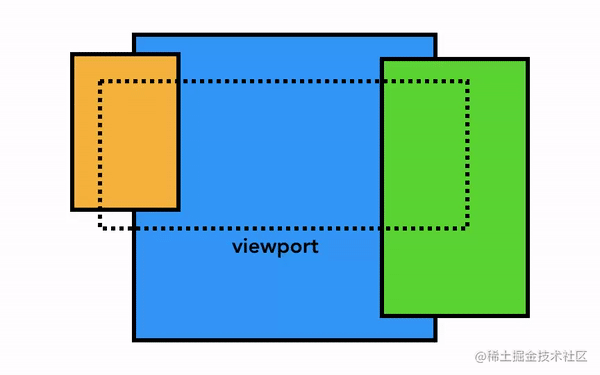
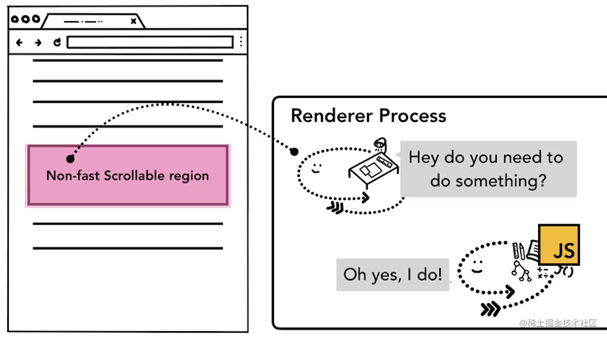
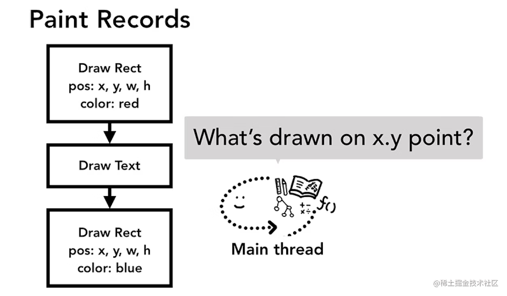

> 原文链接: <https://developer.chrome.com/blog/inside-browser-part3>
>
> 原文作者：[Mariko Kosaka](https://developer.chrome.com/authors/kosamari/)

> 本文是现代浏览器原理系列博客的第 4 篇。在这个由 4 篇文章组成的博客系列中，我们将深入了解 Chrome 浏览器，从总体的架构概览到渲染流水线的具体细节，包括页面导航、渲染、合成的具体流程。如果你想知道浏览器是如何将你的代码转化为一个能够运行的网站的，或者你想了解某些性能优化技巧背后的原理，那么本系列文章就是为你量身打造的。
>
> - [现代浏览器原理（1）- Chrome 浏览器架构概览](https://juejin.cn/post/7269070543882027043)
> - [现代浏览器原理（2）- 网页导航流程](https://juejin.cn/post/7269225865619636259)
> - [现代浏览器原理（3）- 渲染流水线](https://juejin.cn/post/7269385060611047439)
> - [现代浏览器原理（4）- 处理用户输入](https://juejin.cn/post/7269321562683408399)

## 合成线程接收用户输入

在[上一篇文章](https://juejin.cn/post/7269385060611047439)中，我们了解了渲染流水线并学习了合成线程的工作。在本篇文章中，我们将了解合成线程如何在用户输入时实现流畅的交互。

## 浏览器视角下的输入事件

当提到 "输入事件 "时，你想到的可能是在文本框中输入文字或者点击鼠标，但从浏览器的角度来看，输入意味着用户的任何手势。鼠标滚轮滚动是一个输入事件，手指触摸或鼠标移动也是一个输入事件。

当用户触摸屏幕时，浏览器进程会首先接收到该手势。不过，浏览器进程只知道手势发生的位置，因为标签页内的内容是由渲染进程处理的。因此，浏览器进程会向渲染进程发送事件类型（如 `touchstart`）及其坐标。渲染进程通过查找事件目标（event target）并运行对应的事件监听器来处理该事件。



## 合成线程接收输入事件



在上一篇文章中，我们了解了合成线程如何通过合成光栅化图层来平滑处理滚动。如果页面上没有添加输入事件监听器，合成线程就可以完全独立于主线程创建新的合成帧。但如果页面上有事件监听器呢？合成线程如何确定事件是否需要处理？

## 非快速滚动区域（non-fast scrollable region）

由于运行 JavaScript 是主线程的工作，因此在合成页面时，合成线程会将页面中添加了事件监听器的区域标记为 "非快速滚动区域"。有了这些信息，合成线程就能确保在输入事件发生在该区域时将其发送给主线程。如果输入事件来自该区域之外，则合成线程将继续合成新帧，无需等待主线程。



#### 编写事件回调时要小心

前端开发中一种常见的事件处理模式是事件委托。由于事件会冒泡，因此可以在最顶层的元素上添加一个事件回调，然后根据事件的 target 来执行不同的任务。你可能见过或写过类似下面这样的代码：

```
document.body.addEventListener('touchstart', event => {
    if (event.target === area) {
        event.preventDefault();
    }
});
```

因为这样只需要为所有的事件写一个回调，所以对于开发者来说非常方便。但是，如果从浏览器的角度来看这段代码，现在整个页面都被标记为不可快速滚动区域。这意味着，即使你的应用不关心页面某些部分的用户交互事件，合成线程也必须与主线程通信，并在每次输入事件到来时等待主线程。这样的话，合成线程就没法丝滑地滚动了。


为了避免这种情况发生，可以在事件监听器中添加 `passive: true` 参数。这样浏览器就会知道你仍想在主线程中监听事件，但合成线程也可以继续丝滑地合成新帧。

```
document.body.addEventListener('touchstart', event => {
    if (event.target === area) {
        event.preventDefault()
    }
}, {passive: true});
```

## 检查事件是否可以被取消


试想一下，如果要将页面中一个元素的滚动方向限制为只能横向滚动，你会怎么做呢？

在指针事件中使用 `passive: true` 意味着页面可以丝滑滚动，但垂直滚动可能在你用 `preventDefault` 来限制滚动方向之前已经开始。可以使用 `event.cancelable` 方法来检测是否发生了这种情况：

```
document.body.addEventListener('pointermove', event => {
    if (event.cancelable) {
        event.preventDefault(); // block the native scroll
        /*
        *  do what you want the application to do here
        */
    }
}, {passive: true});
```

或者，您也可以使用 CSS（如 `touch-action`）来禁用垂直滚动。

```
#area {
  touch-action: pan-x;
}
```

## 寻找事件目标



当合成线程向主线程发送输入事件时，首先要运行命中测试（hit test）来查找事件目标。命中测试利用渲染过程中生成的绘制记录数据来查找事件发生点坐标下方的内容。

## 减少向主线程的事件派发（event dispatch）

在[上一篇文章](https://juejin.cn/post/7269385060611047439)中，我们提到过大部分显示器每秒刷新屏幕 60 次，以及我们如何跟上节奏以实现流畅的动画效果。在输入方面，常见的触屏设备每秒会产生 60-120 次触摸事件，而常见的鼠标每秒会产生 100 次事件。输入事件的触发速度高于我们的屏幕刷新速度。

如果像 `touchmove` 这样的连续事件每秒向主线程发送 120 次，由于这比屏幕刷新的速度还快，所以可能会触发过多的命中测试和 JavaScript 回调执行，导致资源浪费和页面卡顿。


为了尽量减少对主线程的过多调用，Chrome 浏览器会将连续事件（如`wheel`, `mousewheel`, `mousemove`, `pointermove`, `touchmove`）进行合并，并将事件的分派延迟到下一个 `requestAnimationFrame` 之前。


所有离散的事件，如 `keydown`, `keyup`, `mouseup`, `mousedown`, `touchstart`, `touchend` 会被立即分派。

## 使用 `getCoalescedEvents` 获取帧内事件

对于大多数 web 应用来说，聚合事件能够提供良好的用户体验。但是，设想你正在构建一个绘图应用程序并根据 `touchmove` 坐标绘制路径，事件聚合可能导致你会丢失中间的坐标来绘制平滑的线条。在这种情况下，你可以使用指针事件中的 `getCoalescedEvents` 方法来获取被合并事件的具体信息。


```
window.addEventListener('pointermove', event => {
    const events = event.getCoalescedEvents();
    for (let event of events) {
        const x = event.pageX;
        const y = event.pageY;
        // draw a line using x and y coordinates.
    }
});
```

## 下一步

在本系列文章中，我们介绍了现代浏览器的内部工作原理。如果你从未想过为什么开发者工具建议在事件处理程序（event handler）中添加 `{passive: true}` 参数，或者为什么要在 `script` 标签中写入 `async` 属性，我希望本系列文章能让您了解浏览器为什么需要这些信息来提供更快、更流畅的用户体验。

### 使用 Lighthouse

如果你想让自己的代码性能更好，但又不知道从何下手，那么 可以试试开发者工具中的 Lighthouse。它是一款可以对网站进行评估的工具，它能为你提供一份报告，说明你的哪些做法是正确的，哪些需要改进。阅读其评估列表还能让你了解浏览器关注哪些方面的事情。

### 学习如何测量性能

不同网站的所需要的性能调整策略可能会有所不同，因此你必须测量网站的性能并决定最适合您网站的策略。Chrome DevTools 团队有一系列关于[如何测量网站性能](https://developers.google.com/web/tools/chrome-devtools/speed/get-started)的教程。

### 在网站上添加功能政策（Feature Policy）

如果你还想更进一步，[Feature Policy](https://developers.google.com/web/updates/2018/06/feature-policy) 是一项新的 web 平台功能，它可以在你构建项目时为你提供保护。使用 Feature Policy 可以保证应用程序的特定行为，防止你犯错。例如，如果你想确保你的 JS 代码永远不会阻塞解析，你可以使用同步脚本策略来运行你的应用程序。当启用 `sync-script：'none'` 策略时，浏览器会阻止阻塞渲染的同步 JavaScript 代码的执行。这样，你的任何代码都不会阻塞 HTML 解析，浏览器无需担心会 HTML 解析会被暂停。

## 总结

当编写网页的前端代码时，我们基本上只关心如何编写代码以及怎样提高工作效率。这些当然是很重要的，但我们还应该考虑浏览器如何使用我们编写的代码。现代浏览器努力地为用户提供更好的 web 体验，如果我们通过改善代码来善待浏览器，就能够更进一步地改善用户体验。希望我们一起努力，善待浏览器，提升用户体验！
