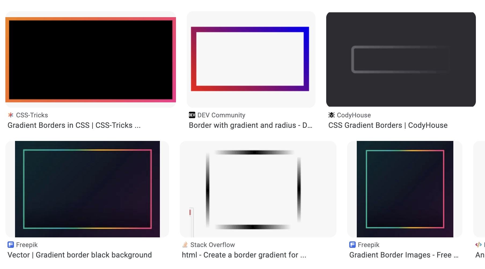
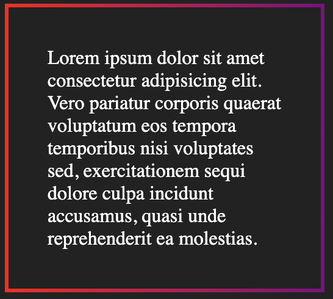
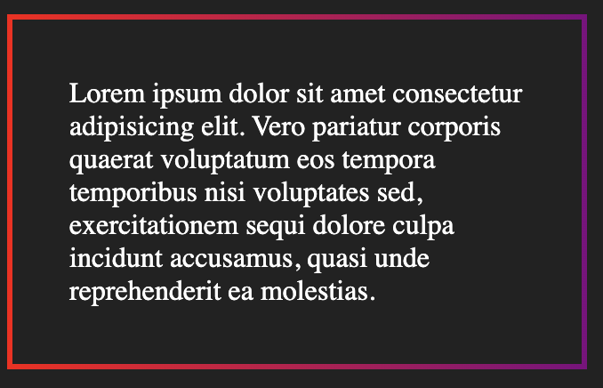

现在的网页设计越来越卷了，各种炫酷的效果层出不穷，可以说是给我们前端工程师出了很多难题。这其中很常见的一种需求就是实现各种渐变边框，如图所示：



作为一名优秀的前端工程师，这肯定是难不倒我们的！用 CSS 实现渐变边框有两种常见的方法：

## 1. 使用渐变背景 `linear-gradient` 搭配外层容器

渐变边框听起来很难搞，但渐变背景我们还是很熟悉的，哪怕你记不住 `linear-gradient` 的语法（就像我），也有大量的工具可以帮助我们自动生成（例如 https://cssgradient.io/）。

而渐变边框完全是可以通过渐变背景来实现的，只要把中间的部分遮掉，只留外面那一圈，不就是渐变边框了嘛！

废话少说，直接上代码：

```html
<style>
  .module-border-wrap {
    padding: 1rem;
    background: linear-gradient(to right, red, purple);
    padding: 3px;
  }

  .module {
    background: #222;
    color: white;
    padding: 2rem;
  }
</style>

<body>
  <div class="module-border-wrap">
    <div class="module">
      Lorem ipsum dolor sit amet consectetur adipisicing elit. Vero pariatur
      corporis quaerat voluptatum eos tempora temporibus nisi voluptates sed,
      exercitationem sequi dolore culpa incidunt accusamus, quasi unde
      reprehenderit ea molestias.
    </div>
  </div>
</body>
```

在上面的代码中，我们嵌套了两层 `div` 元素：外层的 `div` 有一个从红色到紫色的渐变背景；内层的 `div` 则是纯黑色背景，文本内容也包含在其中。由于外层 `div` 有 3px 的内边距，所以内层元素的四周会有 3px 的渐变背景展示出来，相当于一个宽度为 3px 的渐变边框。

代码运行效果如图所示：



如果使用两层嵌套 `div` 的方式让你觉得不够优雅，我们还可以用伪元素来实现类似的效果。

```html
<style>
  body {
    background: #222;
  }

  .module::before {
    position: absolute;
    content: "";
    top: 0;
    left: 0;
    bottom: 0;
    right: 0;

    background: linear-gradient(to right, red, purple);
    margin: -3px;
    z-index: -1;
  }

  .module {
    position: relative;
    background: #222;
    color: white;
    max-width: 256px;
    padding: 2rem;

    border: solid 3px transparent;
    background-clip: padding-box;
  }
</style>

<div class="module">
  Lorem ipsum dolor sit amet consectetur adipisicing elit. Vero pariatur
  corporis quaerat voluptatum eos tempora temporibus nisi voluptates sed,
  exercitationem sequi dolore culpa incidunt accusamus, quasi unde reprehenderit
  ea molestias.
</div>
```

这里实现起来会稍微复杂一点。我们先看 `.module` 元素本身，重点关注最后两行样式代码：我们设定了 3px 的透明边框，同时把 `background-clip` 置为 `padding-box`，从而为 3px 的渐变边框留出位置。

这里再解释一下 `background-clip` 这个属性：其默认值是 `border-box`，也就是说元素的背景会一直延伸到元素 `border` 的下方，此时如果元素 `border` 是透明的话，那么 `border` 处展示的就仍然是背景颜色。设置为 `padding-box` 之后，元素的背景就不会延伸到 `border` 下方了，此时如果元素 `border` 是透明的，展示的就是透明色而不是背景颜色。

再看 `.module::before` 元素，我们将其上下左右的坐标都设置为 0，从而使其充满整个 `.module` 元素。再设置一个 -3px 的 margin，这样它就比 `.module` 元素大出 3px 的一圈，刚好是边框的粗细。通过设置 `z-index: -1` 使其处于 `.module` 元素下方，展示出来的就只有 3px 的渐变边框了。

最终效果和刚刚一模一样：



## 2. 使用 border-image 属性

CSS 提供了一个 `border-image` 属性，它可以更直接地帮我们实现渐变边框效果。

```css
.border-gradient {
  border: 5px solid;
  border-image-source: linear-gradient(to left, #00c853, #b2ff59);
  border-image-slice: 1;
}
```

我们通过 `border-image-source` 指定了渐变边框的颜色效果，同时需要将 `border-image-slice` 设置为 1，边框才会正确地填充。效果如图所示：


我们还能指定某个方向的边框不展示：

```css
.only-top {
  border-left: 0;
  border-right: 0;
  border-bottom: 0;
}
```

效果如图所示：


## 对比与总结

1. `linear-gradient` 属性的浏览器支持更好，且可以和 `border-radius` 同时存在（设置了 `border-image` 时 `border-radius` 会失效），如果你需要设置**边框圆角**或者对浏览器兼容性要求较高，则选择 `linear-gradient` 更合适。
2. 如果没有上述两个要求，用 `border-image` 来实现渐变边框通常会更简洁，且不需要增加额外的 DOM 元素。
3. 如果它们都不能符合你的要求，可以考虑用 SVG 来实现，具体可以参阅我的[这篇文章]()。

> 本文作者 wzkMaster
