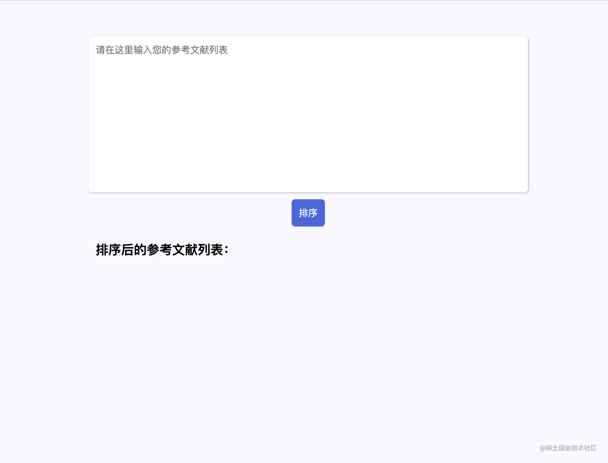
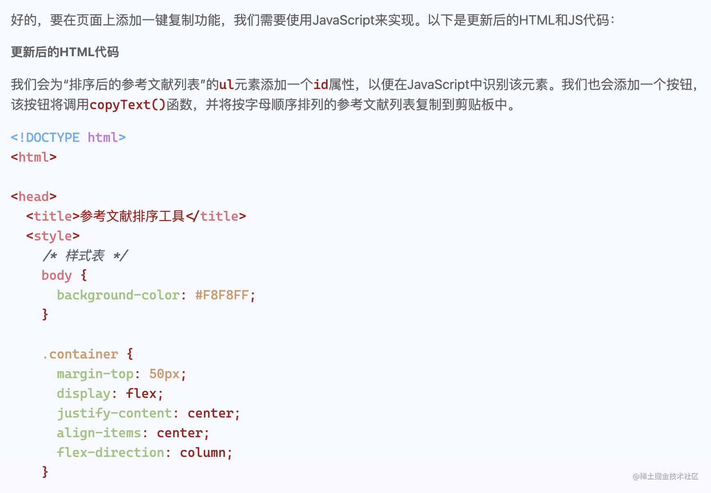
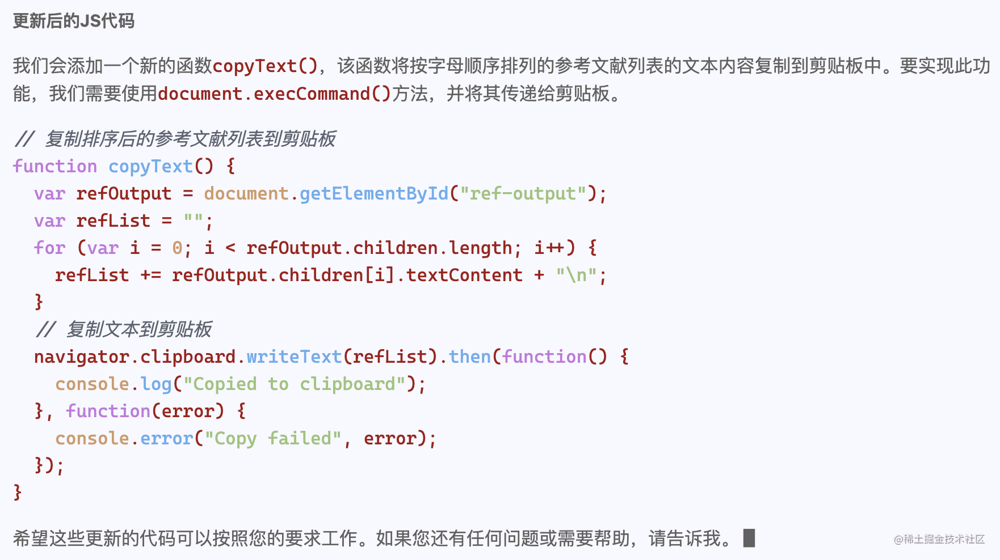
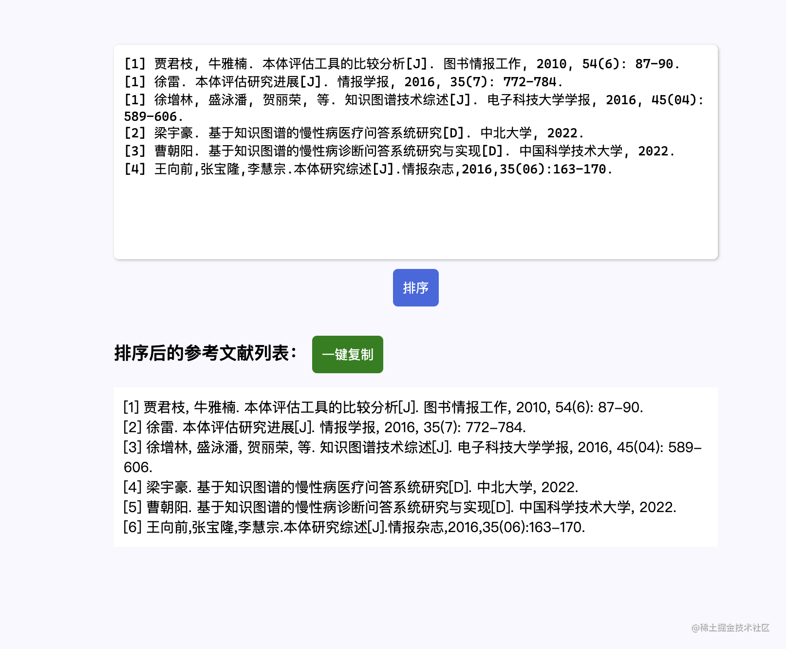

## 背景介绍

又到了一年一度的毕业论文答辩季，相信很多人都在整理论文参考文献时都遇到过类似的场景：

假设你的论文现在有五十篇的参考文献，已经编号完成了。老师看完论文之后要求你再补充一些内容，于是你又多引用了一篇文献，但因为参考文献必须按顺序排列，所以你只能从中间插入这篇文献。假设这篇文献的位置应该是第 17，那也就意味着从第 17 篇开始的参考文献序号都得加 1。而 Word 又不像 VSCode 或者 vim，可以实现快速的数字修改，所以只能苦逼地手动修改 34 篇文献的序号。

```txt
[1] 段宇锋, 黄思思. 本体构建方法研究[J]. 情报杂志, 2015, 34(11): 139-144.
...
[15] 贾君枝, 牛雅楠. 本体评估工具的比较分析[J]. 图书情报工作, 2010, 54(6): 87-90.
[16] 徐雷. 本体评估研究进展[J]. 情报学报, 2016, 35(7): 772-784.

// 如果我想在这里增加一篇，那么后面的从17-50的文献编号就得改成18-51，要改34个数字！

[17] 徐增林, 盛泳潘, 贺丽荣, 等. 知识图谱技术综述[J]. 电子科技大学学报, 2016, 45(04): 589-606.
...
[50] 李兴森, 石勇, 张玲玲. 从信息爆炸到智能知识管理[M]. 科学出 版社. 2010:49-62.
```

我在写论文的过程中就遇到了这样的问题，因为觉得实在是太麻烦了，就想着能不能写一个程序来自动化地完成这个重新编号的任务。于是我就新建了一个 `js` 文件打算试一试，结果发现其实并不复杂，只要几行代码就可以做到了。下面就来讲讲具体的思路。

## 序号自动生成

### 输入输出分析

程序的输入是一个长字符串，也就是我从 word 文档里面复制过来的一整个参考文献列表。每一条参考文献条目由换行符分隔。

程序的输出同样应该是一个长字符串，形式与输入类似，这样我才能直接粘贴回 word 里面。输出与输入的区别在于输出中每一个参考文献条目的序号是正确的。

### 核心算法开发

因为我们要对每一条参考文献条目都做单独的处理，所以首先应该把读取进来的长字符串分割为一个数组，数组中的每一项对应一条参考文献。这可以用 `split` 函数来实现：

```js
const refs = input.split("\n");
```

然后我们需要遍历这个数组，给每一条参考文献条目生成正确的序号，这个任务可以分解为两步：

1. 把条目中原有的序号去除

   序号的样式是 `[<数字>]`，我们可以用正则表达式做匹配，然后把匹配到的字符串中序号的部分替换为空字符串，就可以去除原有的序号了。

   为了防止误伤条目里面的其他内容，我们必须规定只替换字符串开头处的匹配子串。同时，为了防止段落缩进导致字符串开头有空白，所以应该先将字符串前面的空格去除。

   ```js
   const origin = ref.trimStart().replace(/^\[\d+\]/, "");
   ```

   通过 `\d` 来匹配所有的数字字符，`+` 号表示 1 个以上的数字。因为方括号在正则表达式中是有特殊含义的，所以必须添加斜杠转义。

2. 生成新的序号

   这一步就比较简单了，我们可以根据条目在数组中的索引来判断其正确的序号值。因为数组索引是从 0 开始的，而参考文献序号是从 1 开始的，所以将索引加一就能得到序号值了。

最终的序号生成算法代码如下：

```js
const output = refs.map((ref, index) => {
  // 去除原有序号
  const origin = ref.trimStart().replace(/^\[\d+\]/, "");
  // 添加新序号并返回
  return `[${index + 1}] ${origin}`;
});
```

最后将处理之后的数组用换行符拼接成一个新的字符串返回就好了。

```js
return output.join("\n");
```

## 和 chatGPT 一起进行应用开发

一开始给程序提供输入的方式就是直接把 `input` 变量的值改成我的参考文献列表。后来我就觉得这样实在是很麻烦，于是就想开发一个前端页面，这样还能放到网络上分享给同学们用，毕竟这个需求肯定是很多人都有的。

但是那个时候刚好接近论文的 ddl，我实在没时间去倒腾一个前端界面。这时我想到了 chatGPT，不是听说你写前端很厉害吗，来给我试试！于是我跟它说：


它很快就给我写出了页面的 HTML 和 CSS 代码（太长就不放上来了），在浏览器中运行的效果如图所示：



可以看到还是挺不错的！但用的过程中我发现了一个问题，就是如果参考文献列表太长了，要重新从网页中复制到 word 里面比较麻烦。于是我决定增加一个“一键复制”的功能，因为刚刚那个网页它写的很不错，所以我决定继续交给 chatGPT 帮我实现。

它很快就帮我把对应的 HTML 和 JS 代码写了出来，还附上了详细的解释。





我把代码复制回页面后，发现确实是可以正常工作的！随后我又微调了一些样式来让页面更加美观，再最终把代码上传到 Github 上进行部署。前后只用了**20 分钟不到**的时间，我就完成了一个非常好用的论文自动排序应用，而且界面相当简洁美观。



后面我又在应用中添加了根据作者字顺排序的功能，并提供了使用说明的链接。大家可以点击[链接](https://wzkmaster.github.io/thesis-reference-tool/)来访问最终的应用。

## 总结

1. 正则表达式确实是非常好用的工具，可以高效地实现很多字符串处理的任务。当在日常生活中遇到一些重复率很高的文字处理任务时，都应该多想想能不能利用编程工具来提效。
2. 利用 chatGPT 来辅助应用开发可以很好地提升效率。特别是像简单的前端界面开发这样的任务，这类任务的复杂度不高，所以不容易有 bug，但如果自己做又会比较浪费时间，因为还得自己设计界面和调整 CSS，交给 chatGPT 做就非常合适。
