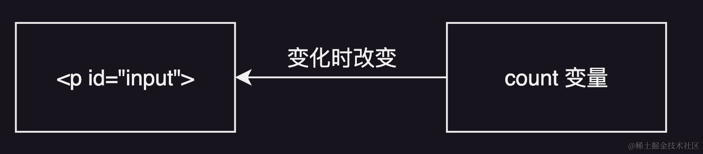
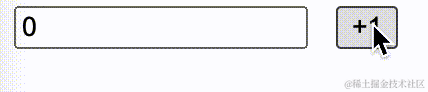
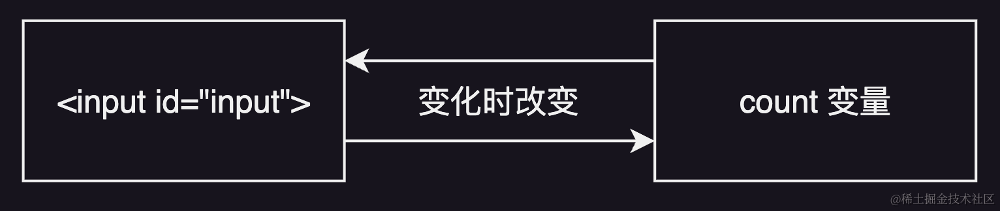
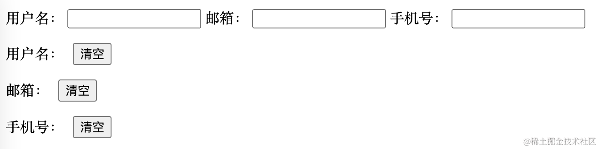

“双向绑定”是现代前端框架中非常重要的一个概念，它可以大大简化我们的代码，提高开发效率。大家在平时开发的过程中基本都会用到，特别是包含了大量表单的官网和 ToB 网站更是如此。很多前端框架也都内置了对双向绑定的支持，例如 Vue 的 `v-model`，Angular、Svelte 等框架也能够方便地实现双向绑定。

双向绑定的功能非常强大，但其背后的实现原理并不复杂，在这篇文章中，我将会介绍单向绑定和双向绑定的基本原理，并讲解 Proxy 的基本概念，最后手把手地带大家用纯 JS 实现一个双向绑定的表单页面。读完这篇文章之后，相信你能够对响应式 UI 框架的基本原理有进一步的认识。

## 什么是双向绑定

### 单向绑定

假设我们想要实现一个简单的计数器，页面中有一个显示数字的 `<p>` 元素和一个将数字 +1 的按钮。

```html
<p id="count">0</p>
<button id="increment">+1</button>
```

在不使用响应式前端框架的情况下，要想实现点击按钮就给数字加 1 的功能，需要用到下面的代码：

```js
const countEle = document.getElementById("count");
const buttonEle = document.getElementById("increment");

let count = 0;
buttonEle.addEventListener("click", () => {
  count++;
  countEle.textContent = count;
});
```

我们首先必须保存 `<p>` 元素和按钮元素的引用，并声明一个 `count` 变量用于记录当前的数值。然后给按钮添加点击事件，每次点击就给`count`加 1，然后改变 `<p>` 元素显示的内容。

可以看出，这个过程还是非常绕的，一旦应用功能变得复杂起来，代码的复杂度会成倍地上升。理想的方式是每次我们更新 `count` 变量，`<p>` 元素的内容就会自动更新。这就是现代前端响应式框架解决的核心问题，我们以下面的这段 `svelte` 代码为例：

```html
<script>
  let count = 0;
</script>

<p>{count}</p>
<button on:click={() => count++}>
  +1
</button>
```

我们声明了一个响应式变量 `count`，每次按钮点击时把 `count` 加 1，`<p>` 元素的内容就是 `count` 的值，会随着其变化自动更新，这大大简化了我们的代码。

这里，`<p>` 标签的内容完全由 `count` 的值决定，也就是它的值被 `count` 变量“绑定”了，这就是**单向绑定**。



### 双向绑定

那么双向绑定又是怎么一回事呢？

我们不妨把刚刚的 `<p>` 标签换成一个 `<input>` 标签，同时对 js 代码做一点改动，维持我们原有的单向绑定功能。

```js
const countEle = document.getElementById("count");
const buttonEle = document.getElementById("increment");
let count = 0;

buttonEle.addEventListener("click", () => {
  count++;
  countEle.value = count;
});
```

这时我们会发现一个问题，就是 `input` 框的内容是可以随时被用户改变的，但每次用户改变了其内容之后点击按钮，输入框中原有的内容就会被覆盖掉。这是因为目前我们只做到了 `<input>` 对 `count` 的绑定，也就是 `count` 的更新会引起 `<input>` 内容的更新，反过来则没有。


我们希望 `<input>` 的值改变时，`count` 变量的值也跟着改变，用下面的代码可以实现这个功能：

```js
countEle.addEventListener("change", () => {
  count = Number(countEle.value);
});
```

我们监听了输入框的 `change` 事件，每次用户改变输入框的值，我们就更新 `count` 的值。因为 `countEle.value` 返回的是一个字符串，所以我们需要用 `Number()` 做一个类型转换。



这样我们就实现了输入框和 `count` 变量的双向绑定，不仅输入框的内容被绑定为 `count` 的值，而且`count` 的值也会始终和输入框保持一致，改变两端的任何一个值都会造成另外一个值的变化。



如果用 Vue 之类的前端框架来实现双向绑定就会非常方便，只需要使用 `v-model` 指令就可以。

```vue
<template>
   
  <div>
       <input v-model="count" />    <button @click="increment">+1</button>  
  </div>
</template>

<script>
export default {
  data() {
    return {
      count: 0,
    }
  },
  
  methods() {
    increment() {
      this.count++;
    }
  }
}
</script>
```

## 用 Proxy 实现双向绑定

通过上面的例子可以看出，用纯 JS 实现双向绑定是非常麻烦的一件事，但是一个输入框就已经需要大量的代码。如果是复杂的表单，代码会变得很难维护。幸运的是，我们可以利用 Proxy 来对双向绑定进行简化。

### Proxy

简单来说，Proxy 可以用于拦截对象操作，例如属性设置、属性访问等。：

```js
let target = {
  a: "hello",
  b: "everyone",
};

const proxiedTarget = new Proxy(target, {
  get(target, prop) {
    console.log(target, prop);
  },

  set(target, prop, value) {
    console.log(target, prop, value);
  },
});

proxiedTarget.a; // {a: 'hello', b: 'everyone'} 'a'
proxiedTarget.b = "world"; // {a: 'hello', b: 'everyone'} 'b' 'world'
```

这里我们将 `target` 对象利用 Proxy 做了一层封装，我们会拦截针对 `target` 的属性访问（get）和属性设置（set）操作。具体来说，我们会在每次 get 操作时打印出 get 的目标对象（也就是 `target` 对象）和访问的属性名（`property`），在每次 set 操作时打印出目标对象（`target`）、属性名（`property`）和将要设置的属性值（`value`）。

### 用 Proxy 实现复杂表单的双向绑定

#### 项目准备

我们的 HTML 代码如下：

```html
<form>
  <label for="name">用户名：</label>
  <input name="name" type="text" />
  <label for="email">邮箱：</label>
  <input name="email" type="email" />
  <label for="phone">手机号：</label>
  <input name="phone" type="text" />
</form>

<p id="name">用户名：<span></span><button>清空</button></p>
<p id="email">邮箱：<span></span><button>清空</button></p>
<p id="phone">手机号：<span></span><button>清空</button></p>
```

我们在页面中创建了一个表单，包含用户名、邮箱和手机号三个输入框，同时还有三个展示对应数据的 `<p>` 段落，以及对应每项数据的清空按钮。



如果我们还是按照刚刚的方式来进行数据的双向绑定，就意味着每项数据都要进行输入框 `change` 事件的绑定、`<p>` 和 `<input>` 标签内容与变量内容的绑定以及按钮点击事件的绑定，这是非常复杂的一件事情，而越是复杂的代码就越容易出错。

利用刚刚介绍的 Proxy 我们可以简化这一流程。

首先我们把要用到的数据都收敛到一个 `user` 对象中：

    let user = {
      name: "",
      email: "",
      phone: "",
    };

然后我们给表单的各个输入框绑定内容改变的监听事件，每次用户改变输入时就更改对应的属性值。因为我们的属性名称和输入框的`name` 属性是一一对应的，所以我们可以用下面的代码来实现数据绑定：

```js
const form = document.querySelector("form");

Array.from(form.elements).forEach((element) => {
  if (element.name) {
    element.addEventListener("input", () => {
      user[element.name] = element.value;
    });
  }
});
```

同时我们还需要在“清空”按钮点击时清除对应的数据。遍历每一个 `<p>` 标签包含的按钮，因为 `p.id` 对应的就是该按钮控制的属性名称，所以我们可以得到下面的代码：

```js
document.querySelectorAll("p").forEach((p) => {
  p.querySelector("button").addEventListener("click", () => {
    user[p.id] = "";
  });
});
```

最后，我们利用 Proxy 来监听 `user` 对象的属性变更，从而实现响应式的 UI 更新。

```js
user = new Proxy(user, {
  set(target, property, value) {
    target[property] = value;
    form.elements[property].value = value;
    document.getElementById(property).querySelector("span").textContent = value;
    return true;
  },
});
```

我们监听了 `user` 对象的 `set` 操作，在 `set` 操作触发时，首先进行正常的属性更新。然后把表单中相应的输入框内容更新：这里 `form.elements` 的 `key` 就是元素的 `name` 属性，而我们的 `name` 属性又是和 `user` 的属性名称一一对应的，所以用 `form.elements[property]` 就可以取到需要更新的输入框。（例如用户改变了 `user.email`，此时 `property` 就是 `email`，那么表单中 `name="email"` 的元素 `value` 就会被更新了。）

同理，我们更新下方 `<p>` 标签中的内容。最后 `return true`，表示 `set` 操作正常进行。


可以看到下方的数据会随着我们的输入改变，通过按钮清空数据，也会马上反映在输入框中。这表明我们已经建立了数据和表单的双向绑定。

只用了不到三十行代码，我们就在不依赖任何框架的情况下建立起了一个双向绑定的响应式 UI 表单。如果想要扩展更多的属性也很简单，只要给 `user` 对象添加新的属性，然后在 HTML 中增加相应的输入框和 `<p>` 元素就 OK 了（注意 `name` 和 `id` 要和属性名称相同）。

## 小结

在这篇文章中，我们了解了单向绑定、双向绑定的概念和实现原理，学习了 Proxy 的基本概念，最后还实现了一个纯 JS 的响应式表单。实际上 Vue 等框架实现响应式更新的底层原理就是通过 Proxy，相信你现在已经对响应式 UI 的基本原理有了进一步的理解了。
