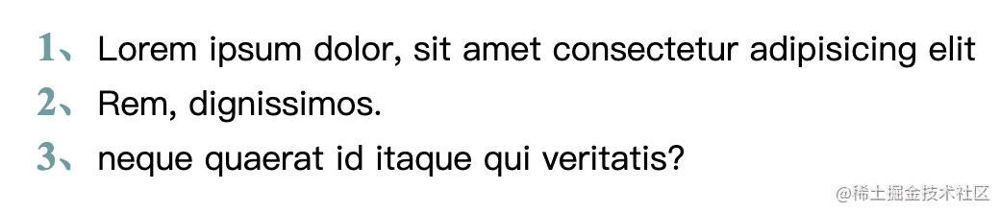
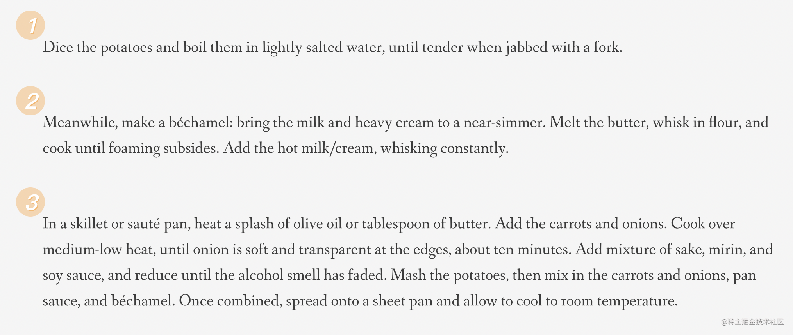
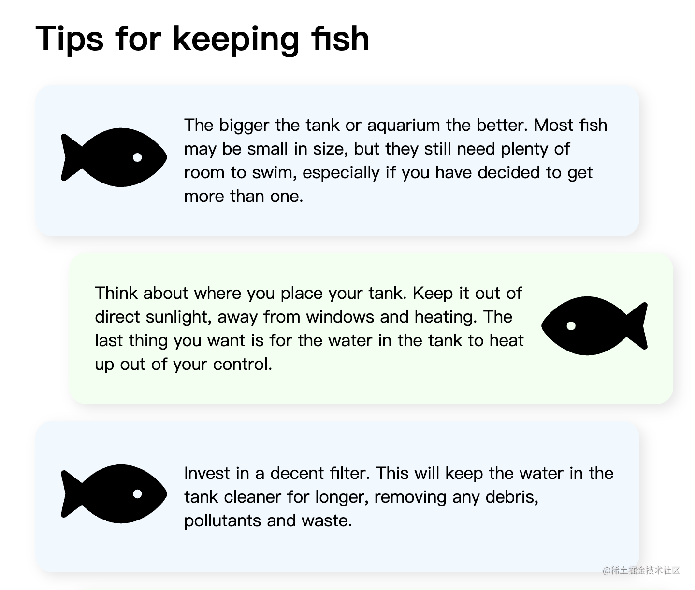

我们在网页开发中会遇到很多使用 HTML 列表元素的场景，例如商品列表、导航栏、图片列表等等。原生列表最大的一个问题就是项目符号（也就是无序列表每个项目前面的那个小圆点 / 有序列表里的数字）的样式通常不符合设计的要求，因此我们需要了解一些自定义列表符号样式的方法。对于简单的符号自定义需求，我们可以直接修改 `list-style`，如果是更复杂的需求就要通过标题中提到的 `counter` 函数和 `::marker` 伪元素来实现了。

> 你将学到的：
>
> 1. list-style 的设置
> 2. ::marker 伪元素
> 3. CSS counter 的使用方法

## 1. 使用 list-style

简单的自定义样式需求可以利用 `list-style-type` 或 `list-style-image` 来实现。它们的作用是改变列表的符号。

`list-style-type` 可以将`无序列表`默认的圆点改成方块，或将`有序列表`改为按字母、罗马数字等排序。我们还传入自定义的字符串（可以用 `emoji` ）

```css
li {
  list-style-type: "👉 ";
}
```

但大部分情况下我们需要自定义的不只是符号的内容，还有**大小、间距、颜色**等等。这个时候就要用到下面的方法了。

## 2. 使用 ::marker 伪元素

`::marker` 伪元素对应的正是列表项的符号，我们可以通过改变 `::marker` 伪元素的样式来进行更深入的列表样式自定义。下面这个例子改变了列表符号的颜色和第一个列表符号的字体大小。


```css
li::marker {
  color: plum;
  transition: color 0.5s ease-in-out;
}

li:first-child::marker {
  font-size: 2.5rem;
}
```

除了字体大小和颜色，`::marker` 伪元素可以改变的样式还包括：

- `animation-*`
- `transition-*`
- `color`
- `direction`
- `font-*`
- `content`
- `unicode-bidi`
- `white-space`

可以看到其中包含了过渡和动画属性，这意味着我们可以利用 `::marker` 来进行对列表符号单独进行动画设置。[这个例子](https://code.juejin.cn/pen/7214525077654601766)中被 `hover` 的列表项符号会渐变为红色。

```css
li::marker {
  transition: color 0.5s ease-in-out;
}

li:hover::marker {
  color: crimson;
}
```

对于有序列表，我们可以使用 `content` 属性搭配 `counter` 函数来实现符号内容的自定义。


```css
li::marker {
  content: counter(list-item) "、";
}
```

`counter(list-item)` 会自动返回当前列表所属次序的数字。它其实是浏览器自动为我们设置的一个 `counter`。CSS `counter` 的具体用法会在下文讲解。

从上面的属性列表可以发现 `::marker` 伪元素支持的属性比较有限，对于**背景颜色、文字阴影、定位、边距**等属性都不支持。比如下面这个网页截图中的列表符号样式就没办法通过 `::marker` 来实现。



如果我们希望通过改变其他 `::marker` 不支持的属性来更深入地自定义列表符号，就要用最后的这个方法。

## 3. 使用 ::before 伪元素

我们可以通过设置 `list-style-none` 来去掉默认的项目符号，然后用 `::before` 伪元素设置自定义的项目符号。相较于 `::marker`，`::before` 伪元素的缺点在于我们通常需要手动改变其定位才能让它出现在正确的位置上。但它也给我们提供了更多的可能性，比如动态改变列表符号的位置。例如下面的这个例子（来源：[这篇文章](https://web.dev/creative-list-styling/)）



```css
li {
  /* 利用flex布局把符号和内容放到同一行 */
  display: flex;
  align-items: center;
  gap: 1rem;
}

li::before {
  /* 把项目符号设置为一条鱼 */
  content: url("data:image/svg+xml,%3Csvg xmlns='http://www.w3.org/2000/svg' viewBox='0 0 576 512' width='100' title='fish'%3E%3Cpath d='M327.1 96c-89.97 0-168.54 54.77-212.27 101.63L27.5 131.58c-12.13-9.18-30.24.6-27.14 14.66L24.54 256 .35 365.77c-3.1 14.06 15.01 23.83 27.14 14.66l87.33-66.05C158.55 361.23 237.13 416 327.1 416 464.56 416 576 288 576 256S464.56 96 327.1 96zm87.43 184c-13.25 0-24-10.75-24-24 0-13.26 10.75-24 24-24 13.26 0 24 10.74 24 24 0 13.25-10.75 24-24 24z' /%3E%3C/svg%3E");
}

li:nth-child(even) {
  /* 偶数行的列表项符号和内容位置交换 */
  flex-direction: row-reverse;
}

li:nth-child(even)::before {
  /* 偶数行的列表项符号方向反转 */
  transform: rotateY(180deg);
}
```

[完整代码链接](https://code.juejin.cn/pen/7214687165333602341)

我们也可以通过::before 来自定义有序列表的符号，不过有一个问题需要注意：在 `::marker` 中我们可以用 `counter(list-item)` 来自动获取序号，而在 `::before` 伪元素中是不行的，所以我们得手动设定一个 `counter` 来获取序号。在此基础上就可以快乐地自定义符号样式了。


```css
ol {
  /* 设置index初始值为0 */
  counter-reset: index 0;
}
ol li {
  /* 每出现一个li就给index加1 */
  counter-increment: index;
}
ol li::before {
  /* 利用counter获取序号 */
  /* 列表第一项就返回1，第二项返回2，以此类推 */
  content: counter(index);
}
```

[完整代码链接](https://code.juejin.cn/pen/7214116605872537661)

## 总结

自定义 `<li>` 符号时：

- 如果只想改变符号的内容，使用 `list-style-*` 即可。
- 如果希望改变字体相关属性，或者为符号增加单独的过渡和动画，使用 `::marker` 伪元素。
- 如果上面的方法都不够用，就使用 `::before` 伪元素。如果想在 `::before` 伪元素中获取当前编号，可以利用 `counter`。

（本文作者：wzkMaster）
