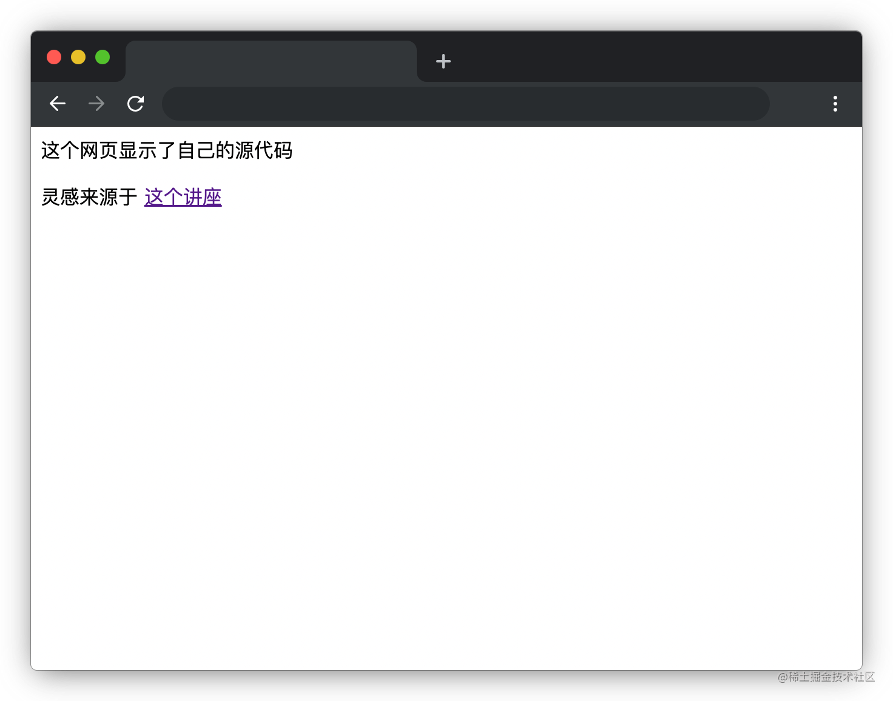
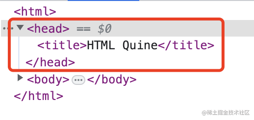
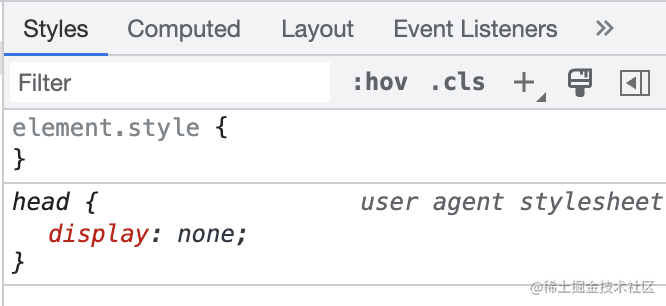
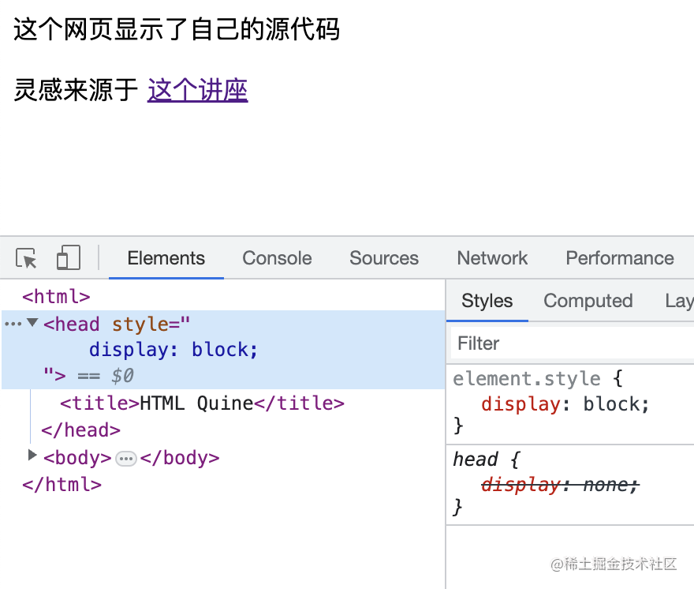
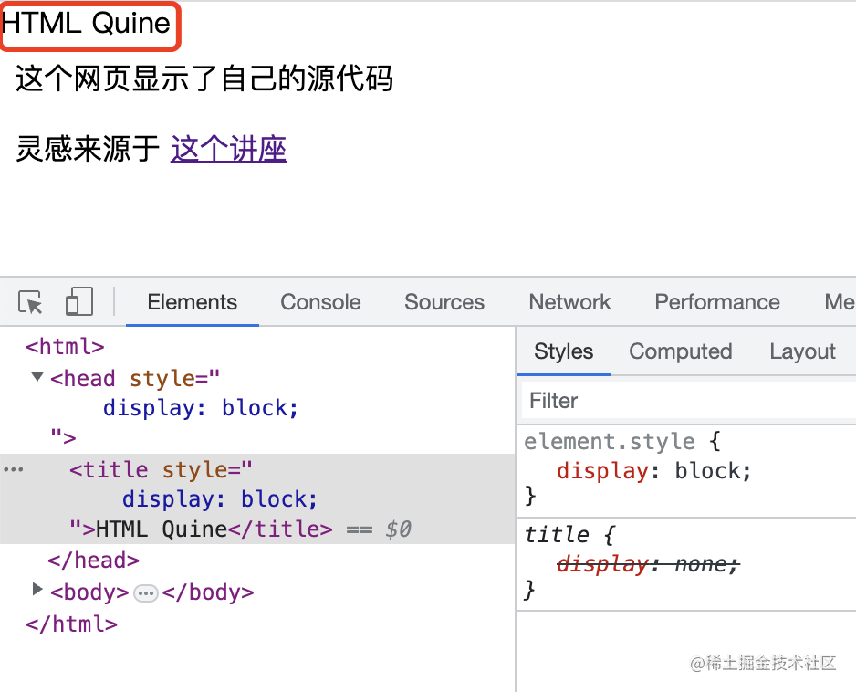
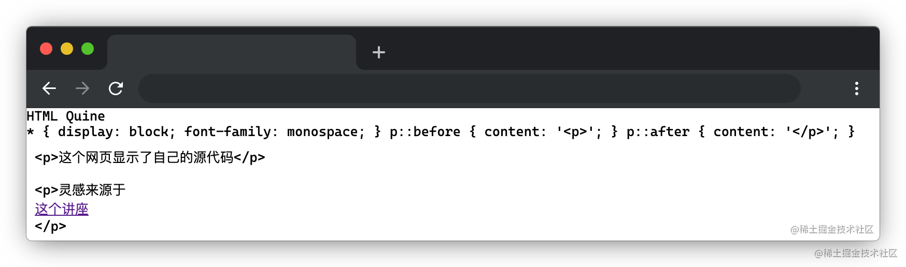
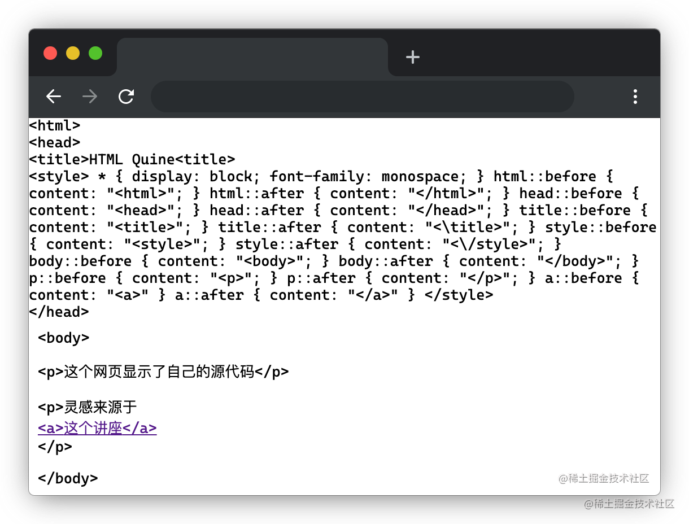
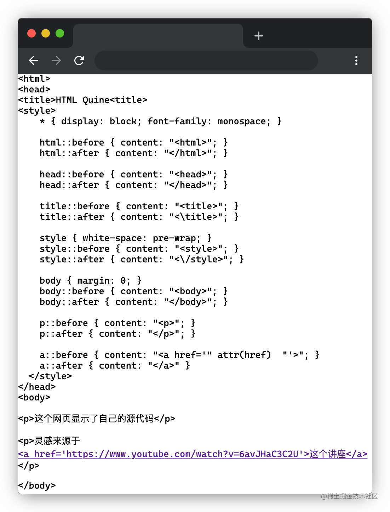
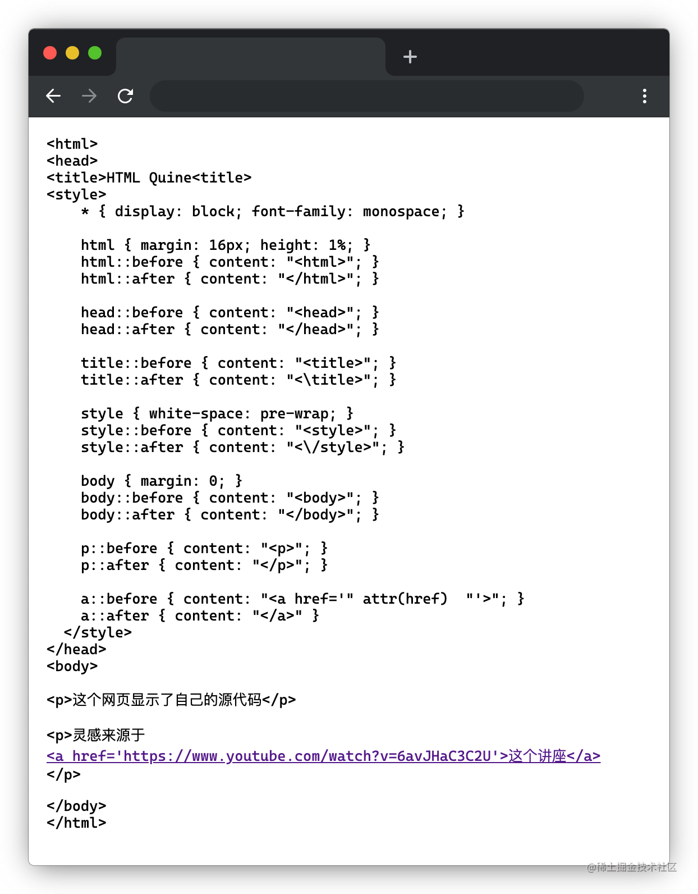

Quine 程序是指一个能够输出自身代码的计算机程序。Quine 程序的实现是计算机科学中一个有趣的问题，不同语言中有不同的实现方式，常见的技巧包括代码注入、字符串插值或反射等。实现 Quine 程序可以帮助我们对平常所使用的编程语言产生更深入的理解。

在这篇文章中，我们将用 HTML 代码来实现一个 Quine 程序。严格意义上讲，HTML 并不是一门编程语言，但我们同样可以让一个 HTML 网页打印出自己的全部源代码。我们把这个任务分成两步，首先让`<head>`标签中的内容显示出来，然后让所有的 html 元素都显示出自己的标签。

## 1. \<head\>标签中的内容打印

我们首先写一段简单的 HTML，其中包括了两个`<p>`段落和一个`<a>`标签。

```html
<html>
  <head>
    <title>HTML Quine</title>
  </head>
  <body>
    <p>这个网页显示了自己的源代码</p>
    <p>
      灵感来源于
      <a href="https://www.youtube.com/watch?v=6avJHaC3C2U">这个讲座</a>
    </p>
  </body>
</html>
```

运行页面效果如图所示：



现在我们来思考一下：通常网页中展示的都是`<body>`标签中的内容，要显示网页的所有源代码意味着`<head>`标签中的内容也要被展示出来，这要怎么办呢？

大家回想一下浏览器渲染页面的过程，第一步叫做“根据 HTML 代码构建 DOM 树”，也就是说其实`<head>`标签的内容也是在 DOM 树中的，我们不妨打开浏览器控制台验证一下这一点。



那为什么`<head>`标签的内容不会被展示出来呢？我们接着顺着浏览器引擎的渲染过程往下走，接下来它会解析页面的 CSS 文件，我们这个网页没有任何自定义的 CSS，但是浏览器本身是有自带的 CSS 的，这个叫做 `user agent stylesheet`，是浏览器给我们的网页提供的一套默认的 CSS。不同浏览器的这套样式会有所不同，例如 chrome 就会有一个默认的网页内边距，所以我们才会需要 `reset-css` 这样的解决方案来磨平这些默认样式的差异。

而我们的 `<head>` 标签的内容没有被显示出来其实也正是这个 `user agent stylesheet` 搞的鬼。在控制台中选中 `<head>` 标签，我们可以通过右侧（或者下方）的 `styles` 面板来看浏览器最终计算得出的该元素的样式规则。



可以看到正是`user agent stylesheet`让我们的 head 标签`display: none`，所以才啥也看不见。那如果我们把它改成 `display: block` 呢？（点击上面的`element.style`那一栏可以添加自定义的样式，这也是一个 `debug` 的好方法）



还是啥也没有！但这是因为`<title>`也被设置为`display: none`了。我们再把`<title>`元素也改为`display: block`试试。



真的出现了！那么我们只要把让`<head>`中的所有元素显示出来的样式代码添加到 HTML 中就可以完成第一步了。为了方便，我们直接通过通配符来让所有的元素都`display: block`即可。同时，为了让打印出来的源代码更像代码，我们还设置了一个等宽字体。

```html
<style>
  * {
    display: block;
    font-family: monospace;
  }
</style>
```

## 2. 打印元素标签和属性

现在我们距离成功打印网页的源代码只差了标签文本的显示了。HTML 的标签起到了标记文本的作用，并不会作为网页本身的文本呈现，所以要把它们显示出来只能自己手动添加了。我们要做的就是想办法在网页中的每一个元素前后的显示它们的标签文本。emm...在元素的前后添加东西，这不就是`before`和`after`伪元素吗！以 `<p>` 标签的显示为例：

```css
p::before {
  content: "<p>";
}
p::after {
  content: "</p>";
}
```


可以看到两个段落的 `<p>` 标签都显示出来了。同理，我们只需要枚举我们的网页中包含的所有标签就可以把完整的网页源代码打印出来了。

```css
html::before {
  content: "<html>";
}
html::after {
  content: "</html>";
}

head::before {
  content: "<head>";
}
head::after {
  content: "</head>";
}

title::before {
  content: "<title>";
}
title::after {
  content: "<\title>";
}

style::before {
  content: "<style>";
}
style::after {
  content: "<\/style>";
}

body::before {
  content: "<body>";
}
body::after {
  content: "</body>";
}

p::before {
  content: "<p>";
}
p::after {
  content: "</p>";
}

a::before {
  content: "<a>";
}
a::after {
  content: "</a>";
}
```



可以看到我们已经把源代码成功显示出来了，但还有几个地方不太符合预期。

首先是`<a>`标签的`href`属性没有显示出来，我们可以通过`attr`函数来获取`href`属性的内容，再把它拼接到`a`标签的`before`文本中。

```css
a::before {
  content: "<a href='" attr(href) "'>";
}
```


第二是`<style>`的内容被挤到了一行里面，没有像我们输入时那样格式化地展示。这是因为 HTML 解析时会默认忽略源代码中的换行符和空格，我们可以通过`white-space: pre-wrap`这条规则来让它保留源代码中的空白。

```css
style {
  white-space: pre-wrap;
}
```

第三是`<body>`标签的内容和`<head>`标签对的不是很齐，还记得我刚刚说过 chrome 会有一个默认的网页内边距吗，这就是它干的好事！因为正常情况下 HTML 网页显示的都是`<body>`标签的内容，所以这个默认的`margin`就是加在`<body>`标签身上的，我们把它清除一下就行了。

```css
body {
  margin: 0;
}
```

此时的页面效果如图所示：


最后还有一个问题是`<html>`的闭合标签不知所踪，其实是因为它被放到了页面的底部，要滚动一下才能看到。我们可以通过把`<html>`元素的高度减小来解决这个问题。同时为了让页面更美观一点，我们再给它加上一个`16px`的内边距。

```css
html {
  margin: 16px;
  height: 1%;
}
```



大功告成！我们写的这个 HTML 网页完完整整地打印出了自己的源代码，并且也保留了原有的代码缩进和换行。最终完整的代码如下：

```html
<html>
  <head>
    <title>HTML Quine</title>
    <style>
      * {
        display: block;
        font-family: monospace;
      }

      html {
        margin: 16px;
        height: 1%;
      }
      html::before {
        content: "<html>";
      }
      html::after {
        content: "</html>";
      }

      head::before {
        content: "<head>";
      }
      head::after {
        content: "</head>";
      }

      title::before {
        content: "<title>";
      }
      title::after {
        content: "<\title>";
      }

      style {
        white-space: pre-wrap;
      }
      style::before {
        content: "<style>";
      }
      style::after {
        content: "<\/style>";
      }

      body {
        margin: 0;
      }
      body::before {
        content: "<body>";
      }
      body::after {
        content: "</body>";
      }

      p::before {
        content: "<p>";
      }
      p::after {
        content: "</p>";
      }

      a::before {
        content: "<a href='" attr(href) "'>";
      }
      a::after {
        content: "</a>";
      }
    </style>
  </head>
  <body>
    <p>这个网页显示了自己的源代码</p>
    <p>
      灵感来源于
      <a href="https://www.youtube.com/watch?v=6avJHaC3C2U">这个讲座</a>
    </p>
  </body>
</html>
```

## 总结

1. `<head>`标签的内容没有显示出来是因为浏览器自定义的样式表隐藏了其内容，我们可以自定义样式覆盖浏览器定义的规则，就可以让其显示出来。
2. 元素标签的显示可以通过伪元素实现，元素属性的内容可以通过`attr`函数获取并展示。

> 本文作者 wzkMaster
