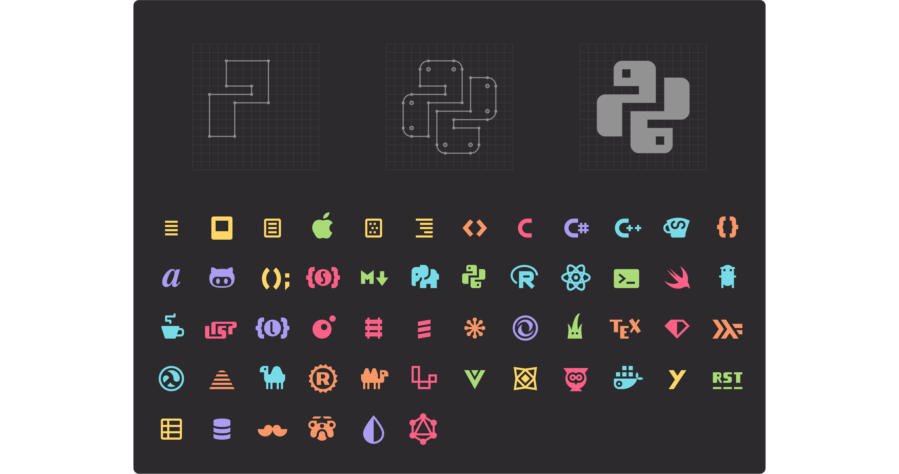

VSCode 是一款高度自定义的代码编辑器，具有丰富的插件生态系统。我们可以利用插件来对编辑器的功能、外观、图标等等进行自定义。编辑器默认的设置有时候并不符合我们的审美和习惯，因此正确地配置编辑器主题能够大大提高我们的效率。

笔者平时在开发之余浏览了很多 VSCode 插件市场中的颜色主题和文件图标主题，关于推荐的颜色主题我之前写过两篇文章进行了总结：

[😝 分享几个好玩的 VSCode 主题](https://juejin.cn/post/7244174817678721079)
\
[🌈 冷门但好看的 VSCode 主题推荐](https://juejin.cn/post/7242143701069807673)

一个好用的文件图标主题除了能够愉悦身心之外，对于开发的效率也会有很大的提升，可以帮助我们更快地找到需要的文件，或者发现文件命名中的错误。这篇文章就给大家总结一下我用过的最棒的 10 个文件图标主题。

## 如何修改文件图标主题

点击左下角的设置，选择 Themes，点击 File Icon Theme，就会弹出如图所示的窗口。

此时就可以进行文件图标主题的选择了。VSCode 默认的文件图标主题是 Minimal 和 Seti，如果你没有安装其他的文件图标主题能够选择的就只有这两个。

## [Material Icon Theme](https://marketplace.visualstudio.com/items?itemName=PKief.material-icon-theme)

Material Icon Theme 是 VSCode 中最受欢迎的文件图标主题，采用了谷歌的 Material 设计风格。其特点是图标非常的丰富，而且辨识度很高，色彩丰富，让人看了非常愉悦。

以后缀名为`pug`的文件为例，`pug`是一种 HTML 模版文件，而这个单词的原意是哈巴狗，因此其图标也是一只可爱的哈巴狗。

除了丰富的文件图标之外，Material Icon Theme 还有丰富的文件夹图标，这也是我非常喜欢的一点。文件夹会根据名称变换图标，方便快速定位需要的文件夹，也可以作为文件夹名称拼写错误的提醒。

完整的图标列表可以点击链接到插件的详情页面查看。

[下载链接](https://marketplace.visualstudio.com/items?itemName=PKief.material-icon-theme)

## [Material Theme Icons](https://marketplace.visualstudio.com/items?itemName=Equinusocio.vsc-material-theme-icons)

这个主题的名字和上一个主题很像，只是调换了后两个单词的位置，但他们实际上是两个完全不同的插件。虽然都是基于 Material 风格的，但 Material Theme Icons 的色调更浅，风格也更加卡通化。其文件夹图标相对来说也没有第一个主题丰富。

[下载链接](https://marketplace.visualstudio.com/items?itemName=Equinusocio.vsc-material-theme-icons)

## [VSCode Icons](https://marketplace.visualstudio.com/items?itemName=vscode-icons-team.vscode-icons)

VSCode Icons 的受欢迎程度仅次于最开始介绍的 Material Icon Theme，其图标同样非常丰富，而且也有丰富的文件夹图标，对于文件的识别有很大的帮助。这款文件图标主题还支持图标自动化和自定义图标的导入。

[下载链接](https://marketplace.visualstudio.com/items?itemName=vscode-icons-team.vscode-icons)

## [VSCode Great Icons](https://marketplace.visualstudio.com/items?itemName=emmanuelbeziat.vscode-great-icons)

VSCode Great Icons 同样是插件市场中非常受欢迎的一款文件图标主题，其特点是图标的配色风格非常的鲜艳活泼，辨识度很高。另外一个好用的小细节是对打开的文件夹和关闭的文件夹会用明显的颜色差别进行区分。美中不足的是这款主题包含的文件夹图标比较少。

[下载链接](https://marketplace.visualstudio.com/items?itemName=emmanuelbeziat.vscode-great-icons)

## [Monokai Pro Icons](https://marketplace.visualstudio.com/items?itemName=monokai.theme-monokai-pro-vscode)

Monokai Pro Icons 是 Monokai 团队从零开始创建的，以确保侧边栏中的小尺寸图标也能便于识别，让用户能够快速定位到正确的文件。Monokai Pro Icons 是下载 Monokai Pro 颜色主题时附带的文件图标主题，如果你喜欢使用 Monokai 风格的颜色主题，这款文件图标主题就非常适合你。

[下载链接](https://marketplace.visualstudio.com/items?itemName=monokai.theme-monokai-pro-vscode)

## [City Lights Icon](https://marketplace.visualstudio.com/items?itemName=Yummygum.city-lights-icon-vsc)

City Lights Icon 是 City Lights 这个颜色主题附带的，有黑白和彩色两种色调。它是我个人非常喜欢的一款文件图标主题，跟各个深色的颜色主题都非常适配，所以即便你用的不是 City Lights 这个主题，也可以尝试。顺带一提，City Lights 这个颜色主题也是非常不错的。

[下载链接](https://marketplace.visualstudio.com/items?itemName=Yummygum.city-lights-icon-vsc)

## [Chalice Icon Theme](https://marketplace.visualstudio.com/items?itemName=artlaman.chalice-icon-theme)

不同于前面介绍的那些文件图标主题，Chalice 是一款最小化的文件图标主题，只包含了十种不同的图标。

大多数图标主题都包含了为每一个现有框架而创建的数百个图标，这会导致分心，让文件资源管理器看起来就像是在屏幕上贴上了很多贴纸。Chalice 的作者认为那些图标只应该用于它们最初的目的：作为代表文件的贴纸和装饰，而不是用于导航。因此 Chalice 舍弃了光鲜亮丽但无用的图标，而是将文件分成 10 个易于记忆的类别，用简单的单色符号进行标记。

这些类别包括：

- 不属于其他类别的普通文件
- 图片文件
- JSON-like 文件
- XML-like 的文件
- 样式文件
- 脚本文件
- Lisps
- 代码文件
- Haskell 文件（理论上的特殊类别）
- Markdown 文件

[下载链接](https://marketplace.visualstudio.com/items?itemName=artlaman.chalice-icon-theme)

## [Catppuccin Icons](https://marketplace.visualstudio.com/items?itemName=Catppuccin.catppuccin-vsc-icons)

Catppuccin 是一款开源的颜色主题配色方案，旨在打造低对比度和高对比度之间的中间路径，其颜色以暖色调为主，色彩很丰富。

Catppucin Icons 是 Catppucin 主题的配套文件图标主题，包含了丰富的文件图标和文件夹图标。其最大的特色是其图标都是空心的，所以会导致在某些情况下可见度非常的差。如果你用的是 Catppucin 的颜色主题，使用其文件图标主题就非常适配，如果是用的其他的颜色主题就要小心了。

[下载链接](https://marketplace.visualstudio.com/items?itemName=Catppuccin.catppuccin-vsc-icons)

## [Ayu Icons](https://marketplace.visualstudio.com/items?itemName=teabyii.ayu)

Ayu Icons 是 Ayu 主题的配套文件图标，风格类似于 VSCode Great Icons，颜色以橙红色调为主，在深色和浅色主题下都有比较好的观感。

[下载链接](https://marketplace.visualstudio.com/items?itemName=teabyii.ayu)

## [Bearded Icons](https://marketplace.visualstudio.com/items?itemName=BeardedBear.beardedicons)

Bearded Icons 是 Bearded 颜色主题的配套文件图标，图标种类很全，图标风格相对来说比较简洁，不会那么花里胡哨，适合深色模式的颜色主题使用。

## 总结

这篇文章介绍了十个好用的文件图标主题，这些主题中有的图标非常丰富，有的则是以简洁著称，还有的则是和特定的颜色主题绑定，大家可以根据自己的喜好进行选择，来让自己在 VSCode 中写代码的体验更上一层楼。
