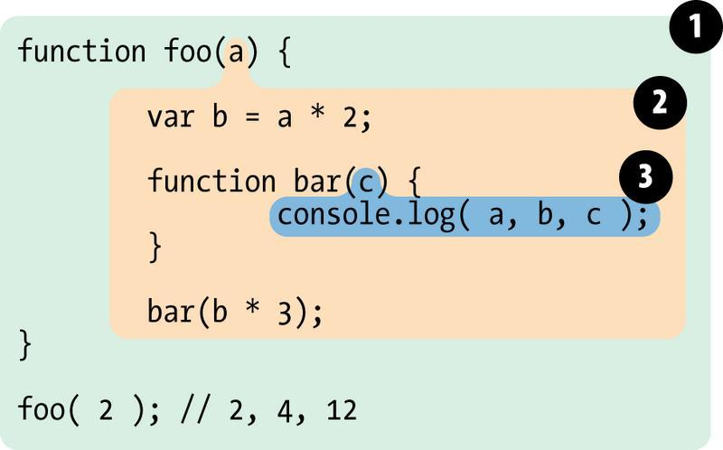
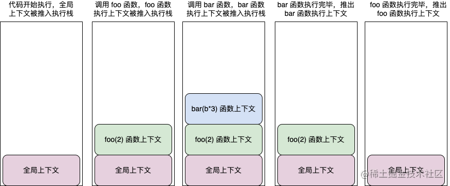
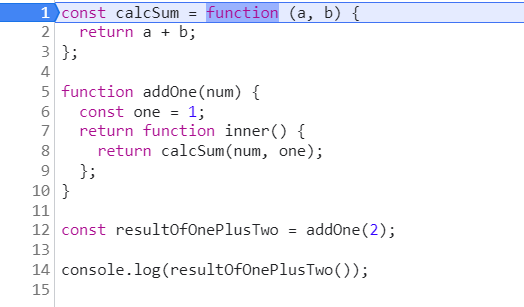
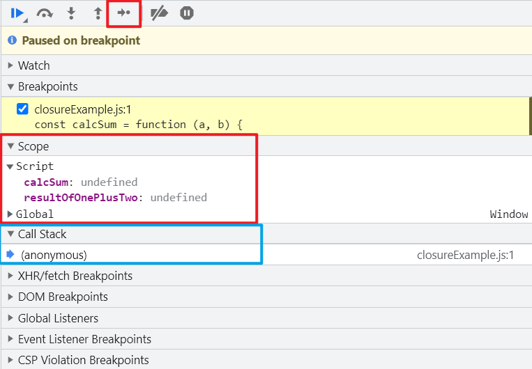
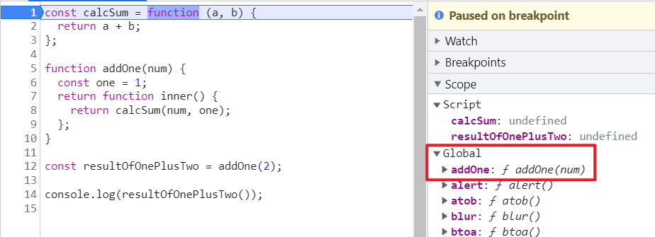
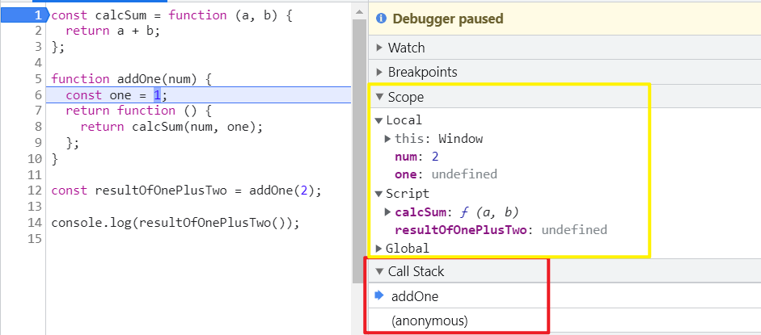
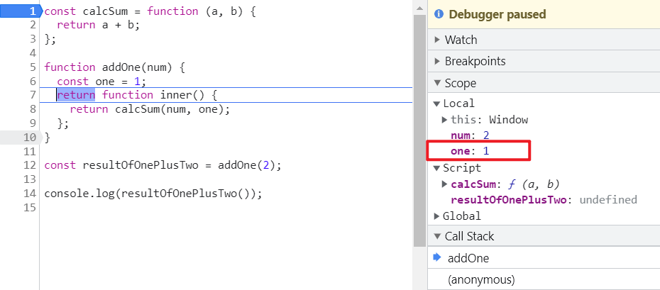
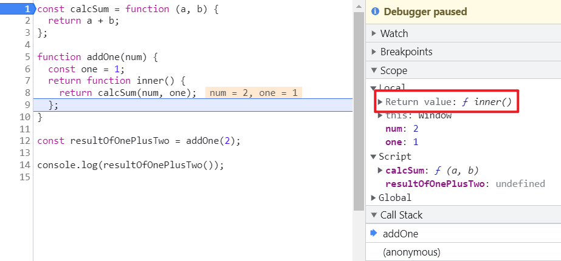
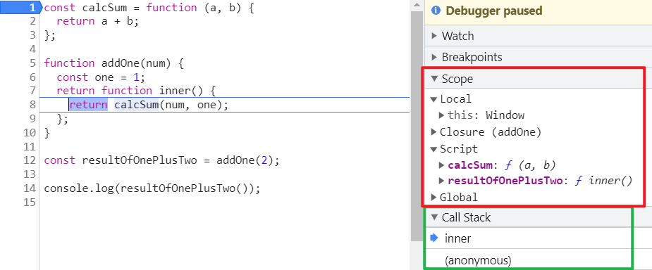

## 闭包的含义

在讲述闭包的概念时，一般有两种说法：

① 一个函数可以访问并操作位于其外部的变量。

```js
function closureExample() {
  let num = 1;
  function printNum() {
    num++; // 改变位于函数外部的变量num
    console.log(num); // 访问位于函数外部的变量num
  }
  printNum();
}
closureExample();
// output: 2
```

② 一个函数可以访问其外层作用域中的变量，即便其外层作用域已经不存在于执行上下文中。

```js
function addX(x) {
  return function (num) {
    return num + x; // 访问了函数外层的变量x
  };
}

const plusOne = addX(1); // addX执行完毕，执行上下文已不存在
console.log(plusOne(3)); // 内层函数仍然正常运行，说明其仍可以访问外层变量x
```

第二种说法其实是第一种说法的一个特殊情况。在这两种说法中，我认为更重要的是第二种，因为这种情况更能体现出闭包的特别之处。

## 为什么会有闭包

闭包产生的原因主要有两点，第一是在 JS 中**函数是一等公民**，第二是 JS 的**静态词法作用域**机制，两者的结合决定了闭包是 JS 必备的语言特性。

### JS 中函数是一等公民

一等公民的意思是想干啥就干啥，能够做到所有普通变量能做的事情（如作为函数参数、返回值）。具体来讲，JS 中的函数可以做到下面这些：

1. 以字面量的形式声明

这种形式是最常见的函数声明形式。函数声明会被**提升**，也就是会在所有代码执行之前被首先执行，不管声明被写在代码中的哪个位置，所以一个函数可以**在其声明语句之前被调用**。

```js
foo()  // 因为存在函数提升现象，这行代码可以正常运行
function foo() {
  console.log('以字面量的形式创建函数)
}
```

2.  被赋值给变量、作为数组元素、作为对象属性

```js
const func = function () {};
array.push(func);
obj.fn = func;
```

3.  作为其他函数的参数

```js
const btn = document.getElementById("btn");
btn.addEventListener("click", () => {
  console.log("button clicked");
});
```

4.  作为函数返回值

```js
function addX(X) {
  return function (num) {
    return num + X;
  };
}
```

5.  创建自定义属性

函数和普通的对象一样，都是可以有自己的自定义属性的，可以通过点操作符对属性进行添加、修改和获取。

```js
const foo = () => {};
foo.nickName = "fool function";
console.log(foo.nickName); // fool function
```

### 作用域、执行上下文和闭包

#### 词法作用域的概念

JS 的变量作用域在**编译阶段**就确定了，是**静态**的。JS 有 REPL 这个事实会让我们倾向于认为它是一门解释型语言，但其实不然，JS 引擎在解析 JS 时是有一个编译阶段的。

作用域分为**全局作用域、函数作用域和块级作用域**。作用域层层嵌套，每个内层作用域都可以访问和操作其外层作用域内的变量。


上面这张图中共有三个作用域：

绿色的是**全局作用域**，其中的内容包括`变量foo`；

橙色的是**函数 foo 的作用域**，其中的内容包括`参数a`、`变量b`和`函数bar`；

蓝色的是**函数 bar 的作用域**，其中的内容包括`参数c`。

当我们在函数 bar 中尝试访问`变量a`时，JS 首先会在其本地作用域中寻找，如果找不到，就顺着作用域链层层往外寻找，如果到了全局作用域还是找不到，就会报错，在这个例子中函数会使用外层作用域 foo 中的变量`a`。变量`b`和变量`c`的访问过程同理。

#### 执行上下文的概念

执行上下文是在代码**运行**过程中**动态**产生的，分为`全局上下文`和`函数上下文`两种类型。

执行上下文是当前 JavaScript 代码被解析和执行时所在环境的抽象概念， JavaScript 中任何的代码都是在执行上下文中运行的。上下文中的内容主要包括当前上下文中的`本地变量`，`scope`和`this`，这几个概念的具体内容会在后文中提到。


JS 以**执行栈**的形式管理执行上下文。当代码开始运行时，全局上下文被推入执行栈，上下文中保存全局上下文中的变量。每执行一个新的函数，就会往执行栈中推入一个新的上下文，中断上一个上下文的执行。函数执行完毕后，该函数的上下文会从执行栈中被推出，然后继续执行被中断的上一个上下文。



同样以这段代码为例，其执行过程中执行栈的情况如图所示：



当一个上下文执行完毕时，由于其中声明的变量对象已经不会再被用到，所以会被 JS 引擎自动垃圾回收，从而释放内存空间。

#### 通过调试代码理解

直接说概念很抽象，我们结合具体的代码，通过开发者工具来看看作用域、执行上下文以及闭包到底是怎么一回事。

```js
const calcSum = function (a, b) {
  return a + b;
};

function addOne(num) {
  const one = 1;
  return function inner() {
    return calcSum(num, one);
  };
}

const resultOfOnePlusTwo = addOne(2);

console.log(resultOfOnePlusTwo());
```

在`html`文件中引入这段代码，在开发者工具的**Sources**窗口点击右侧的`1`，给第一行代码**打上断点**，刷新后就可以逐行运行这段代码了。



此时代码还未开始运行，我们查看窗口右侧，可以看到不少信息。这里我们主要关注**Scope**和**Call Stack**。**Call Stack**是函数调用栈，实际上也就是执行上下文的**执行栈**，其中有一个`(anonymous)`，这个其实就是刚刚所说的全局上下文。



我们发现此时**Scope**中已经出现了我们将要声明的两个常量，这也证实了刚刚所说的 JS 中存在编译阶段这个事实。但虽然从一开始就知道有这两个变量了，但如果我们尝试在常量声明之前就访问它的话还是会产生报错，这是因为对于`let`和`const`声明的变量存在 **“暂时性死区”** 的限制。

这里我们点击上方被我框出来的那个按钮，就可以逐行运行代码了。


我们点击一下，可以看到**Scope**中的`calcSum`已经被赋值了，也就是说第 1~3 行的常量声明执行完毕。但此时代码直接跳到了第 12 行，也就是说第 5 行的`addOne`函数声明直接被跳过了，这其实就是因为刚刚提到的**函数提升**现象。那么这个函数为什么没有出现在**Scope**中呢？这是因为函数声明会被放在`Window对象`中，也就是**Scope**里面的那个`Global`。我们刷新一下网页，回到代码尚未开始运行的时刻，打开`Global`标签，可以看到`addOne`函数已经被添加在其中了。



`Script`和`Global`的区别在于`Script`**是单个 JS 文件的全局作用域**，而`Global`是**整个 html 中所有 JS 文件共享的全局对象（在浏览器中即`Window`）** 。这也就意味着同个 html 中其他的 Script 文件也可以访问我们声明的`addOne`函数，只要它们是在这个文件之后运行的。



言归正传，我们继续运行代码，此时为了给`resultOfOnePlusTwo`赋值，我们需要运行`addOne`函数得到其结果。所以点击下一步时，我们会进入`addOne`函数内部，此时观察执行栈，会看到`addOne`函数被推入了执行栈，这也就意味着我们进入了一个新的执行上下文。刚刚我们讲到执行上下文中会有本地变量、`Scope`和`this`三个要素，这些都可以在黄色框框出来的**Scope**部分中查看：

①`Local`就是上下文的**本地变量**，其中包括函数的参数`num`和函数中声明的常量`one`。

②`this`的值为`Window`，因为这个函数是在**非严格模式下直接调用（严格模式下为 undefined）** 的。而不是作为某个对象的方法，通过`obj.method()`的形式调用，这种情况下`this`将会指向调用函数的那个对象。

③ **Scope**标签下的内容就是这个执行上下文的`Scope`（作用域），在这个例子中`addOne`函数的`Scope`包括本地作用域`Local`, 全局作用域`Script`和`Global`。

我们继续运行代码，点击下一步之后可以看到`one`被赋值`1`。



再点一下就到了函数的 return 语句，这个函数返回了一个内层函数`inner`，`inner`引用了外层函数的`num`和`one`变量，也就是说出现了**闭包**。



我们再点一下退出`addOne`函数的运行，此时观察**Call Stack**会发现，`addOne`的上下文已经被推出了。


同时由于我们已经求出了`addOne`的运行结果，所以`resultOfOnePlusTwo`也被赋值了，其值为我们刚刚返回的`inner`函数。

下一步我们想要打印`resultOfOnePlusTwo`的结果，那么就需要运行这个函数，所以点击下一步会进入`inner`函数的内部，往执行栈中推入`inner`函数的上下文。此时观察 Scope，会发现除了 Local, Script 和 Global 之外，出现了一个名为`addOne`的 Closure，也就是闭包。



点击展开可以看到`Closure`中的内容是`inner`引用的外层函数`addOne`中的变量`num`和`one`。


我们回想刚刚展示的那张关于 JS 的作用域的图片，再观察这个 Scope 的结构，会发现它和刚才那张图展示的作用域是类似的结构，即**本地作用域 - 外层函数作用域 - 全局作用域**。但是刚刚讲执行上下文时，笔者提到了执行上下文运行结束后其中的变量会被回收，那这里`num`和`one`这两个变量为什么又回来了呢？这是因为在`inner`函数被返回之后，JS 引擎为了确保它后续能够被正常地调用，会让它把自己引用的外层函数变量也携带在身上，具体来讲，`inner`身上有一个私有变量`[[Scopes]]`，它所引用的外层变量会作为一个闭包被储存其中，就好像在自己身上携带了一个背包。当`inner`函数被运行时，JS 引擎会解开它的`[[Scopes]]`背包作为执行上下文的 Scope。我们可以展开`inner`函数查看它的`[[Scopes]]`。这其实就是闭包背后真正的原理。


这里还有一个值得注意的点，就是有时候我们会认为作用域的结构和执行栈应该是相同的，但其实两者没有任何关系，作用域是**编译时**就确定的，而执行栈和执行上下文是**运行时**的概念。从这个例子中我们也可以看到，虽然执行栈是`inner - 全局`这样的结构，但作用域却是`inner - addOne - 全局`的结构。这说明作用域和函数运行的位置以及执行栈的情况是无关的。

## 闭包带来的问题

闭包会带来**内存泄漏**的问题，要理解这一点，首先得了解 JS 的垃圾回收机制。

### JS 的垃圾回收机制

#### ① 标记清除法

使用标记清除法的垃圾回收程序在运行时会标记内存中的所有变量，然后将所有存在于执行上下文中，以及被执行上下文中变量所引用的变量的标记去掉。这一步可以通过从`window`对象开始，递归地遍历其属性，只要某个变量能够被遍历到就说明其存在于上下文中。随后将所有仍带标记的变量销毁并回收它们的内存。

#### ② 引用计数法 （不常用）

引用计数法的核心在于**跟踪记录每个对象被引用的次数**。每当存在一个变量引用了某个对象，该对象的引用 +1。相反，如果每存在一个引用该对象的变量发生更改，从而不再引用该对象时，该对象的引用 -1。当对象的引用值为 0 时，说明该对象不被任何变量所指向，即没有变量可以访问它。因此，就可以将该对象所在内存空间释放回收。

```js
function Example() {
  let ObjectA = new Object();
  let ObjectB = new Object();

  ObjectA.p = ObjectB;
  ObjectB.p = ObjectA;
}

Example();
```

该方法无法解决循环引用的问题。上述代码中的两个对象在函数结束执行后引用数都不为 0，因此不会被清理，但实际上这两个变量都无法被上下文中的其他变量访问，属于无用变量。如果函数该多次运行，产生了多个无用但不会被回收的`ObjectA`和`ObjectB`，则会造成内存浪费。

### 内存泄漏

内存泄漏意味着我们声明了大量不会被垃圾回收的变量。

闭包会导致外层函数即使运行完毕，但其上下文中的变量仍作为闭包被内层函数的`[[Scopes]]`引用，这些被引用的变量无法被垃圾回收。不合理地滥用闭包会导致大量的变量无法被垃圾回收，从而导致内存泄漏，影响性能。这就是闭包可能带来的问题。

## 参考链接：

- 执行上下文概念讲解： <https://zhuanlan.zhihu.com/p/48590085>
- Chrome 的内存管理策略：<https://juejin.cn/post/6992455656011743268>
